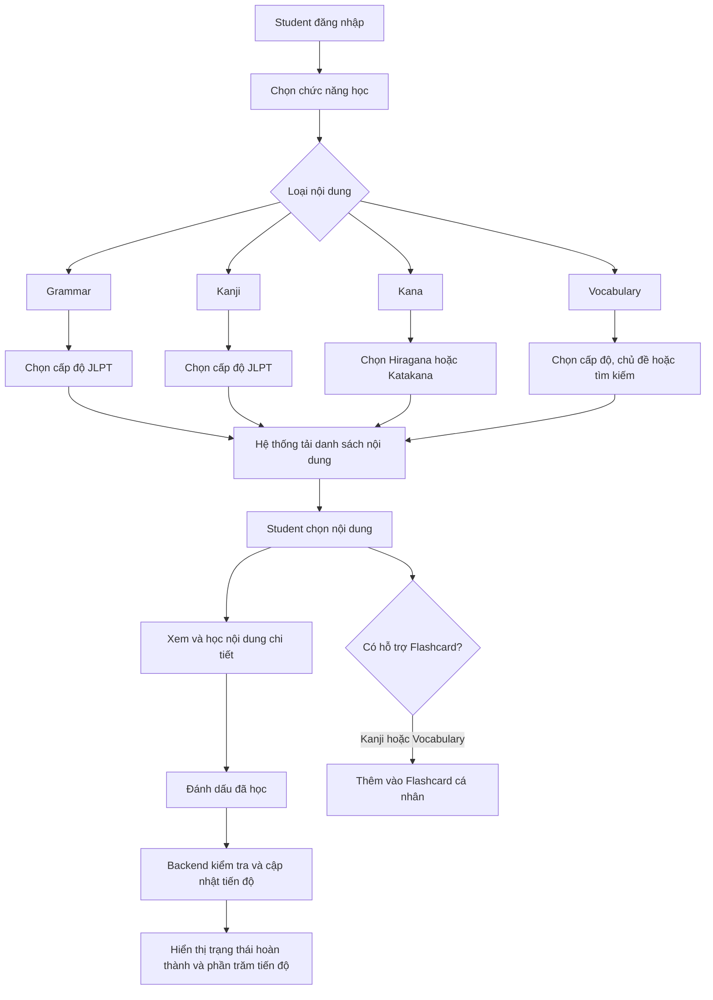

# LUỒNG HỌC TẬP CỦA STUDENT

## 1. Phạm vi

Tài liệu này mô tả luồng của Student đối với bốn chức năng học tập chính:

- Learn Grammar — Học ngữ pháp.
- Learn Kanji — Học chữ Hán.
- Learn Kana — Học Hiragana và Katakana.
- Vocabulary — Học từ vựng.

## 2. Tác nhân và tiền điều kiện

### 2.1. Tác nhân chính

**Student** — học viên sử dụng hệ thống để xem nội dung, tương tác với bài học và cập nhật tiến độ học tập.

### 2.2. Tiền điều kiện

- Student đã đăng nhập bằng JWT hợp lệ.
- Tài khoản Student có trạng thái `active`.
- Backend kiểm tra Role, cấp độ JLPT và subscription trước khi trả nội dung.
- Nội dung Grammar, Kanji và Vocabulary phải có trạng thái `published` và chưa bị soft delete.
- Nội dung VIP chỉ được truy cập khi Student có subscription VIP còn hiệu lực.

## 3. Luồng học tập tổng quát



Luồng tổng quát:

1. Student đăng nhập vào hệ thống.
2. Student chọn một trong bốn chức năng học tập.
3. Student chọn cấp độ, loại bảng chữ, chủ đề hoặc từ khóa tùy chức năng.
4. Frontend gọi API để tải danh sách nội dung.
5. Backend xác thực quyền truy cập và chỉ trả nội dung hợp lệ.
6. Student chọn một nội dung để học.
7. Student đọc nội dung, xem ví dụ, nghe audio hoặc xem thứ tự nét viết.
8. Student đánh dấu nội dung đã học.
9. Backend xác thực dữ liệu và cập nhật tiến độ.
10. Frontend hiển thị trạng thái hoàn thành và phần trăm tiến độ mới.

## 4. Learn Grammar — Học ngữ pháp

### 4.1. Luồng chính

1. Student mở trang **Ngữ pháp**.
2. Student chọn cấp độ JLPT từ N5 đến N1.
3. Frontend yêu cầu danh sách điểm ngữ pháp theo cấp độ.
4. Backend kiểm tra cấp độ và lấy các điểm ngữ pháp có trạng thái `published`, chưa bị xóa.
5. Hệ thống hiển thị danh sách kèm trạng thái đã học hoặc chưa học.
6. Student chọn một điểm ngữ pháp.
7. Hệ thống hiển thị:
   - Cấu trúc ngữ pháp.
   - Công thức.
   - Nghĩa tiếng Việt.
   - Giải thích cách sử dụng.
   - Câu ví dụ tiếng Nhật.
   - Bản dịch câu ví dụ sang tiếng Việt.
8. Student nhấn **Đánh dấu đã học** sau khi hoàn thành.
9. Backend upsert tiến độ với `contentType = grammar`, `status = completed` và `progressPercent = 100`.
10. Frontend cập nhật trạng thái và tỷ lệ hoàn thành.

### 4.2. API liên quan

```text
GET  /api/grammar-points?level=N3&page=0&size=20
GET  /api/grammar-points/{grammarId}
POST /api/learning-progress
```

### 4.3. Luồng thay thế và lỗi

- Cấp độ không hợp lệ: trả `422 LEVEL_MISMATCH`.
- Nội dung không tồn tại, chưa được duyệt hoặc đã bị xóa: trả `404 CONTENT_NOT_FOUND`.
- Nội dung VIP nhưng Student không có VIP: trả `403 VIP_REQUIRED`.
- Student cố hạ tiến độ đã đạt: trả `422 PROGRESS_REGRESSION`.
- Grammar không hỗ trợ thêm vào Flashcard theo đặc tả hiện tại.

## 5. Learn Kanji — Học Kanji

### 5.1. Luồng chính

1. Student mở trang **Kanji**.
2. Student chọn cấp độ JLPT.
3. Frontend tải danh sách Kanji theo cấp độ.
4. Hệ thống hiển thị lưới Kanji, trạng thái từng chữ và thống kê số chữ đã học.
5. Student chọn một chữ Kanji.
6. Hệ thống hiển thị:
   - Ký tự Kanji.
   - Nghĩa tiếng Việt.
   - Onyomi — âm Hán.
   - Kunyomi — âm Nhật.
   - Số nét.
   - Hình ảnh thứ tự nét viết tĩnh.
   - Từ ví dụ, cách đọc và nghĩa.
7. Student có thể nhấn **Đánh dấu đã học**.
8. Backend upsert tiến độ với `contentType = kanji`.
9. Student có thể chọn **Thêm vào Flashcard**.
10. Backend tạo Flashcard trong bộ thẻ cá nhân nếu thẻ chưa tồn tại.

### 5.2. API liên quan

```text
GET  /api/kanji?level=N5&page=0&size=20
GET  /api/kanji/{kanjiId}
POST /api/learning-progress
POST /api/flashcards
```

### 5.3. Luồng thay thế và lỗi

- Kanji không tồn tại hoặc chưa được publish: trả `404 CONTENT_NOT_FOUND`.
- Nội dung VIP nhưng Student không có VIP: trả `403 VIP_REQUIRED`.
- Flashcard đã tồn tại trong bộ thẻ: trả `409 FLASHCARD_EXISTS`.
- Hệ thống chỉ hiển thị hình ảnh thứ tự nét tĩnh; không phân tích thứ tự nét trong luồng này.
- Luyện viết và chấm bằng OCR thuộc một luồng AI riêng.

## 6. Learn Kana — Học Hiragana và Katakana

### 6.1. Luồng chính

1. Student mở trang **Kana**.
2. Student chọn tab **Hiragana** hoặc **Katakana**.
3. Frontend tải toàn bộ bảng chữ tương ứng.
4. Backend trả danh sách được sắp xếp theo thứ tự hiển thị; danh sách Kana không phân trang.
5. Mỗi ô hiển thị ký tự Kana, Romaji và trạng thái đã học.
6. Student chọn một ký tự để mở chi tiết.
7. Hệ thống hiển thị:
   - Ký tự Kana.
   - Cách đọc Romaji.
   - Audio phát âm.
   - Hình ảnh thứ tự nét viết.
8. Student nhấn nút phát âm; trình duyệt phát trực tiếp từ `audioUrl`.
9. Student nhấn **Đánh dấu đã học**.
10. Backend upsert tiến độ với `contentType = kana`.
11. Frontend cập nhật trạng thái ký tự và phần trăm hoàn thành bảng chữ.

### 6.2. API liên quan

```text
GET  /api/kana?type=hiragana
GET  /api/kana?type=katakana
POST /api/learning-progress
```

### 6.3. Luồng thay thế và lỗi

- Loại Kana không thuộc `hiragana` hoặc `katakana`: trả `400 VALIDATION_FAILED`.
- Ký tự Kana không tồn tại: trả `404 CONTENT_NOT_FOUND`.
- Audio không tự động phát; Student phải chủ động nhấn nút phát.
- Backend không cung cấp endpoint stream audio riêng.
- Kana không có giới hạn VIP trong đặc tả hiện tại.

## 7. Vocabulary — Học từ vựng

### 7.1. Luồng chính

1. Student mở trang **Từ vựng**.
2. Student có thể chọn:
   - Cấp độ JLPT.
   - Chủ đề như Du lịch, Nhà hàng hoặc Gia đình.
   - Từ khóa tìm kiếm.
3. Frontend tải danh sách từ vựng có phân trang.
4. Backend lọc đồng thời theo cấp độ, chủ đề và từ khóa nếu được cung cấp.
5. Hệ thống hiển thị từng từ với:
   - Từ tiếng Nhật.
   - Furigana hoặc cách đọc.
   - Nghĩa tiếng Việt.
   - Chủ đề và cấp độ JLPT.
   - Audio phát âm.
   - Câu ví dụ tiếng Nhật và bản dịch tiếng Việt.
6. Student có thể nghe phát âm.
7. Student nhấn **Đánh dấu đã học**.
8. Backend upsert tiến độ với `contentType = vocabulary`.
9. Student có thể nhấn **Thêm vào Flashcard**.
10. Backend tạo Flashcard cá nhân nếu từ chưa có trong bộ thẻ.
11. Frontend cập nhật tiến độ và trạng thái Flashcard.

### 7.2. API liên quan

```text
GET  /api/vocabulary?level=N5&topic=Du lịch&search=&page=0&size=20
GET  /api/vocabulary/{vocabularyId}
GET  /api/vocabulary/topics?level=N5
POST /api/learning-progress
POST /api/flashcards
```

### 7.3. Luồng thay thế và lỗi

- Cấp độ JLPT không hợp lệ: trả `422 LEVEL_MISMATCH`.
- Không có từ khớp chủ đề hoặc từ khóa: trả danh sách rỗng.
- Từ vựng không tồn tại, chưa publish hoặc đã bị xóa: trả `404 CONTENT_NOT_FOUND`.
- Nội dung VIP nhưng Student không có VIP: trả `403 VIP_REQUIRED`.
- Từ đã có trong Flashcard: trả `409 FLASHCARD_EXISTS`.

## 8. Quy tắc cập nhật tiến độ

Khi Student đánh dấu một nội dung đã học, backend phải thực hiện các bước sau:

1. Xác định Student từ JWT; không nhận `studentId` tùy ý từ client.
2. Kiểm tra loại nội dung và nội dung mục tiêu có tồn tại hay không.
3. Kiểm tra quyền truy cập theo Role, cấp độ và subscription.
4. Kiểm tra `progressPercent` nằm trong khoảng từ 0 đến 100.
5. Upsert theo khóa duy nhất:

```text
student_id + content_type + content_id
```

6. Không tạo bản ghi tiến độ trùng lặp.
7. Tiến độ chỉ được tăng; không cho phép chuyển từ `completed` về `learning`.
8. Khi hoàn thành, đặt `completed_at` theo thời gian server.
9. Cập nhật `student_users.last_activity_date` để tính streak.
10. Ghi hoạt động học tập vào learning activity log.

## 9. Các mã lỗi chung

| HTTP status | Error code | Trường hợp |
|:---:|:---|:---|
| 400 | `VALIDATION_FAILED` | Dữ liệu đầu vào không hợp lệ |
| 401 | `UNAUTHORIZED` | Chưa đăng nhập hoặc JWT không hợp lệ |
| 403 | `VIP_REQUIRED` / `FORBIDDEN` | Không đủ quyền, cấp độ hoặc subscription |
| 404 | `CONTENT_NOT_FOUND` | Nội dung không tồn tại hoặc không được phép hiển thị |
| 409 | `FLASHCARD_EXISTS` | Nội dung đã có trong Flashcard |
| 422 | `LEVEL_MISMATCH` | Cấp độ JLPT không hợp lệ |
| 422 | `PROGRESS_REGRESSION` | Cố gắng hạ tiến độ đã đạt |

## 10. Hậu điều kiện

### 10.1. Thành công

- Student xem được nội dung phù hợp với quyền truy cập.
- Tiến độ được tạo mới hoặc cập nhật mà không trùng lặp.
- Trạng thái hoàn thành được phản ánh trên giao diện.
- `last_activity_date` và learning activity log được cập nhật.
- Flashcard được tạo đối với nội dung có hỗ trợ khi Student yêu cầu.

### 10.2. Thất bại

- Không cập nhật dữ liệu khi request không hợp lệ hoặc Student không có quyền.
- Hệ thống trả response lỗi theo định dạng API chuẩn.
- Tiến độ hiện có không bị giảm hoặc ghi đè sai.

## 11. Địa chỉ các file code

Các đường dẫn dưới đây trỏ tới code hiện đang triển khai luồng Student trong thư mục `apps`.

### 11.1. Khai báo route và lớp gọi API dùng chung

| Thành phần | Địa chỉ file | Vai trò |
|:---|:---|:---|
| Frontend routes | [`apps/frontend/src/App.jsx`](../../../apps/frontend/src/App.jsx) | Khai báo các route `/grammar`, `/kanji`, `/kanji/:id`, `/kana`, `/vocabulary` và `/vocabulary/flashcard` |
| Student API service | [`apps/frontend/src/shared/api/studentService.js`](../../../apps/frontend/src/shared/api/studentService.js) | Tập trung các hàm gọi API Grammar, Kanji, Kana, Vocabulary, progress và Flashcard |

### 11.2. Learn Grammar

#### Frontend

| Thành phần | Địa chỉ file | Vai trò |
|:---|:---|:---|
| Trang Grammar | [`apps/frontend/src/features/grammar/grammar/Grammar.jsx`](../../../apps/frontend/src/features/grammar/grammar/Grammar.jsx) | Tải danh sách/chi tiết Grammar và xử lý đánh dấu hoàn thành |
| Giao diện Grammar | [`apps/frontend/src/features/grammar/grammar/Grammar.css`](../../../apps/frontend/src/features/grammar/grammar/Grammar.css) | Định dạng giao diện trang Grammar |

#### Backend

| Tầng | Địa chỉ file | Vai trò |
|:---|:---|:---|
| Controller | [`StudentGrammarController.java`](../../../apps/backend/src/main/java/com/jlpt/feature/student/grammar/StudentGrammarController.java) | Nhận request danh sách và chi tiết Grammar của Student |
| Service interface | [`StudentGrammarService.java`](../../../apps/backend/src/main/java/com/jlpt/feature/student/grammar/StudentGrammarService.java) | Khai báo nghiệp vụ Grammar dành cho Student |
| Service implementation | [`StudentGrammarServiceImpl.java`](../../../apps/backend/src/main/java/com/jlpt/feature/student/grammar/StudentGrammarServiceImpl.java) | Kiểm tra level, trạng thái nội dung, quyền truy cập và mapping DTO |
| Repository | [`StudentGrammarRepository.java`](../../../apps/backend/src/main/java/com/jlpt/feature/student/grammar/StudentGrammarRepository.java) | Truy vấn Grammar đã publish và chưa bị xóa |
| Entity | [`GrammarPoint.java`](../../../apps/backend/src/main/java/com/jlpt/feature/learning/GrammarPoint.java) | Ánh xạ dữ liệu điểm ngữ pháp |
| List DTO | [`GrammarListResponse.java`](../../../apps/backend/src/main/java/com/jlpt/feature/student/grammar/dto/GrammarListResponse.java) | Response danh sách Grammar có phân trang |
| Summary DTO | [`GrammarSummaryResponse.java`](../../../apps/backend/src/main/java/com/jlpt/feature/student/grammar/dto/GrammarSummaryResponse.java) | Dữ liệu tóm tắt một điểm Grammar |
| Detail DTO | [`GrammarDetailResponse.java`](../../../apps/backend/src/main/java/com/jlpt/feature/student/grammar/dto/GrammarDetailResponse.java) | Dữ liệu chi tiết một điểm Grammar |

### 11.3. Learn Kanji

#### Frontend

| Thành phần | Địa chỉ file | Vai trò |
|:---|:---|:---|
| Danh sách Kanji | [`KanjiList.jsx`](../../../apps/frontend/src/features/kanji/kanji/KanjiList.jsx) | Lọc theo JLPT level, hiển thị lưới và thống kê tiến độ |
| Chi tiết/luyện Kanji | [`KanjiPractice.jsx`](../../../apps/frontend/src/features/kanji/kanji/KanjiPractice.jsx) | Hiển thị chi tiết Kanji và đánh dấu hoàn thành |
| Trình phát nét viết | [`KanjiGridPlayer.jsx`](../../../apps/frontend/src/features/kanji/components/KanjiGridPlayer.jsx) | Hiển thị các nét Kanji tham chiếu |
| Canvas luyện viết | [`KanjiWritingCanvas.jsx`](../../../apps/frontend/src/features/kanji/components/KanjiWritingCanvas.jsx) | Thu nhận thao tác luyện viết của Student |
| Lớp hiển thị nét | [`KanjiStrokeLayer.jsx`](../../../apps/frontend/src/features/kanji/components/KanjiStrokeLayer.jsx) | Render dữ liệu nét viết trên giao diện |

#### Backend

| Tầng | Địa chỉ file | Vai trò |
|:---|:---|:---|
| Controller | [`StudentKanjiController.java`](../../../apps/backend/src/main/java/com/jlpt/feature/student/kanji/StudentKanjiController.java) | API danh sách, chi tiết và luyện viết Kanji |
| Service interface | [`StudentKanjiService.java`](../../../apps/backend/src/main/java/com/jlpt/feature/student/kanji/StudentKanjiService.java) | Khai báo nghiệp vụ đọc nội dung Kanji |
| Service implementation | [`StudentKanjiServiceImpl.java`](../../../apps/backend/src/main/java/com/jlpt/feature/student/kanji/StudentKanjiServiceImpl.java) | Xử lý danh sách, chi tiết, quyền truy cập và tiến độ Kanji |
| Repository | [`StudentKanjiRepository.java`](../../../apps/backend/src/main/java/com/jlpt/feature/student/kanji/StudentKanjiRepository.java) | Truy vấn Kanji cho màn hình Student |
| Entity | [`Kanji.java`](../../../apps/backend/src/main/java/com/jlpt/feature/learning/Kanji.java) | Ánh xạ dữ liệu Kanji |
| List DTO | [`KanjiListResponse.java`](../../../apps/backend/src/main/java/com/jlpt/feature/student/kanji/dto/KanjiListResponse.java) | Response danh sách Kanji có phân trang |
| Item DTO | [`KanjiItemResponse.java`](../../../apps/backend/src/main/java/com/jlpt/feature/student/kanji/dto/KanjiItemResponse.java) | Dữ liệu một Kanji trong danh sách |
| Detail DTO | [`KanjiDetailResponse.java`](../../../apps/backend/src/main/java/com/jlpt/feature/student/kanji/dto/KanjiDetailResponse.java) | Dữ liệu chi tiết Kanji |
| Writing service | [`KanjiWritingServiceImpl.java`](../../../apps/backend/src/main/java/com/jlpt/feature/student/kanji/KanjiWritingServiceImpl.java) | Xử lý đánh giá nét và lưu phiên luyện viết |
| Writing attempt entity | [`KanjiWritingAttempt.java`](../../../apps/backend/src/main/java/com/jlpt/feature/student/kanji/KanjiWritingAttempt.java) | Lưu kết quả một phiên luyện viết Kanji |

### 11.4. Learn Kana

#### Frontend

| Thành phần | Địa chỉ file | Vai trò |
|:---|:---|:---|
| Danh sách Kana | [`KanaList.jsx`](../../../apps/frontend/src/features/kana/kana/KanaList.jsx) | Chuyển Hiragana/Katakana, hiển thị bảng chữ và cập nhật tiến độ |
| Modal chi tiết | [`KanaDetailModal.jsx`](../../../apps/frontend/src/features/dashboard/student/KanaDetailModal.jsx) | Hiển thị Romaji, audio, nét viết và nút hoàn thành |
| Giao diện Kana | [`KanaList.css`](../../../apps/frontend/src/features/kana/kana/KanaList.css) | Định dạng trang và bảng Kana |

#### Backend

| Tầng | Địa chỉ file | Vai trò |
|:---|:---|:---|
| Controller | [`StudentKanaController.java`](../../../apps/backend/src/main/java/com/jlpt/feature/student/kana/controller/StudentKanaController.java) | Nhận request tải bảng Hiragana/Katakana |
| Service interface | [`KanaService.java`](../../../apps/backend/src/main/java/com/jlpt/feature/student/kana/service/KanaService.java) | Khai báo nghiệp vụ Kana |
| Service implementation | [`KanaServiceImpl.java`](../../../apps/backend/src/main/java/com/jlpt/feature/student/kana/service/impl/KanaServiceImpl.java) | Lấy bảng Kana, gắn tiến độ và mapping DTO |
| Repository | [`KanaCharacterRepository.java`](../../../apps/backend/src/main/java/com/jlpt/feature/learning/repository/KanaCharacterRepository.java) | Truy vấn ký tự theo loại và thứ tự hiển thị |
| Entity | [`KanaCharacter.java`](../../../apps/backend/src/main/java/com/jlpt/feature/learning/KanaCharacter.java) | Ánh xạ dữ liệu ký tự Kana |
| List DTO | [`KanaListResponse.java`](../../../apps/backend/src/main/java/com/jlpt/feature/student/kana/dto/response/KanaListResponse.java) | Response toàn bộ bảng Kana và thống kê tiến độ |
| Item DTO | [`KanaResponse.java`](../../../apps/backend/src/main/java/com/jlpt/feature/student/kana/dto/response/KanaResponse.java) | Dữ liệu một ký tự Kana |

### 11.5. Vocabulary

#### Frontend

| Thành phần | Địa chỉ file | Vai trò |
|:---|:---|:---|
| Điều phối màn hình | [`VocabularyRoute.jsx`](../../../apps/frontend/src/features/vocabulary/vocabulary/VocabularyRoute.jsx) | Chọn màn hình Vocabulary Home hoặc danh sách theo query string |
| Vocabulary Home | [`VocabHome.jsx`](../../../apps/frontend/src/features/vocabulary/vocabulary/VocabHome.jsx) | Hiển thị lộ trình/chủ đề từ vựng của Student |
| Danh sách từ vựng | [`VocabularyList.jsx`](../../../apps/frontend/src/features/vocabulary/vocabulary/VocabularyList.jsx) | Lọc level/topic, tìm kiếm, hiển thị tiến độ và danh sách từ |
| Thẻ từ vựng | [`VocabCard.jsx`](../../../apps/frontend/src/features/dashboard/student/VocabCard.jsx) | Hiển thị từ, nghĩa, audio và các hành động học |
| Phiên Flashcard | [`VocabFlashcardSession.jsx`](../../../apps/frontend/src/features/vocabulary/vocabulary/VocabFlashcardSession.jsx) | Điều khiển phiên học/ôn tập từ vựng bằng Flashcard |

#### Backend

| Tầng | Địa chỉ file | Vai trò |
|:---|:---|:---|
| Controller | [`StudentVocabularyController.java`](../../../apps/backend/src/main/java/com/jlpt/feature/learning/StudentVocabularyController.java) | API danh sách chủ đề và danh sách từ vựng |
| Service | [`StudentVocabularyService.java`](../../../apps/backend/src/main/java/com/jlpt/feature/learning/StudentVocabularyService.java) | Lọc level/topic/từ khóa, kiểm tra dữ liệu và mapping DTO |
| Vocabulary repository | [`VocabularyRepository.java`](../../../apps/backend/src/main/java/com/jlpt/feature/learning/VocabularyRepository.java) | Truy vấn danh sách từ vựng |
| Topic repository | [`VocabularyTopicRepository.java`](../../../apps/backend/src/main/java/com/jlpt/feature/learning/VocabularyTopicRepository.java) | Truy vấn các chủ đề theo cấp độ |
| Vocabulary entity | [`Vocabulary.java`](../../../apps/backend/src/main/java/com/jlpt/feature/learning/Vocabulary.java) | Ánh xạ dữ liệu từ vựng |
| Topic entity | [`VocabularyTopic.java`](../../../apps/backend/src/main/java/com/jlpt/feature/learning/VocabularyTopic.java) | Ánh xạ dữ liệu chủ đề từ vựng |
| List DTO | [`VocabularyListResponse.java`](../../../apps/backend/src/main/java/com/jlpt/feature/learning/dto/VocabularyListResponse.java) | Response danh sách Vocabulary có phân trang |
| Item DTO | [`VocabularyListItemResponse.java`](../../../apps/backend/src/main/java/com/jlpt/feature/learning/dto/VocabularyListItemResponse.java) | Dữ liệu một từ trong danh sách |
| Topic DTO | [`VocabTopicResponse.java`](../../../apps/backend/src/main/java/com/jlpt/feature/learning/dto/VocabTopicResponse.java) | Dữ liệu chủ đề từ vựng |

### 11.6. Tiến độ học tập dùng chung

| Tầng | Địa chỉ file | Vai trò |
|:---|:---|:---|
| Controller | [`StudentLearningProgressController.java`](../../../apps/backend/src/main/java/com/jlpt/feature/student/progress/StudentLearningProgressController.java) | Nhận request `POST /api/learning-progress` |
| Service interface | [`StudentLearningProgressService.java`](../../../apps/backend/src/main/java/com/jlpt/feature/student/progress/StudentLearningProgressService.java) | Khai báo nghiệp vụ cập nhật tiến độ |
| Service implementation | [`StudentLearningProgressServiceImpl.java`](../../../apps/backend/src/main/java/com/jlpt/feature/student/progress/StudentLearningProgressServiceImpl.java) | Validate nội dung và upsert tiến độ theo Student |
| Progress entity | [`StudentContentProgress.java`](../../../apps/backend/src/main/java/com/jlpt/feature/student/StudentContentProgress.java) | Ánh xạ bảng `student_content_progress` |
| Progress repository | [`StudentContentProgressRepository.java`](../../../apps/backend/src/main/java/com/jlpt/feature/student/StudentContentProgressRepository.java) | Đọc và ghi tiến độ học tập |
| Progress request DTO | [`LearningProgressRequest.java`](../../../apps/backend/src/main/java/com/jlpt/feature/student/progress/dto/LearningProgressRequest.java) | Dữ liệu cập nhật tiến độ nhận từ frontend |
| Progress response DTO | [`LearningProgressResponse.java`](../../../apps/backend/src/main/java/com/jlpt/feature/student/progress/dto/LearningProgressResponse.java) | Dữ liệu tiến độ trả cho frontend |

### 11.7. Flashcard/Notebook dùng chung

| Tầng | Địa chỉ file | Vai trò |
|:---|:---|:---|
| Notebook controller | [`StudentNotebookController.java`](../../../apps/backend/src/main/java/com/jlpt/feature/flashcard/controller/StudentNotebookController.java) | API quản lý bộ thẻ và thêm từ vào Notebook |
| Flashcard controller | [`StudentFlashcardController.java`](../../../apps/backend/src/main/java/com/jlpt/feature/flashcard/controller/StudentFlashcardController.java) | API mở phiên và gửi kết quả ôn tập Flashcard |
| Notebook service | [`NotebookService.java`](../../../apps/backend/src/main/java/com/jlpt/feature/flashcard/service/NotebookService.java) | Nghiệp vụ thêm, đọc và quản lý thẻ trong Notebook |
| Flashcard SRS service | [`FlashcardSrsService.java`](../../../apps/backend/src/main/java/com/jlpt/feature/flashcard/service/FlashcardSrsService.java) | Nghiệp vụ lặp lại ngắt quãng và lịch ôn tập |
| Flashcard repository | [`FlashcardRepository.java`](../../../apps/backend/src/main/java/com/jlpt/feature/flashcard/repository/FlashcardRepository.java) | Truy vấn và lưu Flashcard |
| Flashcard entity | [`Flashcard.java`](../../../apps/backend/src/main/java/com/jlpt/feature/flashcard/Flashcard.java) | Ánh xạ dữ liệu Flashcard |

## 12. Tài liệu tham chiếu

- [UC-06 — Học Ngữ Pháp](../../03-Interface-Specs/feature-specs/backend/feat-core-learning/UC-06-grammar.md)
- [UC-07 — Học Kanji](../../03-Interface-Specs/feature-specs/backend/feat-core-learning/UC-07-kanji.md)
- [UC-08 — Học Kana](../../03-Interface-Specs/feature-specs/backend/feat-core-learning/UC-08-kana.md)
- [UC-09 — Học Từ Vựng](../../03-Interface-Specs/feature-specs/backend/feat-core-learning/UC-09-vocabulary.md)
