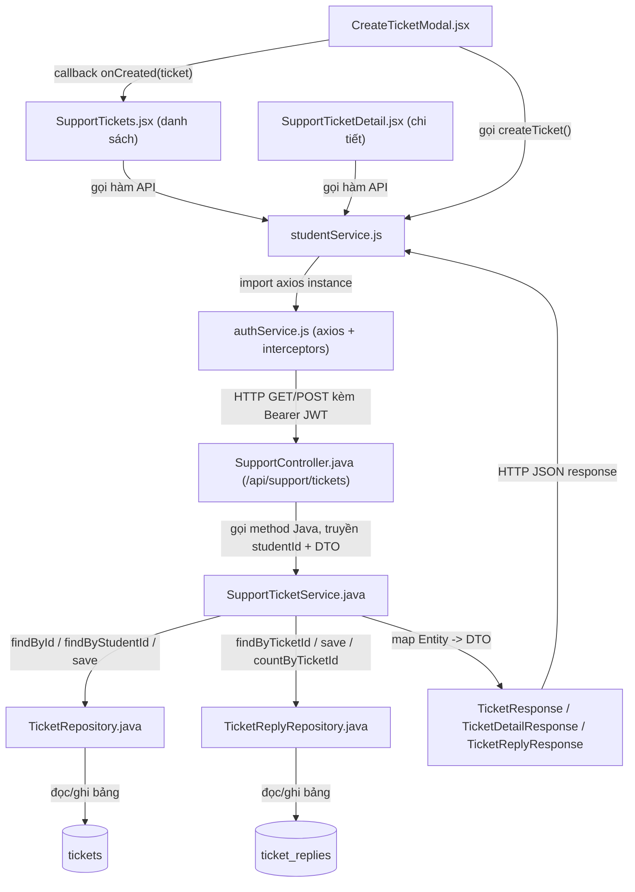
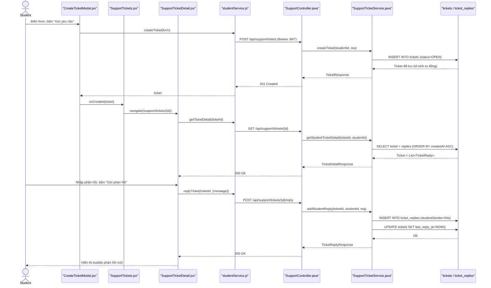

# Phân Tích Feature: Student Ticket Support (Nhóm con của "support")

> **Tác giả phân tích:** AI Senior Software Architect
> **Ngày phân tích:** 2026-07-22
> **Phạm vi:** UC-29 — Student tạo/xem/phản hồi/đóng ticket hỗ trợ (không bao gồm nhóm Staff/Manager xử lý ticket hay nhóm Speaking Submission Grading UC-31 — đã tách riêng, xem mục 8)
> **Nguồn:** Đọc trực tiếp source code trong workspace

---

## 1. Tóm Tắt Tổng Quan

Feature này cho phép **Student** tạo yêu cầu hỗ trợ (ticket), xem danh sách/chi tiết ticket của chính mình, gửi phản hồi vào luồng trao đổi (thread), và tự đóng ticket khi đã giải quyết xong. Đây là góc nhìn **Student** của package backend `support` — package này còn có góc nhìn Staff/Manager (trả lời, phân công ticket) và một nhóm chức năng không liên quan (chấm điểm bài nói UC-31) nằm chung file `SupportTicketService.java` nhưng đã được loại khỏi phạm vi phân tích này.

Feature trải dài trên **3 tầng**:

| Tầng | Mô tả |
|---|---|
| **Frontend (React)** | Trang [SupportTickets.jsx](/apps/frontend/src/pages/support/SupportTickets.jsx) (danh sách) + [SupportTicketDetail.jsx](/apps/frontend/src/pages/support/SupportTicketDetail.jsx) (chi tiết/thread) + modal [CreateTicketModal.jsx](/apps/frontend/src/components/support/CreateTicketModal.jsx), gọi API qua [studentService.js](/apps/frontend/src/api/studentService.js) |
| **Backend (Spring Boot)** | [SupportController.java](/apps/backend/src/main/java/com/jlpt/feature/support/controller/SupportController.java) nhận request → [SupportTicketService.java](/apps/backend/src/main/java/com/jlpt/feature/support/service/SupportTicketService.java) xử lý business logic (phần Student) → [TicketRepository](/apps/backend/src/main/java/com/jlpt/feature/support/repository/TicketRepository.java)/[TicketReplyRepository](/apps/backend/src/main/java/com/jlpt/feature/support/repository/TicketReplyRepository.java) đọc/ghi DB |
| **Database** | Bảng `tickets`, `ticket_replies` (entity [Ticket.java](/apps/backend/src/main/java/com/jlpt/feature/support/Ticket.java), [TicketReply.java](/apps/backend/src/main/java/com/jlpt/feature/support/TicketReply.java)) |

**Entry point**: route `/support` (danh sách) và `/support/tickets/:ticketId` (chi tiết) ở frontend → gọi tới `/api/support/tickets[...]` ở backend (đã xác nhận cả 2 route đăng ký trong [App.jsx:116-117](/apps/frontend/src/App.jsx#L116-L117), bọc bởi `PrivateRoute`).

Các use case được cover (đều thuộc UC-29 theo comment trong code):
- Tạo ticket mới
- Xem danh sách ticket của tôi (lọc theo trạng thái, phân trang)
- Xem chi tiết 1 ticket + toàn bộ thread phản hồi
- Gửi phản hồi vào ticket đang mở
- Tự đóng ticket của mình

---

## 2. Bản Đồ Cấu Trúc (Các "Mảnh" Và Vai Trò)

### 2.1 Frontend

| File | Vai trò | Loại |
|---|---|---|
| [SupportTickets.jsx](/apps/frontend/src/pages/support/SupportTickets.jsx) | Trang danh sách: fetch + hiển thị ticket của Student, filter theo trạng thái, phân trang, mở modal tạo mới | Page Component |
| [SupportTicketDetail.jsx](/apps/frontend/src/pages/support/SupportTicketDetail.jsx) | Trang chi tiết: hiển thị thread (nội dung gốc + các reply), form gửi phản hồi, xác nhận đóng ticket | Page Component |
| [CreateTicketModal.jsx](/apps/frontend/src/components/support/CreateTicketModal.jsx) | Modal form tạo ticket mới: validate client-side (subject/content bắt buộc), gọi API tạo | Component |
| [TicketStatusBadge.jsx](/apps/frontend/src/components/support/TicketStatusBadge.jsx) | Hiển thị badge màu theo 5 trạng thái ticket (open/assigned/in_progress/resolved/closed) | Component (hiển thị) |
| [PriorityPill.jsx](/apps/frontend/src/components/support/PriorityPill.jsx) | Hiển thị pill màu theo 4 mức ưu tiên (low/normal/high/urgent) | Component (hiển thị) |
| [studentService.js](/apps/frontend/src/api/studentService.js) | Tầng gọi API: `getMyTickets`, `getTicketDetail`, `createTicket`, `replyTicket`, `closeMyTicket` | API Service |
| [authService.js](/apps/frontend/src/api/authService.js) | Tạo axios instance dùng chung (đính Bearer token qua interceptor, tự refresh khi 401) — được `studentService.js` import làm `api` | Axios Config |

### 2.2 Backend

| File | Vai trò | Loại |
|---|---|---|
| [SupportController.java](/apps/backend/src/main/java/com/jlpt/feature/support/controller/SupportController.java) | Nhận HTTP request tại `/api/support/**`, ép role STUDENT (`@PreAuthorize`), lấy `studentId` từ JWT principal, ủy quyền cho Service | Controller |
| [SupportTicketService.java](/apps/backend/src/main/java/com/jlpt/feature/support/service/SupportTicketService.java) | Business logic: tạo ticket, lấy danh sách/chi tiết, kiểm tra quyền sở hữu, thêm reply, đóng ticket, map Entity→DTO | Service |
| [TicketRepository.java](/apps/backend/src/main/java/com/jlpt/feature/support/repository/TicketRepository.java) | JPQL query: tìm ticket theo student + status, phân trang | Repository |
| [TicketReplyRepository.java](/apps/backend/src/main/java/com/jlpt/feature/support/repository/TicketReplyRepository.java) | JPQL query: lấy reply theo ticket (sắp theo thời gian), đếm reply | Repository |
| [Ticket.java](/apps/backend/src/main/java/com/jlpt/feature/support/Ticket.java) | Entity JPA bảng `tickets` — subject/content/category/priority/status/assignedTo | Entity |
| [TicketReply.java](/apps/backend/src/main/java/com/jlpt/feature/support/TicketReply.java) | Entity JPA bảng `ticket_replies` — 1 trong 2 FK `studentSender`/`staffSender` được set (không bao giờ cả 2) | Entity |
| [TicketRequest.java](/apps/backend/src/main/java/com/jlpt/feature/support/dto/TicketRequest.java) | DTO nhận request tạo ticket (subject, content, category, priority) + validation Jakarta | DTO Request |
| [TicketReplyRequest.java](/apps/backend/src/main/java/com/jlpt/feature/support/dto/TicketReplyRequest.java) | DTO nhận request gửi phản hồi (message, attachmentUrl) | DTO Request |
| [TicketResponse.java](/apps/backend/src/main/java/com/jlpt/feature/support/dto/TicketResponse.java) | DTO trả về tóm tắt 1 ticket (dùng cho danh sách) | DTO Response |
| [TicketDetailResponse.java](/apps/backend/src/main/java/com/jlpt/feature/support/dto/TicketDetailResponse.java) | DTO trả về chi tiết ticket kèm toàn bộ `replies` | DTO Response |
| [TicketReplyResponse.java](/apps/backend/src/main/java/com/jlpt/feature/support/dto/TicketReplyResponse.java) | DTO trả về 1 reply (senderName, senderRole, message...) | DTO Response |

---

## 3. Bản Đồ Kết Nối (Ai Gọi Ai, Dữ Liệu Truyền Qua Đâu)

### 3.1 Diagram Mermaid — Architecture Overview



### 3.2 Bảng phụ — Kết nối chi tiết

| Từ (File A) | Đến (File B) | Cách kết nối | Dữ liệu truyền |
|---|---|---|---|
| `SupportTickets.jsx` | `studentService.js` | Gọi hàm JS `getMyTickets({status, page, size})` | Query params `status/page/size` → nhận `{content, totalElements, totalPages}` |
| `CreateTicketModal.jsx` | `studentService.js` | Gọi hàm JS `createTicket(form)` | Object `{subject, content, category, priority}` |
| `SupportTicketDetail.jsx` | `studentService.js` | Gọi `getTicketDetail`, `replyTicket`, `closeMyTicket` | `ticketId` (path param), `{message, attachmentUrl}` khi reply |
| `studentService.js` | `authService.js` | `import api from './authService'` — dùng chung 1 axios instance | Không truyền dữ liệu, chỉ tái sử dụng cấu hình (baseURL, interceptor JWT) |
| `authService.js` | `SupportController.java` | HTTP request thật (axios) tới `/api/support/tickets*` | Header `Authorization: Bearer <JWT>`, body/query theo từng endpoint |
| `SupportController.java` | `SupportTicketService.java` | Gọi method Java trực tiếp (Spring DI) | `studentId` lấy từ `@AuthenticationPrincipal UserDetailsImpl` + DTO Request đã validate |
| `SupportTicketService.java` | `TicketRepository.java` | Gọi method Spring Data JPA (`findById`, `findByStudentId`, `save`) | Entity `Ticket` |
| `SupportTicketService.java` | `TicketReplyRepository.java` | Gọi method Spring Data JPA | Entity `TicketReply` |
| `SupportTicketService.java` | `SupportController.java` | Trả về DTO Response | `TicketResponse` / `TicketDetailResponse` / `TicketReplyResponse` |

---

## 4. Luồng Xử Lý Theo Trình Tự

Kể theo trình tự thực tế của luồng **"Student tạo ticket mới, sau đó gửi phản hồi"** — luồng có giá trị nhất vì đi qua đủ Create + Read + Update:

1. **Student mở trang `/support`** → `SupportTickets.jsx` mount, `useEffect` gọi `load()` ([SupportTickets.jsx:35-49](/apps/frontend/src/pages/support/SupportTickets.jsx#L35-L49)) → gọi `getMyTickets()` trong `studentService.js`.
2. **Student bấm "Tạo yêu cầu mới"** → mở `CreateTicketModal`, điền form, submit → `validate(form)` kiểm tra client-side (subject/content không rỗng) ([CreateTicketModal.jsx:13-20](/apps/frontend/src/components/support/CreateTicketModal.jsx#L13-L20)) → gọi `createTicket(form)`.
3. **`studentService.createTicket`** gửi `POST /api/support/tickets` kèm JWT (do interceptor trong `authService.js` tự đính).
4. **`SupportController.createTicket`** ([SupportController.java:36-43](/apps/backend/src/main/java/com/jlpt/feature/support/controller/SupportController.java#L36-L43)) lấy `studentId` từ JWT principal, gọi `supportTicketService.createTicket(studentId, req)`.
5. **`SupportTicketService.createTicket`** ([SupportTicketService.java:63-81](/apps/backend/src/main/java/com/jlpt/feature/support/service/SupportTicketService.java#L63-L81)) tìm Student thật trong DB, parse `priority` (mặc định NORMAL nếu không gửi), build `Ticket` entity với `status=OPEN`, lưu qua `ticketRepository.save(ticket)`.
6. Backend trả `201 Created` kèm `TicketResponse` → Frontend nhận, đóng modal, `navigate('/support/tickets/{ticketId}')`.
7. **Student mở trang chi tiết** → `SupportTicketDetail.jsx` gọi `getTicketDetail(ticketId)` → `SupportController.getTicketDetail` → `SupportTicketService.getStudentTicketDetail` ([SupportTicketService.java:104-112](/apps/backend/src/main/java/com/jlpt/feature/support/service/SupportTicketService.java#L104-L112)) kiểm tra `ticket.getStudent().getId().equals(studentId)` (chống xem ticket người khác) rồi lấy toàn bộ `replies` từ `TicketReplyRepository`.
8. **Student nhập phản hồi, bấm "Gửi phản hồi"** → `handleSend()` ([SupportTicketDetail.jsx:54-74](/apps/frontend/src/pages/support/SupportTicketDetail.jsx#L54-L74)) gọi `replyTicket(ticketId, {message, attachmentUrl})`.
9. **`SupportController.replyToTicket`** → **`SupportTicketService.addStudentReply`** ([SupportTicketService.java:125-143](/apps/backend/src/main/java/com/jlpt/feature/support/service/SupportTicketService.java#L125-L143)): kiểm tra ticket chưa đóng (`checkTicketNotClosed`), kiểm tra quyền sở hữu, lưu `TicketReply` mới (chỉ set `studentSender`), cập nhật `ticket.lastReplyAt`.
10. Backend trả `TicketReplyResponse` → Frontend nối vào mảng `replies` hiện có, hiển thị ngay không cần load lại toàn trang.

### 4.1 Sequence Diagram



---

## 5. Vai Trò Từng Đoạn Code Quan Trọng

### 5.1 Kiểm tra quyền sở hữu ticket (chống Student A xem/reply ticket của Student B)

File: [SupportTicketService.java:104-112](/apps/backend/src/main/java/com/jlpt/feature/support/service/SupportTicketService.java#L104-L112)

```java
@Transactional(readOnly = true)
public TicketDetailResponse getStudentTicketDetail(Long ticketId, Long studentId) {
    Ticket ticket = findTicketOrThrow(ticketId); // Tìm ticket theo id, ném ResourceNotFoundException nếu không tồn tại
    if (!ticket.getStudent().getId().equals(studentId)) {
        // So sánh chủ sở hữu ticket (student.id) với studentId lấy từ JWT của người gọi
        // -> Nếu khác, KHÔNG cho xem, dù ticket có tồn tại thật (chặn IDOR - Insecure Direct Object Reference)
        throw new ForbiddenException("Bạn không có quyền xem ticket này");
    }
    List<TicketReply> replies = ticketReplyRepository.findByTicketIdOrderByCreatedAtAsc(ticketId);
    // Lấy toàn bộ thread phản hồi, sắp xếp tăng dần theo thời gian để hiển thị đúng thứ tự hội thoại
    return toTicketDetailResponse(ticket, replies);
}
```
Giải thích: đây là điểm chặn bảo mật quan trọng nhất của cả feature — `studentId` không bao giờ đến từ client (frontend không gửi lên), mà lấy từ JWT đã xác thực ở tầng Controller, nên Student không thể tự sửa payload để xem ticket người khác.

### 5.2 Chặn phản hồi vào ticket đã đóng

File: [SupportTicketService.java:414-418](/apps/backend/src/main/java/com/jlpt/feature/support/service/SupportTicketService.java#L414-L418)

```java
private void checkTicketNotClosed(Ticket ticket) {
    if (ticket.getStatus() == Ticket.TicketStatus.RESOLVED || ticket.getStatus() == Ticket.TicketStatus.CLOSED) {
        // Rẽ nhánh chính: nếu ticket đã ở trạng thái cuối (RESOLVED/CLOSED)
        // -> ném lỗi nghiệp vụ 409, ngăn không cho ghi thêm reply vào 1 luồng đã kết thúc
        throw new BusinessException(409, "TICKET_CLOSED", "Ticket đã được đóng, không thể phản hồi thêm");
    }
}
```
Giải thích: hàm helper này được gọi ở cả `addStudentReply` (dòng 128) và `addStaffReply` (dòng 150) — là nơi DUY NHẤT enforce rule "không phản hồi vào ticket đã đóng", tránh lặp code kiểm tra ở 2 nơi.

### 5.3 Ràng buộc: 1 reply chỉ có 1 người gửi (Student HOẶC Staff, không bao giờ cả 2)

File: [SupportTicketService.java:133-139](/apps/backend/src/main/java/com/jlpt/feature/support/service/SupportTicketService.java#L133-L139)

```java
var student = findStudentOrThrow(studentId);
// Only studentSender set — DB constraint CK_replies_sender
TicketReply reply = ticketReplyRepository.save(TicketReply.builder()
        .ticket(ticket)
        .studentSender(student)   // Chỉ set studentSender, KHÔNG set staffSender
        .message(req.getMessage())
        .attachmentUrl(req.getAttachmentUrl())
        .build());
```
Giải thích: `TicketReply` entity có 2 FK riêng biệt (`studentSender`, `staffSender` — xem [TicketReply.java:28-34](/apps/backend/src/main/java/com/jlpt/feature/support/TicketReply.java#L28-L34)) thay vì 1 cột polymorphic; comment trong code xác nhận có ràng buộc DB `CK_replies_sender` đảm bảo đúng 1 trong 2 FK được set — đây là cách xác định `senderRole` khi trả về (`STUDENT` vs `STAFF`) mà không cần cột `role` riêng, thấy rõ ở [SupportTicketService.java:462-466](/apps/backend/src/main/java/com/jlpt/feature/support/service/SupportTicketService.java#L462-L466): `r.getStudentSender() != null ? "STUDENT" : "STAFF"`.

### 5.4 Frontend: xử lý lỗi 409 khi reply vào ticket vừa bị đóng (đồng bộ lại UI)

File: [SupportTicketDetail.jsx:67-71](/apps/frontend/src/pages/support/SupportTicketDetail.jsx#L67-L71)

```jsx
} catch (err) {
  const msg = err?.response?.data?.message ?? 'Không thể gửi phản hồi. Vui lòng thử lại.';
  addToast('error', msg);
  if (err?.response?.status === 409) load(); // ticket vừa bị đóng → đồng bộ
  // Nếu backend trả 409 (TICKET_CLOSED - xem mục 5.2), tải lại toàn bộ chi tiết ticket
  // để UI phản ánh đúng trạng thái mới nhất (vd Staff vừa đóng ticket ở tab khác)
} finally {
  setSending(false);
}
```
Giải thích: đây là điểm kết nối trực tiếp giữa business rule ở backend (mục 5.2) và hành vi UI — thay vì chỉ hiện toast lỗi, code chủ động gọi lại `load()` để đồng bộ trạng thái, tránh UI "đứng hình" hiển thị form reply cho 1 ticket đã đóng.

---

## 6. Dữ Liệu Di Chuyển Như Thế Nào

Theo dõi dữ liệu **"nội dung ticket mới"** (`subject` + `content` Student nhập) xuyên suốt hệ thống:

1. **Nhập liệu (Frontend)**: Student gõ vào 2 field trong `CreateTicketModal.jsx` — state cục bộ `form.subject`, `form.content` ([CreateTicketModal.jsx:22-28](/apps/frontend/src/components/support/CreateTicketModal.jsx#L22-L28)).
2. **Validate client-side**: hàm `validate(form)` kiểm tra `subject`/`content` không rỗng, `subject` ≤ 255 ký tự ([CreateTicketModal.jsx:13-20](/apps/frontend/src/components/support/CreateTicketModal.jsx#L13-L20)) — chỉ chặn UX, không phải bảo mật thật.
3. **Gửi lên API**: `createTicket(form)` gửi nguyên object `{subject, content, category, priority}` qua `POST /api/support/tickets` ([studentService.js:355-358](/apps/frontend/src/api/studentService.js#L355-L358)).
4. **Nhận & validate lại ở Backend**: `TicketRequest` DTO validate lại bằng Jakarta annotation (`@NotBlank`, `@Size(max=255)`) — tên field giữ nguyên `subject`/`content` ([TicketRequest.java:10-24](/apps/backend/src/main/java/com/jlpt/feature/support/dto/TicketRequest.java#L10-L24)). Đây là **validate thật** — không tin dữ liệu client dù đã qua bước 2.
5. **Lưu DB**: `SupportTicketService.createTicket` map thẳng `req.getSubject()`/`req.getContent()` vào `Ticket` entity, cột DB `subject VARCHAR(255)` và `content NVARCHAR(MAX)` ([Ticket.java:28-32](/apps/backend/src/main/java/com/jlpt/feature/support/Ticket.java#L28-L32)) — tên field không đổi qua các tầng.
6. **Trả về Frontend**: `toTicketResponse(ticket)` map lại thành `TicketResponse.subject`/`.content` — vẫn cùng tên field, JSON key giữ nguyên (không có tầng transform đổi tên).
7. **Hiển thị lại**: `SupportTickets.jsx` hiển thị `t.subject` trực tiếp trong card danh sách ([SupportTickets.jsx:136](/apps/frontend/src/pages/support/SupportTickets.jsx#L136)); `SupportTicketDetail.jsx` hiển thị `detail.content` như bubble tin nhắn đầu tiên của thread ([SupportTicketDetail.jsx:141](/apps/frontend/src/pages/support/SupportTicketDetail.jsx#L141)).

**Nhận xét**: dữ liệu giữ nguyên tên field (`subject`, `content`) xuyên suốt cả 3 tầng (React state → JSON request → Entity → JSON response → React render) — không có bước đổi tên hay biến đổi cấu trúc nào giữa các tầng, chỉ có 2 lớp validate độc lập (client UX + server thật).

---

## 7. Bảng Tra Cứu Tổng Hợp

| Bước | File | Function | Kết nối tới | Dữ liệu | Ghi chú |
|---|---|---|---|---|---|
| 1 | [SupportTickets.jsx](/apps/frontend/src/pages/support/SupportTickets.jsx) | `load()` | `studentService.getMyTickets` | `{status, page, size}` | Chạy trong `useEffect`, phụ thuộc `[statusFilter, page]` |
| 2 | [CreateTicketModal.jsx](/apps/frontend/src/components/support/CreateTicketModal.jsx) | `handleSubmit()` | `studentService.createTicket` | `{subject, content, category, priority}` | Validate client trước khi gọi API |
| 3 | [studentService.js](/apps/frontend/src/api/studentService.js) | `createTicket()` | `POST /api/support/tickets` | Body JSON | Dùng chung axios instance `api` từ `authService.js` |
| 4 | [SupportController.java](/apps/backend/src/main/java/com/jlpt/feature/support/controller/SupportController.java) | `createTicket()` | `SupportTicketService.createTicket` | `studentId` (từ JWT) + `TicketRequest` | `@PreAuthorize("hasRole('STUDENT')")` ở class-level |
| 5 | [SupportTicketService.java](/apps/backend/src/main/java/com/jlpt/feature/support/service/SupportTicketService.java) | `createTicket()` | `TicketRepository.save` | `Ticket` entity, `status=OPEN` | `@Transactional` |
| 6 | [SupportController.java](/apps/backend/src/main/java/com/jlpt/feature/support/controller/SupportController.java) | `getTicketDetail()` | `SupportTicketService.getStudentTicketDetail` | `ticketId`, `studentId` | Kiểm tra quyền sở hữu (mục 5.1) |
| 7 | [SupportTicketService.java](/apps/backend/src/main/java/com/jlpt/feature/support/service/SupportTicketService.java) | `getStudentTicketDetail()` | `TicketReplyRepository.findByTicketIdOrderByCreatedAtAsc` | `List<TicketReply>` | `@Transactional(readOnly = true)` |
| 8 | [SupportTicketDetail.jsx](/apps/frontend/src/pages/support/SupportTicketDetail.jsx) | `handleSend()` | `studentService.replyTicket` | `{message, attachmentUrl}` | Optimistic UI: nối reply mới vào state ngay khi thành công |
| 9 | [SupportTicketService.java](/apps/backend/src/main/java/com/jlpt/feature/support/service/SupportTicketService.java) | `addStudentReply()` | `checkTicketNotClosed` + `TicketReplyRepository.save` | `TicketReply` entity | Ném `409 TICKET_CLOSED` nếu ticket đã đóng |
| 10 | [SupportTicketDetail.jsx](/apps/frontend/src/pages/support/SupportTicketDetail.jsx) | `handleClose()` | `studentService.closeMyTicket` | `ticketId` | Có modal xác nhận trước khi gọi |
| 11 | [SupportTicketService.java](/apps/backend/src/main/java/com/jlpt/feature/support/service/SupportTicketService.java) | `closeStudentTicket()` | `TicketRepository.save` | `status=CLOSED`, `resolvedAt=now()` | Kiểm tra quyền sở hữu + `checkTicketNotClosed` trước khi đóng |

---

## 8. Các Mục Cần Bổ Sung Context

- **Phạm vi đã loại trừ theo lựa chọn của user**: 2 nhóm con còn lại của package `support` — (a) **Staff/Manager Ticket Handling** (`StaffSupportController`, `addStaffReply`, `assignTicket`, `getAllTickets`, `StaffTickets.jsx`, `ManagerTickets.jsx`, `TicketDetail.jsx`, `TicketList.jsx`) và (b) **Speaking Submission Grading — UC-31** (`StaffGradingController`, `manualGrade`, `StaffGrading.jsx`, `GradingPanel.jsx`) — **chưa được phân tích** trong tài liệu này, dù cả 2 đều nằm chung file `SupportTicketService.java`. Cần yêu cầu riêng nếu muốn phân tích tiếp.
- **Notification khi có reply mới**: `addStaffReply` có gọi `notificationService.notifyStudent(...)` ([SupportTicketService.java:172-178](/apps/backend/src/main/java/com/jlpt/feature/support/service/SupportTicketService.java#L172-L178)) nhưng `addStudentReply` (phần đang phân tích) thì **không** gọi notification nào cho phía Staff — không tìm thấy cơ chế báo cho Staff biết có ticket/reply mới từ Student trong source code đã đọc. Có thể Staff chỉ biết qua việc chủ động vào danh sách `StaffTickets.jsx` (thuộc nhóm chưa phân tích).
- **`UserDetailsImpl.getStudentUser()`**: được gọi nhiều lần trong `SupportController` để lấy `studentId`, nhưng file định nghĩa class này (`shared/security/UserDetailsImpl.java` hoặc tương đương) **không nằm trong phạm vi đọc của phân tích này** — chưa xác nhận trực tiếp cách nó được populate lúc xác thực JWT.
- **Giới hạn độ dài `content`/thread**: không tìm thấy giới hạn số lượng reply tối đa hay giới hạn độ dài `content` (NVARCHAR(MAX) — không giới hạn cứng ở tầng DTO/Entity) trong source code đã đọc.
