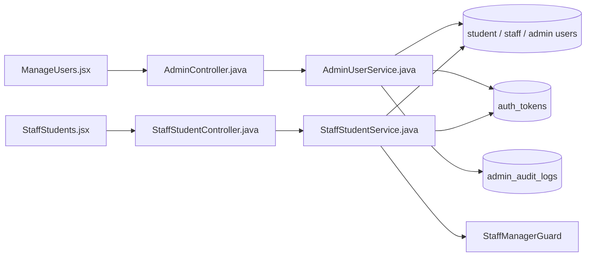

# Suspend or Activate Account Feature Analysis

## 1. Tóm tắt tổng quan

Hệ thống có hai entry point khóa/mở khóa: Admin áp dụng cho Student/Staff/Admin tại `/api/admin/users/{type}/{id}`, còn Staff Manager chỉ áp dụng cho Student tại `/api/staff/students/{id}`. Suspend đổi trạng thái, lưu lý do và thu hồi token đang hoạt động; Activate chỉ hợp lệ với tài khoản đang suspended và xóa lý do.

## 2. Bản đồ cấu trúc

| File | Vai trò | Loại |
|---|---|---|
| [ManageUsers.jsx](apps/frontend/src/features/management/admin/ManageUsers.jsx) | Mở modal và gửi hành động Admin | React Page |
| [StaffStudents.jsx](apps/frontend/src/features/management/staff/StaffStudents.jsx) | Giao diện Staff Student | React Page |
| [adminService.js](apps/frontend/src/shared/api/adminService.js) | Admin suspend/activate API | API Service |
| [staffService.js](apps/frontend/src/shared/api/staffService.js) | Staff Manager suspend/activate API | API Service |
| [AdminController.java](apps/backend/src/main/java/com/jlpt/feature/admin/AdminController.java) | Endpoint Admin | Controller |
| [AdminUserService.java](apps/backend/src/main/java/com/jlpt/feature/admin/AdminUserService.java) | Mutation user, revoke token, audit | Service |
| [StaffStudentController.java](apps/backend/src/main/java/com/jlpt/feature/staffcontent/student/controller/StaffStudentController.java) | Endpoint Staff Manager | Controller |
| [StaffStudentService.java](apps/backend/src/main/java/com/jlpt/feature/staffcontent/student/service/StaffStudentService.java) | Mutation Student và revoke token | Service |
| [AuthTokenRepository.java](apps/backend/src/main/java/com/jlpt/feature/auth/AuthTokenRepository.java) | Thu hồi phiên | Repository |

## 3. Bản đồ kết nối



| Từ | Đến | Cách kết nối | Dữ liệu |
|---|---|---|---|
| ManageUsers | Admin API | POST | type/id/reason |
| StaffStudents | Staff API | POST | studentId/reason |
| Admin service | user repo | JPA | status/reason |
| Staff service | manager guard | role check | actorEmail |
| services | token repo | update | revoke active tokens |

## 4. Luồng xử lý theo trình tự

1. Người quản trị chọn Suspend hoặc Activate.
2. Suspend yêu cầu `reason`; frontend gọi endpoint theo actor.
3. Backend xác minh Admin hoặc Staff Manager và chặn tự sửa tài khoản Admin.
4. Suspend kiểm tra trạng thái không phải suspended/deleted, đổi status và lưu reason.
5. Backend thu hồi mọi token active để phiên hiện tại bị chấm dứt.
6. Admin mutation ghi audit log.
7. Activate chỉ nhận tài khoản suspended, đổi lại active và xóa reason.

```mermaid
sequenceDiagram
    actor Actor as "Admin / Staff Manager"
    participant UI as "ManageUsers / StaffStudents"
    participant Ctrl as "AdminController / StaffStudentController"
    participant Svc as "AdminUserService / StaffStudentService"
    participant DB as "Users / auth_tokens / audit"
    Actor->>UI: Chọn Suspend và nhập reason
    UI->>Ctrl: POST suspend
    Ctrl->>Svc: actor + target + reason
    Svc->>DB: Kiểm tra và đổi status
    Svc->>DB: Revoke active tokens
    Svc-->>UI: status=suspended
    Actor->>UI: Chọn Activate
    UI->>Svc: POST activate
    Svc->>DB: suspended → active, clear reason
```

## 5. Vai trò đoạn code quan trọng

[StaffStudentService.java#L123](apps/backend/src/main/java/com/jlpt/feature/staffcontent/student/service/StaffStudentService.java#L123)

```java
@Transactional
public StaffStudentSummaryResponse suspend(String actorEmail, Long studentId, String reason) {
    // Staff thường không được mutation; guard bắt buộc actor là Staff Manager.
    staffManagerGuard.requireManager(actorEmail, FORBIDDEN_MSG);
    StudentUser s = studentUserRepository.findById(studentId)
            .orElseThrow(() -> new ResourceNotFoundException("StudentUser", studentId));
    s.setStatus(StudentUser.StudentStatus.SUSPENDED);
    s.setSuspendReason(reason);
    studentUserRepository.save(s);
    // Khóa tài khoản phải chấm dứt phiên hiện tại, không chỉ đổi cờ DB.
    authTokenRepository.revokeAllActiveByStudentId(studentId, LocalDateTime.now());
    return toSummary(s);
}
```

[AdminUserService.java#L266](apps/backend/src/main/java/com/jlpt/feature/admin/AdminUserService.java#L266)

```java
return switch (normalizeType(type)) {
    // type từ path quyết định repository và enum trạng thái tương ứng.
    case "student" -> { /* cập nhật Student, revoke token, ghi audit */ }
    case "staff" -> { /* cập nhật Staff, revoke token, ghi audit */ }
    case "admin" -> { /* cập nhật Admin, revoke token, ghi audit */ }
    default -> throw new BadRequestException("Loại người dùng không hợp lệ");
};
```

## 6. Dữ liệu di chuyển

Actor/target/reason → role guard → entity status/reason → revoked token timestamp → audit record (Admin) → response `{userId,userType,status,...}` → UI reload.

## 7. Bảng tra cứu tổng hợp

| Bước | File | Function | Kết nối tới | Dữ liệu | Ghi chú |
|---:|---|---|---|---|---|
| 1 | UI | suspend handler | API | target/reason | Modal |
| 2 | Controller | `suspendUser`/`suspend` | Service | actor + target | Auth principal |
| 3 | Service | guard | repositories | current state | Chặn sai quyền |
| 4 | Service | status mutation | token repo | status/revoke | Atomic transaction |
| 5 | Service | `activateUser`/`activate` | user repo | active | Clear reason |

## 8. Các mục cần bổ sung context

- Staff Manager suspend không ghi `AdminAuditLog`; source không cho thấy một audit entity riêng của Staff.
- Token access JWT đã phát có thể còn hiệu lực tới khi security layer kiểm tra trạng thái/revocation; chi tiết filter nằm ngoài nhóm file lõi.

<!-- BACKEND-METHOD-INVENTORY:START -->

## Phụ lục — Danh mục đầy đủ hàm backend

> Phần này được đối chiếu trực tiếp từ source backend hiện tại. Chỉ liệt kê các hàm khai báo tường minh trong những file Java mà tài liệu này tham chiếu; các hàm do Lombok/JPA sinh tự động không xuất hiện trong source nên không liệt kê.

### `AdminController`

Nguồn: [AdminController.java](../../../apps/backend/src/main/java/com/jlpt/feature/admin/AdminController.java)

| # | Hàm backend (đầy đủ chữ ký) | Endpoint | Tác dụng/chức năng phục vụ |
|---:|---|---|---|
| 1 | [`ResponseEntity<ApiResponse<Object>> getUserDetail(@PathVariable String type, @PathVariable Long userId)`](../../../apps/backend/src/main/java/com/jlpt/feature/admin/AdminController.java#L73) | `GET /users/{type}/{userId}` | Xử lý endpoint `GET /users/{type}/{userId}`; thực hiện nghiệp vụ `get user detail`. |
| 2 | [`ResponseEntity<ApiResponse<CreateStaffResponse>> createStaff(Authentication auth, @Valid @RequestBody CreateStaffRequest request)`](../../../apps/backend/src/main/java/com/jlpt/feature/admin/AdminController.java#L81) | `POST /staff` | Xử lý endpoint `POST /staff`; thực hiện nghiệp vụ `create staff`. |
| 3 | [`ResponseEntity<ApiResponse<Object>> updateStudent(Authentication auth, @PathVariable Long userId, @Valid @RequestBody UpdateStudentRequest request)`](../../../apps/backend/src/main/java/com/jlpt/feature/admin/AdminController.java#L91) | `PUT /users/student/{userId}` | Xử lý endpoint `PUT /users/student/{userId}`; thực hiện nghiệp vụ `update student`. |
| 4 | [`ResponseEntity<ApiResponse<Object>> updateStaff(Authentication auth, @PathVariable Long userId, @Valid @RequestBody UpdateStaffInfoRequest request)`](../../../apps/backend/src/main/java/com/jlpt/feature/admin/AdminController.java#L98) | `PUT /users/staff/{userId}` | Xử lý endpoint `PUT /users/staff/{userId}`; thực hiện nghiệp vụ `update staff`. |
| 5 | [`ResponseEntity<ApiResponse<SuspendUserResponse>> suspendUser(Authentication auth, @PathVariable String type, @PathVariable Long userId, @Valid @RequestBody SuspendUserRequest request)`](../../../apps/backend/src/main/java/com/jlpt/feature/admin/AdminController.java#L107) | `POST /users/{type}/{userId}/suspend` | Xử lý endpoint `POST /users/{type}/{userId}/suspend`; thực hiện nghiệp vụ `suspend user`. |
| 6 | [`ResponseEntity<ApiResponse<ActivateUserResponse>> activateUser(Authentication auth, @PathVariable String type, @PathVariable Long userId)`](../../../apps/backend/src/main/java/com/jlpt/feature/admin/AdminController.java#L119) | `POST /users/{type}/{userId}/activate` | Xử lý endpoint `POST /users/{type}/{userId}/activate`; thực hiện nghiệp vụ `activate user`. |
| 7 | [`ResponseEntity<ApiResponse<Void>> resetPassword(Authentication auth, @PathVariable String type, @PathVariable Long userId)`](../../../apps/backend/src/main/java/com/jlpt/feature/admin/AdminController.java#L128) | `POST /users/{type}/{userId}/reset-password` | Xử lý endpoint `POST /users/{type}/{userId}/reset-password`; thực hiện nghiệp vụ `reset password`. |
| 8 | [`ResponseEntity<ApiResponse<IssueTempPasswordResponse>> issueTempPassword(Authentication auth, @PathVariable Long staffId, @Valid @RequestBody IssueTempPasswordRequest request)`](../../../apps/backend/src/main/java/com/jlpt/feature/admin/AdminController.java#L144) | `POST /staff/{staffId}/issue-temp-password` | Xử lý endpoint `POST /staff/{staffId}/issue-temp-password`; thực hiện nghiệp vụ `issue temp password`. |
| 9 | [`ResponseEntity<ApiResponse<SoftDeleteUserResponse>> softDeleteUser(Authentication auth, @PathVariable String type, @PathVariable Long userId)`](../../../apps/backend/src/main/java/com/jlpt/feature/admin/AdminController.java#L153) | `DELETE /users/{type}/{userId}` | Xử lý endpoint `DELETE /users/{type}/{userId}`; thực hiện nghiệp vụ `soft delete user`. |
| 10 | [`ResponseEntity<ApiResponse<RestoreUserResponse>> restoreUser(Authentication auth, @PathVariable String type, @PathVariable Long userId)`](../../../apps/backend/src/main/java/com/jlpt/feature/admin/AdminController.java#L162) | `POST /users/{type}/{userId}/restore` | Xử lý endpoint `POST /users/{type}/{userId}/restore`; thực hiện nghiệp vụ `restore user`. |
| 11 | [`ResponseEntity<ApiResponse<ChangeStaffRoleResponse>> changeStaffRole(Authentication auth, @PathVariable Long staffId, @Valid @RequestBody ChangeStaffRoleRequest request)`](../../../apps/backend/src/main/java/com/jlpt/feature/admin/AdminController.java#L171) | `PUT /staff/{staffId}/role` | Xử lý endpoint `PUT /staff/{staffId}/role`; thực hiện nghiệp vụ `change staff role`. |

### `AdminUserService`

Nguồn: [AdminUserService.java](../../../apps/backend/src/main/java/com/jlpt/feature/admin/AdminUserService.java)

| # | Hàm backend (đầy đủ chữ ký) | Endpoint | Tác dụng/chức năng phục vụ |
|---:|---|---|---|
| 1 | [`Page<UserSummaryResponse> listUsers(String type, String q, String status, String jlptLevel, String staffRole, int page, int size)`](../../../apps/backend/src/main/java/com/jlpt/feature/admin/AdminUserService.java#L62) | `—` | Đọc hoặc tra cứu dữ liệu phục vụ `list users`. |
| 2 | [`Object getUserDetail(String type, Long userId)`](../../../apps/backend/src/main/java/com/jlpt/feature/admin/AdminUserService.java#L93) | `—` | Đọc hoặc tra cứu dữ liệu phục vụ `get user detail`. |
| 3 | [`yield toStudentDetail(s)`](../../../apps/backend/src/main/java/com/jlpt/feature/admin/AdminUserService.java#L100) | `—` | Biến đổi/tổng hợp dữ liệu nội bộ cho `to student detail`. |
| 4 | [`yield toStaffDetail(st)`](../../../apps/backend/src/main/java/com/jlpt/feature/admin/AdminUserService.java#L106) | `—` | Biến đổi/tổng hợp dữ liệu nội bộ cho `to staff detail`. |
| 5 | [`yield toAdminDetail(a)`](../../../apps/backend/src/main/java/com/jlpt/feature/admin/AdminUserService.java#L112) | `—` | Biến đổi/tổng hợp dữ liệu nội bộ cho `to admin detail`. |
| 6 | [`CreateStaffResponse createStaff(String adminEmail, CreateStaffRequest request)`](../../../apps/backend/src/main/java/com/jlpt/feature/admin/AdminUserService.java#L120) | `—` | Tạo hoặc ghi dữ liệu cho nghiệp vụ `create staff`. |
| 7 | [`void setupStaffPassword(com.jlpt.feature.staff.dto.request.StaffSetupPasswordRequest request)`](../../../apps/backend/src/main/java/com/jlpt/feature/admin/AdminUserService.java#L166) | `—` | Thực hiện xử lý backend `setup staff password` trong `AdminUserService`. |
| 8 | [`Object updateUser(String adminEmail, String type, Long userId, Object request)`](../../../apps/backend/src/main/java/com/jlpt/feature/admin/AdminUserService.java#L208) | `—` | Cập nhật trạng thái/dữ liệu cho nghiệp vụ `update user`. |
| 9 | [`yield toStudentDetail(s)`](../../../apps/backend/src/main/java/com/jlpt/feature/admin/AdminUserService.java#L237) | `—` | Biến đổi/tổng hợp dữ liệu nội bộ cho `to student detail`. |
| 10 | [`yield toStaffDetail(st)`](../../../apps/backend/src/main/java/com/jlpt/feature/admin/AdminUserService.java#L249) | `—` | Biến đổi/tổng hợp dữ liệu nội bộ cho `to staff detail`. |
| 11 | [`SuspendUserResponse suspendUser(String adminEmail, String type, Long userId, SuspendUserRequest request)`](../../../apps/backend/src/main/java/com/jlpt/feature/admin/AdminUserService.java#L259) | `—` | Cập nhật trạng thái/dữ liệu cho nghiệp vụ `suspend user`. |
| 12 | [`ActivateUserResponse activateUser(String adminEmail, String type, Long userId)`](../../../apps/backend/src/main/java/com/jlpt/feature/admin/AdminUserService.java#L336) | `—` | Cập nhật trạng thái/dữ liệu cho nghiệp vụ `activate user`. |
| 13 | [`void resetPassword(String adminEmail, String type, Long userId)`](../../../apps/backend/src/main/java/com/jlpt/feature/admin/AdminUserService.java#L403) | `—` | Thực hiện xử lý backend `reset password` trong `AdminUserService`. |
| 14 | [`SoftDeleteUserResponse softDeleteUser(String adminEmail, String type, Long userId)`](../../../apps/backend/src/main/java/com/jlpt/feature/admin/AdminUserService.java#L476) | `—` | Thực hiện xử lý backend `soft delete user` trong `AdminUserService`. |
| 15 | [`RestoreUserResponse restoreUser(String adminEmail, String type, Long userId)`](../../../apps/backend/src/main/java/com/jlpt/feature/admin/AdminUserService.java#L527) | `—` | Thực hiện xử lý backend `restore user` trong `AdminUserService`. |
| 16 | [`ChangeStaffRoleResponse changeStaffRole(String adminEmail, Long staffId, ChangeStaffRoleRequest request)`](../../../apps/backend/src/main/java/com/jlpt/feature/admin/AdminUserService.java#L575) | `—` | Cập nhật trạng thái/dữ liệu cho nghiệp vụ `change staff role`. |
| 17 | [`String normalizeType(String type)`](../../../apps/backend/src/main/java/com/jlpt/feature/admin/AdminUserService.java#L611) | `—` | Thực hiện xử lý backend `normalize type` trong `AdminUserService`. |
| 18 | [`AdminUser resolveAdmin(String email)`](../../../apps/backend/src/main/java/com/jlpt/feature/admin/AdminUserService.java#L616) | `—` | Biến đổi/tổng hợp dữ liệu nội bộ cho `resolve admin`. |
| 19 | [`void checkSelfModification(Long actorAdminId, String type, Long targetId)`](../../../apps/backend/src/main/java/com/jlpt/feature/admin/AdminUserService.java#L623) | `—` | Kiểm tra điều kiện/trạng thái phục vụ `check self modification`. |
| 20 | [`void auditLog(AdminUser actor, String action, String targetTable, Long targetId, String description)`](../../../apps/backend/src/main/java/com/jlpt/feature/admin/AdminUserService.java#L629) | `—` | Thực hiện xử lý backend `audit log` trong `AdminUserService`. |
| 21 | [`String generateUrlSafeToken(int bytes)`](../../../apps/backend/src/main/java/com/jlpt/feature/admin/AdminUserService.java#L639) | `—` | Thực hiện xử lý backend `generate url safe token` trong `AdminUserService`. |
| 22 | [`UserSummaryResponse toStudentSummary(StudentUser s)`](../../../apps/backend/src/main/java/com/jlpt/feature/admin/AdminUserService.java#L647) | `—` | Biến đổi/tổng hợp dữ liệu nội bộ cho `to student summary`. |
| 23 | [`UserSummaryResponse toStaffSummary(StaffUser st)`](../../../apps/backend/src/main/java/com/jlpt/feature/admin/AdminUserService.java#L663) | `—` | Biến đổi/tổng hợp dữ liệu nội bộ cho `to staff summary`. |
| 24 | [`UserSummaryResponse toAdminSummary(AdminUser a)`](../../../apps/backend/src/main/java/com/jlpt/feature/admin/AdminUserService.java#L675) | `—` | Biến đổi/tổng hợp dữ liệu nội bộ cho `to admin summary`. |
| 25 | [`StudentDetailResponse toStudentDetail(StudentUser s)`](../../../apps/backend/src/main/java/com/jlpt/feature/admin/AdminUserService.java#L686) | `—` | Biến đổi/tổng hợp dữ liệu nội bộ cho `to student detail`. |
| 26 | [`StaffDetailResponse toStaffDetail(StaffUser st)`](../../../apps/backend/src/main/java/com/jlpt/feature/admin/AdminUserService.java#L708) | `—` | Biến đổi/tổng hợp dữ liệu nội bộ cho `to staff detail`. |
| 27 | [`AdminDetailResponse toAdminDetail(AdminUser a)`](../../../apps/backend/src/main/java/com/jlpt/feature/admin/AdminUserService.java#L721) | `—` | Biến đổi/tổng hợp dữ liệu nội bộ cho `to admin detail`. |

### `AuthTokenRepository`

Nguồn: [AuthTokenRepository.java](../../../apps/backend/src/main/java/com/jlpt/feature/auth/AuthTokenRepository.java)

| # | Hàm backend (đầy đủ chữ ký) | Endpoint | Tác dụng/chức năng phục vụ |
|---:|---|---|---|
| 1 | [`Optional<AuthToken> findByTokenValue(String tokenValue)`](../../../apps/backend/src/main/java/com/jlpt/feature/auth/AuthTokenRepository.java#L16) | `—` | Đọc hoặc tra cứu dữ liệu phục vụ `find by token value`. |
| 2 | [`Optional<AuthToken> findByTokenValueAndTokenType(String tokenValue, AuthToken.TokenType tokenType)`](../../../apps/backend/src/main/java/com/jlpt/feature/auth/AuthTokenRepository.java#L18) | `—` | Đọc hoặc tra cứu dữ liệu phục vụ `find by token value and token type`. |
| 3 | [`void deleteByStudentIdAndTokenType(Long studentId, AuthToken.TokenType tokenType)`](../../../apps/backend/src/main/java/com/jlpt/feature/auth/AuthTokenRepository.java#L20) | `—` | Xóa mềm, thu hồi hoặc loại bỏ dữ liệu trong `delete by student id and token type`. |
| 4 | [`Optional<AuthToken> findFirstByStudentIdAndTokenTypeOrderByCreatedAtDesc(Long studentId, AuthToken.TokenType tokenType)`](../../../apps/backend/src/main/java/com/jlpt/feature/auth/AuthTokenRepository.java#L22) | `—` | Đọc hoặc tra cứu dữ liệu phục vụ `find first by student id and token type order by created at desc`. |

### `StaffStudentController`

Nguồn: [StaffStudentController.java](../../../apps/backend/src/main/java/com/jlpt/feature/staffcontent/student/controller/StaffStudentController.java)

| # | Hàm backend (đầy đủ chữ ký) | Endpoint | Tác dụng/chức năng phục vụ |
|---:|---|---|---|
| 1 | [`ResponseEntity<ApiResponse<StaffStudentProgressResponse>> progress(@PathVariable Long studentId)`](../../../apps/backend/src/main/java/com/jlpt/feature/staffcontent/student/controller/StaffStudentController.java#L50) | `GET /{studentId}/progress` | Xử lý endpoint `GET /{studentId}/progress`; thực hiện nghiệp vụ `progress`. |
| 2 | [`ResponseEntity<ApiResponse<StaffStudentSummaryResponse>> activate(@PathVariable Long studentId, Authentication authentication)`](../../../apps/backend/src/main/java/com/jlpt/feature/staffcontent/student/controller/StaffStudentController.java#L65) | `POST /{studentId}/activate` | Xử lý endpoint `POST /{studentId}/activate`; thực hiện nghiệp vụ `activate`. |

### `StaffStudentService`

Nguồn: [StaffStudentService.java](../../../apps/backend/src/main/java/com/jlpt/feature/staffcontent/student/service/StaffStudentService.java)

| # | Hàm backend (đầy đủ chữ ký) | Endpoint | Tác dụng/chức năng phục vụ |
|---:|---|---|---|
| 1 | [`StaffStudentListResponse listStudents(String search, String level, String status, int page, int size)`](../../../apps/backend/src/main/java/com/jlpt/feature/staffcontent/student/service/StaffStudentService.java#L48) | `—` | Đọc hoặc tra cứu dữ liệu phục vụ `list students`. |
| 2 | [`StaffStudentProgressResponse getProgress(Long studentId)`](../../../apps/backend/src/main/java/com/jlpt/feature/staffcontent/student/service/StaffStudentService.java#L81) | `—` | Đọc hoặc tra cứu dữ liệu phục vụ `get progress`. |
| 3 | [`StaffStudentSummaryResponse suspend(String actorEmail, Long studentId, String reason)`](../../../apps/backend/src/main/java/com/jlpt/feature/staffcontent/student/service/StaffStudentService.java#L123) | `—` | Cập nhật trạng thái/dữ liệu cho nghiệp vụ `suspend`. |
| 4 | [`StaffStudentSummaryResponse activate(String actorEmail, Long studentId)`](../../../apps/backend/src/main/java/com/jlpt/feature/staffcontent/student/service/StaffStudentService.java#L141) | `—` | Cập nhật trạng thái/dữ liệu cho nghiệp vụ `activate`. |
| 5 | [`int scorePct(TestAttempt a)`](../../../apps/backend/src/main/java/com/jlpt/feature/staffcontent/student/service/StaffStudentService.java#L153) | `—` | Thực hiện xử lý backend `score pct` trong `StaffStudentService`. |
| 6 | [`String resolveTitle(Long assessmentId)`](../../../apps/backend/src/main/java/com/jlpt/feature/staffcontent/student/service/StaffStudentService.java#L165) | `—` | Biến đổi/tổng hợp dữ liệu nội bộ cho `resolve title`. |
| 7 | [`StaffStudentSummaryResponse toSummary(StudentUser s)`](../../../apps/backend/src/main/java/com/jlpt/feature/staffcontent/student/service/StaffStudentService.java#L175) | `—` | Biến đổi/tổng hợp dữ liệu nội bộ cho `to summary`. |

**Tổng cộng:** `51` hàm backend trong `5` file Java được tham chiếu.

<!-- BACKEND-METHOD-INVENTORY:END -->
