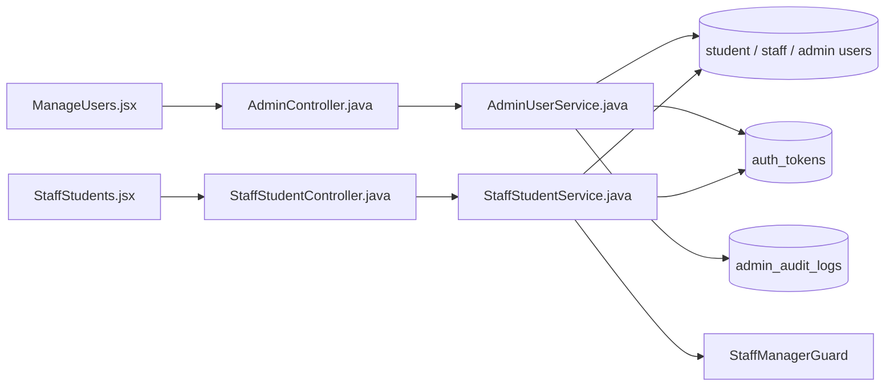

# Suspend or Activate Account Feature Analysis

## 1. Tóm tắt tổng quan

Hệ thống có hai entry point khóa/mở khóa: Admin áp dụng cho Student/Staff/Admin tại `/api/admin/users/{type}/{id}`, còn Staff Manager chỉ áp dụng cho Student tại `/api/staff/students/{id}`. Suspend đổi trạng thái, lưu lý do và thu hồi token đang hoạt động; Activate chỉ hợp lệ với tài khoản đang suspended và xóa lý do.

## 2. Bản đồ cấu trúc

| File | Vai trò | Loại |
|---|---|---|
| [ManageUsers.jsx](apps/frontend/src/features/management/admin/ManageUsers.jsx) | Mở modal và gửi hành động Admin | React Page |
| [StaffStudents.jsx](apps/frontend/src/features/management/staff/StaffStudents.jsx) | Giao diện Staff Student | React Page |
| [adminService.js](apps/frontend/src/shared/api/adminService.js) | Admin suspend/activate API | API Service |
| [staffService.js](apps/frontend/src/shared/api/staffService.js) | Staff Manager suspend/activate API | API Service |
| [AdminController.java](apps/backend/src/main/java/com/jlpt/feature/admin/AdminController.java) | Endpoint Admin | Controller |
| [AdminUserService.java](apps/backend/src/main/java/com/jlpt/feature/admin/AdminUserService.java) | Mutation user, revoke token, audit | Service |
| [StaffStudentController.java](apps/backend/src/main/java/com/jlpt/feature/staffcontent/student/controller/StaffStudentController.java) | Endpoint Staff Manager | Controller |
| [StaffStudentService.java](apps/backend/src/main/java/com/jlpt/feature/staffcontent/student/service/StaffStudentService.java) | Mutation Student và revoke token | Service |
| [AuthTokenRepository.java](apps/backend/src/main/java/com/jlpt/feature/auth/AuthTokenRepository.java) | Thu hồi phiên | Repository |

## 3. Bản đồ kết nối



| Từ | Đến | Cách kết nối | Dữ liệu |
|---|---|---|---|
| ManageUsers | Admin API | POST | type/id/reason |
| StaffStudents | Staff API | POST | studentId/reason |
| Admin service | user repo | JPA | status/reason |
| Staff service | manager guard | role check | actorEmail |
| services | token repo | update | revoke active tokens |

## 4. Luồng xử lý theo trình tự

1. Người quản trị chọn Suspend hoặc Activate.
2. Suspend yêu cầu `reason`; frontend gọi endpoint theo actor.
3. Backend xác minh Admin hoặc Staff Manager và chặn tự sửa tài khoản Admin.
4. Suspend kiểm tra trạng thái không phải suspended/deleted, đổi status và lưu reason.
5. Backend thu hồi mọi token active để phiên hiện tại bị chấm dứt.
6. Admin mutation ghi audit log.
7. Activate chỉ nhận tài khoản suspended, đổi lại active và xóa reason.

```mermaid
sequenceDiagram
    actor Actor as "Admin / Staff Manager"
    participant UI as "ManageUsers / StaffStudents"
    participant Ctrl as "AdminController / StaffStudentController"
    participant Svc as "AdminUserService / StaffStudentService"
    participant DB as "Users / auth_tokens / audit"
    Actor->>UI: Chọn Suspend và nhập reason
    UI->>Ctrl: POST suspend
    Ctrl->>Svc: actor + target + reason
    Svc->>DB: Kiểm tra và đổi status
    Svc->>DB: Revoke active tokens
    Svc-->>UI: status=suspended
    Actor->>UI: Chọn Activate
    UI->>Svc: POST activate
    Svc->>DB: suspended → active, clear reason
```

## 5. Vai trò đoạn code quan trọng

[StaffStudentService.java#L123](apps/backend/src/main/java/com/jlpt/feature/staffcontent/student/service/StaffStudentService.java#L123)

```java
@Transactional
public StaffStudentSummaryResponse suspend(String actorEmail, Long studentId, String reason) {
    // Staff thường không được mutation; guard bắt buộc actor là Staff Manager.
    staffManagerGuard.requireManager(actorEmail, FORBIDDEN_MSG);
    StudentUser s = studentUserRepository.findById(studentId)
            .orElseThrow(() -> new ResourceNotFoundException("StudentUser", studentId));
    s.setStatus(StudentUser.StudentStatus.SUSPENDED);
    s.setSuspendReason(reason);
    studentUserRepository.save(s);
    // Khóa tài khoản phải chấm dứt phiên hiện tại, không chỉ đổi cờ DB.
    authTokenRepository.revokeAllActiveByStudentId(studentId, LocalDateTime.now());
    return toSummary(s);
}
```

[AdminUserService.java#L266](apps/backend/src/main/java/com/jlpt/feature/admin/AdminUserService.java#L266)

```java
return switch (normalizeType(type)) {
    // type từ path quyết định repository và enum trạng thái tương ứng.
    case "student" -> { /* cập nhật Student, revoke token, ghi audit */ }
    case "staff" -> { /* cập nhật Staff, revoke token, ghi audit */ }
    case "admin" -> { /* cập nhật Admin, revoke token, ghi audit */ }
    default -> throw new BadRequestException("Loại người dùng không hợp lệ");
};
```

## 6. Dữ liệu di chuyển

Actor/target/reason → role guard → entity status/reason → revoked token timestamp → audit record (Admin) → response `{userId,userType,status,...}` → UI reload.

## 7. Bảng tra cứu tổng hợp

| Bước | File | Function | Kết nối tới | Dữ liệu | Ghi chú |
|---:|---|---|---|---|---|
| 1 | UI | suspend handler | API | target/reason | Modal |
| 2 | Controller | `suspendUser`/`suspend` | Service | actor + target | Auth principal |
| 3 | Service | guard | repositories | current state | Chặn sai quyền |
| 4 | Service | status mutation | token repo | status/revoke | Atomic transaction |
| 5 | Service | `activateUser`/`activate` | user repo | active | Clear reason |

## 8. Các mục cần bổ sung context

- Staff Manager suspend không ghi `AdminAuditLog`; source không cho thấy một audit entity riêng của Staff.
- Token access JWT đã phát có thể còn hiệu lực tới khi security layer kiểm tra trạng thái/revocation; chi tiết filter nằm ngoài nhóm file lõi.
