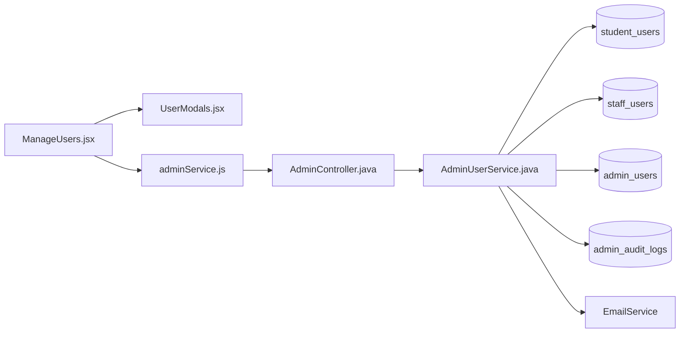
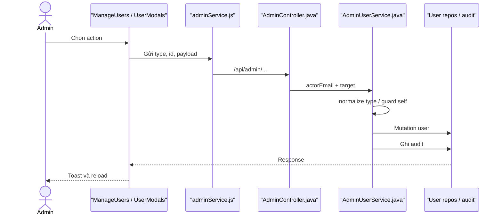

# User Management Feature Analysis

## 1. Tóm tắt tổng quan

User Management là luồng Admin dùng chung cho Student, Staff và Admin: list/detail/update, tạo Staff, reset password, soft delete/restore và đổi Staff role. Suspend/Activate được mô tả riêng. Mọi API nằm dưới `/api/admin/**`, yêu cầu ROLE_ADMIN và các mutation quan trọng ghi audit.

## 2. Bản đồ cấu trúc

| File | Vai trò | Loại |
|---|---|---|
| [ManageUsers.jsx](apps/frontend/src/features/management/admin/ManageUsers.jsx) | Điều phối tab, filter và action | React Page |
| [UserModals.jsx](apps/frontend/src/features/management/components/admin/UserModals.jsx) | Form/xác nhận mutation | Component |
| [adminService.js](apps/frontend/src/shared/api/adminService.js) | Toàn bộ Admin User API | API Service |
| [AdminController.java](apps/backend/src/main/java/com/jlpt/feature/admin/AdminController.java) | User management endpoints | Controller |
| [AdminUserService.java](apps/backend/src/main/java/com/jlpt/feature/admin/AdminUserService.java) | Business rules và mapping | Service |
| [StudentUserRepository.java](apps/backend/src/main/java/com/jlpt/feature/student/StudentUserRepository.java) | Student persistence | Repository |
| [StaffUserRepository.java](apps/backend/src/main/java/com/jlpt/feature/staff/StaffUserRepository.java) | Staff persistence | Repository |
| [AdminUserRepository.java](apps/backend/src/main/java/com/jlpt/feature/admin/AdminUserRepository.java) | Admin persistence | Repository |
| [AdminAuditLogRepository.java](apps/backend/src/main/java/com/jlpt/feature/admin/AdminAuditLogRepository.java) | Audit mutation | Repository |

## 3. Bản đồ kết nối



| Từ | Đến | Cách kết nối | Dữ liệu |
|---|---|---|---|
| UI | modal | props/callback | action/form |
| UI | adminService | async function | userType/id/payload |
| Controller | service | method | principal + target |
| Service | repositories | switch by type | entity |
| Service | audit/email | save/send | action/reset link |

## 4. Luồng xử lý theo trình tự

1. Admin chọn tab loại user và tải danh sách.
2. Các action mở modal tương ứng.
3. `adminService` gọi endpoint create/update/reset/delete/restore/role.
4. Controller lấy `authentication.getName()` cho mutation cần actor.
5. Service normalize type, chặn hành động tự sửa nguy hiểm và thao tác repository tương ứng.
6. Delete là soft delete, restore đổi trạng thái trở lại.
7. Mutation ghi `AdminAuditLog`; reset password còn tạo token và gửi email.



## 5. Vai trò đoạn code quan trọng

[adminService.js#L40](apps/frontend/src/shared/api/adminService.js#L40)

```js
export async function softDeleteUser(type, userId) {
  // Endpoint DELETE thực hiện soft delete trong service, không xóa vật lý bản ghi.
  const res = await api.delete(`/admin/users/${type}/${userId}`);
  return res.data.data;
}

export async function restoreUser(type, userId) {
  // Restore là mutation riêng để khôi phục trạng thái account.
  const res = await api.post(`/admin/users/${type}/${userId}/restore`);
  return res.data.data;
}
```

[AdminUserService.java#L611](apps/backend/src/main/java/com/jlpt/feature/admin/AdminUserService.java#L611)

```java
private String normalizeType(String type) {
    // Chuẩn hóa discriminator trước mọi switch repository.
    if (type == null) throw new BadRequestException("Loại người dùng không hợp lệ");
    return type.trim().toLowerCase();
}
```

## 6. Dữ liệu di chuyển

Modal payload + user type/id → Controller + Admin principal → service guard → entity mutation → audit/email side effect → response DTO → toast/reload.

## 7. Bảng tra cứu tổng hợp

| Bước | File | Function | Kết nối tới | Dữ liệu | Ghi chú |
|---:|---|---|---|---|---|
| 1 | ManageUsers | action handler | Modal | user/action | UI |
| 2 | adminService | API functions | Controller | type/id/body | HTTP |
| 3 | Controller | endpoints | Service | actor + target | Admin only |
| 4 | Service | `normalizeType` | correct repo | discriminator | Guard |
| 5 | Service | mutation | audit/email | outcome | Side effects |

## 8. Các mục cần bổ sung context

- Frontend hiện dùng cùng trang cho ba loại tài khoản; chi tiết Student-only nằm trong tài liệu riêng.
- Không mở rộng DTO của từng mutation để giữ phạm vi dưới 15 file.
