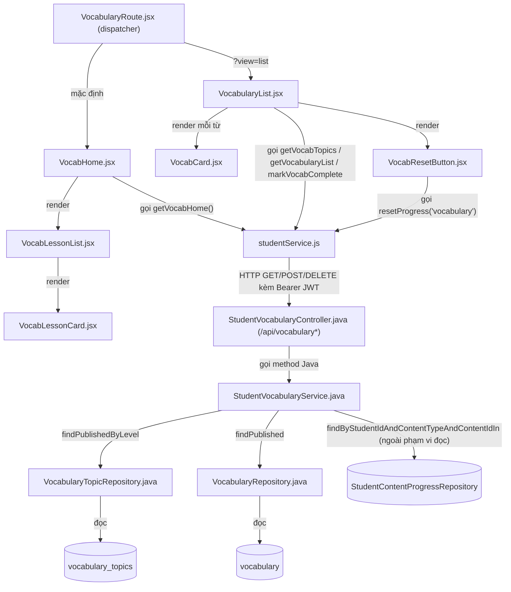
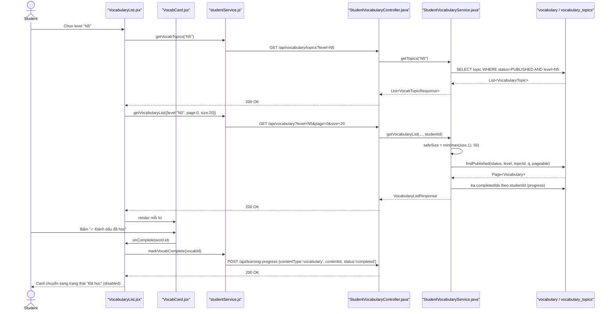

# Phân Tích Feature: Vocabulary (Học Từ Vựng)

> **Tác giả phân tích:** AI Senior Software Architect
> **Ngày phân tích:** 2026-07-22
> **Phạm vi:** Nhóm con của feature "learning" — góc nhìn Student (Vocab Home gamified + danh sách từ vựng dạng list, đánh dấu tiến độ)
> **Nguồn:** Đọc trực tiếp source code trong workspace

---

## 1. Tóm Tắt Tổng Quan

Feature **Vocabulary** cho phép Student học từ vựng theo 2 chế độ giao diện dùng chung 1 route: **Vocab Home** (gamified lesson-path, mặc định) và **Vocabulary List** (dạng danh sách có filter/search, kích hoạt qua query `?view=list`). Cả 2 đều cho phép đánh dấu 1 từ đã học và reset toàn bộ tiến độ.

Feature trải dài trên 3 tầng:

| Tầng | Mô tả |
|---|---|
| **Frontend (React)** | [VocabularyRoute.jsx](/apps/frontend/src/pages/vocabulary/VocabularyRoute.jsx) (dispatcher) → [VocabHome.jsx](/apps/frontend/src/pages/vocabulary/VocabHome.jsx) hoặc [VocabularyList.jsx](/apps/frontend/src/pages/vocabulary/VocabularyList.jsx), gọi API qua [studentService.js](/apps/frontend/src/api/studentService.js) |
| **Backend (Spring Boot)** | [StudentVocabularyController.java](/apps/backend/src/main/java/com/jlpt/feature/learning/StudentVocabularyController.java) → [StudentVocabularyService.java](/apps/backend/src/main/java/com/jlpt/feature/learning/StudentVocabularyService.java) → [VocabularyRepository](/apps/backend/src/main/java/com/jlpt/feature/learning/VocabularyRepository.java)/[VocabularyTopicRepository](/apps/backend/src/main/java/com/jlpt/feature/learning/VocabularyTopicRepository.java) |
| **Database** | Bảng `vocabulary`, `vocabulary_topics` (entity [Vocabulary.java](/apps/backend/src/main/java/com/jlpt/feature/learning/Vocabulary.java), [VocabularyTopic.java](/apps/backend/src/main/java/com/jlpt/feature/learning/VocabularyTopic.java)) |

**Entry point**: route `/vocabulary` (App.jsx:111, bọc `PrivateRoute`) → `VocabularyRoute` tự phân luồng nội bộ theo query string, không có route riêng cho từng chế độ hiển thị.

**Lưu ý phạm vi**: endpoint `GET /students/vocab-home` mà `VocabHome.jsx` gọi **không nằm trong 2 file Controller/Service backend đã đọc** (`StudentVocabularyController` chỉ expose `/api/vocabulary` và `/api/vocabulary/topics`) — xem Mục 8.

---

## 2. Bản Đồ Cấu Trúc (Các "Mảnh" Và Vai Trò)

### 2.1 Frontend

| File | Vai trò | Loại |
|---|---|---|
| [VocabularyRoute.jsx](/apps/frontend/src/pages/vocabulary/VocabularyRoute.jsx) | Dispatcher route `/vocabulary`: `?view=list` → `VocabularyList`, mặc định → `VocabHome` | Page (router) |
| [VocabHome.jsx](/apps/frontend/src/pages/vocabulary/VocabHome.jsx) | Trang gamified: streak, danh sách bài học theo lesson-path, điều hướng sang flashcard | Page Component |
| [VocabLessonList.jsx](/apps/frontend/src/pages/vocabulary/VocabLessonList.jsx) | Render danh sách `VocabLessonCard` theo thứ tự | Component |
| [VocabLessonCard.jsx](/apps/frontend/src/pages/vocabulary/VocabLessonCard.jsx) | Card 1 bài học, hiển thị tiến độ `learnedCount/totalWords` | Component |
| [VocabularyList.jsx](/apps/frontend/src/pages/vocabulary/VocabularyList.jsx) | Trang danh sách từ vựng dạng list: filter level/topic/search, đánh dấu hoàn thành, phân trang | Page Component |
| [VocabCard.jsx](/apps/frontend/src/components/student/VocabCard.jsx) | Card hiển thị 1 từ (audio, nghĩa, ví dụ, nút đánh dấu đã học) | Component |
| [VocabResetButton.jsx](/apps/frontend/src/components/student/VocabResetButton.jsx) | Nút reset toàn bộ tiến độ học Từ vựng | Component |
| [LessonVocabCard.jsx](/apps/frontend/src/components/student/LessonVocabCard.jsx) | Card từ vựng — không tìm thấy nơi sử dụng trong nhóm file Vocabulary đã đọc (xem Mục 8) | Component (chưa xác định nơi dùng) |
| [studentService.js](/apps/frontend/src/api/studentService.js) | Tầng gọi API: `getVocabHome`, `getVocabularyList`, `getVocabTopics`, `markVocabComplete`, `markProgress`, `resetProgress` | API Service |

### 2.2 Backend

| File | Vai trò | Loại |
|---|---|---|
| [StudentVocabularyController.java](/apps/backend/src/main/java/com/jlpt/feature/learning/StudentVocabularyController.java) | REST Controller `@PreAuthorize("hasRole('STUDENT')")`: `GET /api/vocabulary/topics`, `GET /api/vocabulary` | Controller |
| [StudentVocabularyService.java](/apps/backend/src/main/java/com/jlpt/feature/learning/StudentVocabularyService.java) | Business logic: lấy topic theo level, lấy danh sách từ vựng kèm trạng thái hoàn thành | Service |
| [Vocabulary.java](/apps/backend/src/main/java/com/jlpt/feature/learning/Vocabulary.java) | Entity JPA bảng `vocabulary` (word, furigana, meaning, jlptLevel, topicRef, audioUrl, ví dụ) | Entity |
| [VocabularyTopic.java](/apps/backend/src/main/java/com/jlpt/feature/learning/VocabularyTopic.java) | Entity JPA bảng `vocabulary_topics` (slug, titleJa, titleVi, displayOrder, status) | Entity |
| [VocabularyRepository.java](/apps/backend/src/main/java/com/jlpt/feature/learning/VocabularyRepository.java) | Query từ vựng published theo level/topic/search | Repository |
| [VocabularyTopicRepository.java](/apps/backend/src/main/java/com/jlpt/feature/learning/VocabularyTopicRepository.java) | Query topic published theo level, sắp theo `displayOrder` | Repository |
| [VocabTopicResponse.java](/apps/backend/src/main/java/com/jlpt/feature/learning/dto/VocabTopicResponse.java) | DTO 1 chủ đề (dùng chung Student + Staff) | DTO Response |
| [VocabularyListItemResponse.java](/apps/backend/src/main/java/com/jlpt/feature/learning/dto/VocabularyListItemResponse.java) | DTO 1 mục từ vựng, kèm `isCompleted` | DTO Response |
| [VocabularyListResponse.java](/apps/backend/src/main/java/com/jlpt/feature/learning/dto/VocabularyListResponse.java) | DTO trang danh sách (content + phân trang + `completedCount`) | DTO Response |

---

## 3. Bản Đồ Kết Nối (Ai Gọi Ai, Dữ Liệu Truyền Qua Đâu)

### 3.1 Diagram Mermaid — Architecture Overview



### 3.2 Bảng phụ — Kết nối chi tiết

| Từ (File A) | Đến (File B) | Cách kết nối | Dữ liệu truyền |
|---|---|---|---|
| `VocabularyRoute.jsx` | `VocabHome.jsx` / `VocabularyList.jsx` | Render có điều kiện theo `useSearchParams().get('view')` | Không truyền props đặc biệt |
| `VocabHome.jsx` | `studentService.js` | Gọi `getVocabHome(level)` qua Redux thunk | `level` (optional) → `GET /students/vocab-home` |
| `VocabularyList.jsx` | `studentService.js` | Gọi `getVocabTopics(level)` rồi `getVocabularyList({...})` | `level`, `{level, topicId, search, page, size}` |
| `VocabCard.jsx` | `VocabularyList.jsx` (qua prop `onComplete`) | Callback khi bấm nút đánh dấu | `word.id` |
| `VocabularyList.jsx` | `studentService.js` | Gọi `markVocabComplete(vocabId)` → nội bộ gọi `markProgress('vocabulary', vocabId)` | `vocabId` → `POST /learning-progress` |
| `VocabResetButton.jsx` | `studentService.js` | Gọi `resetProgress('vocabulary')` | `contentType='vocabulary'` → `DELETE /learning-progress/reset` |
| `studentService.js` | `StudentVocabularyController.java` | HTTP request thật (axios, JWT tự đính qua interceptor) | Query params / JSON body |
| `StudentVocabularyController.java` | `StudentVocabularyService.java` | Gọi method Java trực tiếp (Spring DI) | `level`, `topicId`, `search`, `page`, `size`, `studentId` (từ JWT) |
| `StudentVocabularyService.java` | `VocabularyRepository.java` / `VocabularyTopicRepository.java` | Spring Data JPA `@Query` | `PageRequest`, filter params |

---

## 4. Luồng Xử Lý Theo Trình Tự

Luồng **"Student chuyển sang chế độ danh sách, lọc theo level/topic, và đánh dấu 1 từ đã học"** (luồng có validate + business rule rõ nhất):

1. Student vào `/vocabulary?view=list` → `VocabularyRoute.jsx:14` render `VocabularyList`.
2. Khi `level` đổi, `VocabularyList.jsx:51-54` gọi `getVocabTopics(level)` ([studentService.js:138-141](/apps/frontend/src/api/studentService.js#L138-L141)) → `GET /vocabulary/topics?level=...`.
3. `StudentVocabularyController.getTopics` ([StudentVocabularyController.java:36-39](/apps/backend/src/main/java/com/jlpt/feature/learning/StudentVocabularyController.java#L36-L39)) ủy quyền cho `StudentVocabularyService.getTopics` ([StudentVocabularyService.java:37-42](/apps/backend/src/main/java/com/jlpt/feature/learning/StudentVocabularyService.java#L37-L42)): parse level **bắt buộc**, tìm topic `PUBLISHED` theo level.
4. `VocabularyList.jsx:56-78` (`fetchWords`) gọi `getVocabularyList({level, topicId, search, page, size})` ([studentService.js:128-135](/apps/frontend/src/api/studentService.js#L128-L135)) → `GET /vocabulary`.
5. `StudentVocabularyController.getVocabularyList` ([StudentVocabularyController.java:43-56](/apps/backend/src/main/java/com/jlpt/feature/learning/StudentVocabularyController.java#L43-L56)) validate `page≥0`, `1≤size≤100` bằng annotation, lấy `studentId` từ JWT.
6. `StudentVocabularyService.getVocabularyList` ([StudentVocabularyService.java:48-99](/apps/backend/src/main/java/com/jlpt/feature/learning/StudentVocabularyService.java#L48-L99)): **tự giới hạn lại `size` tối đa 50** (dòng 52, khác giới hạn 100 ở Controller), gọi `VocabularyRepository.findPublished` rồi tra tiến độ hoàn thành qua `StudentContentProgressRepository`, map sang `VocabularyListItemResponse` kèm `isCompleted`.
7. Kết quả render qua `VocabCard` ([VocabCard.jsx:3-51](/apps/frontend/src/components/student/VocabCard.jsx#L3-L51)) cho từng từ.
8. Student bấm nút đánh dấu đã học → `VocabularyList.jsx:80-90` (`handleComplete`) gọi `markVocabComplete(vocabId)` ([studentService.js:143-145](/apps/frontend/src/api/studentService.js#L143-L145)) → nội bộ gọi `markProgress('vocabulary', vocabId)` (dòng 65-68 → `POST /learning-progress`), cập nhật state cục bộ `isCompleted: true` ngay không cần load lại.

### 4.1 Sequence Diagram



---

## 5. Vai Trò Từng Đoạn Code Quan Trọng

### 5.1 Giới hạn `size` phân trang bị siết lại ở Service (khác giới hạn ở Controller)

File: [StudentVocabularyService.java:52](/apps/backend/src/main/java/com/jlpt/feature/learning/StudentVocabularyService.java#L52)

```java
int safeSize = Math.min(Math.max(size, 1), 50);
// Controller đã validate size <= 100 (@Max(100)), nhưng Service tự siết lại còn tối đa 50
// -> business rule ẩn, không thấy được nếu chỉ đọc Controller; ảnh hưởng UX phân trang thực tế
```
Giải thích: đây là 1 rule không tường minh — client tưởng có thể xin tới 100 item/trang (do Controller cho phép), nhưng thực tế backend luôn giới hạn 50.

### 5.2 Tính `completedCount` khác nhau tùy có lọc level hay không

File: [StudentVocabularyService.java:86-89](/apps/backend/src/main/java/com/jlpt/feature/learning/StudentVocabularyService.java#L86-L89)

```java
long completedCount = jlptLevel == null
        ? progressRepository.countCompleted(studentId, ContentType.VOCABULARY, ProgressStatus.COMPLETED)
        // Không lọc level -> đếm TỔNG toàn hệ thống (mọi cấp độ)
        : progressRepository.countCompletedVocabularyByLevel(
                studentId, jlptLevel, ContentType.VOCABULARY, ProgressStatus.COMPLETED);
        // Có lọc level -> chỉ đếm trong phạm vi level đó
```
Giải thích: rẽ nhánh này quyết định con số hiển thị ở progress bar phía FE — dễ gây hiểu nhầm nếu không biết rule này (số liệu "đã học X từ" thay đổi ý nghĩa tùy có chọn level hay không).

### 5.3 Query JPQL lọc published + level/topic/search đều optional

File: [VocabularyRepository.java:32-48](/apps/backend/src/main/java/com/jlpt/feature/learning/VocabularyRepository.java#L32-L48)

```java
@Query("""
        SELECT v FROM Vocabulary v
        WHERE v.status = :status
          AND (:jlptLevel IS NULL OR v.jlptLevel = :jlptLevel)
          AND (:topicId IS NULL OR v.topicRef.id = :topicId)
          AND (:q IS NULL OR v.word LIKE CONCAT('%', :q, '%')
            OR v.furigana LIKE CONCAT('%', :q, '%')
            OR v.meaning LIKE CONCAT('%', :q, '%'))
        ORDER BY v.jlptLevel ASC, v.word ASC
        """)
Page<Vocabulary> findPublished(...)
```
Giải thích: cho phép FE gọi API với bất kỳ tổ hợp filter nào (chỉ level, chỉ search, cả 2, hoặc không filter gì — chỉ `status=PUBLISHED` bắt buộc). *Lưu ý (do agent khảo sát cờ lại)*: cách nhóm ngoặc giữa nhánh `q` với 2 `OR` phía sau chưa được xác nhận 100% đúng độ ưu tiên toán tử — nếu cần khẳng định hành vi chính xác khi có `q` nhưng không có `jlptLevel`/`topicId`, nên viết test hoặc đọc thêm.

### 5.4 Nút "Đánh dấu đã học" — chặn double-submit, không cho un-complete

File: [VocabCard.jsx:39-46](/apps/frontend/src/components/student/VocabCard.jsx#L39-L46)

```jsx
<button
  className={`voc-btn-done${word.isCompleted ? ' voc-btn-done--active' : ''}`}
  onClick={() => !word.isCompleted && !isCompl && onComplete(word.id)}
  disabled={word.isCompleted || isCompl}
  aria-label={word.isCompleted ? 'Đã học' : 'Đánh dấu đã học'}
>
```
Giải thích: hành động là **một chiều** — không có nút "bỏ đánh dấu" ở đây, chỉ có thể quay lại "chưa học" bằng cách bấm `VocabResetButton` (reset toàn bộ tiến độ Vocabulary, không phải reset từng từ).

---

## 6. Dữ Liệu Di Chuyển Như Thế Nào

Theo dõi dữ liệu **"trạng thái hoàn thành 1 từ vựng" (`isCompleted`)** xuyên suốt hệ thống:

1. **Nguồn dữ liệu gốc**: bảng tiến độ học (`StudentContentProgress` — repository không nằm trong phạm vi đọc trực tiếp của phân tích này, chỉ xác nhận qua call site), lưu theo cặp `(studentId, contentType='VOCABULARY', contentId)`.
2. **Đọc lúc load danh sách**: `StudentVocabularyService.getVocabularyList` ([dòng 57-68](/apps/backend/src/main/java/com/jlpt/feature/learning/StudentVocabularyService.java#L57-L68)) lấy toàn bộ id vocabulary trong trang hiện tại, gọi 1 lần `findByStudentIdAndContentTypeAndContentIdIn` để có tập `completedIds`, rồi gắn cờ `isCompleted` khi map từng `Vocabulary` sang `VocabularyListItemResponse` — tránh N+1 query.
3. **Trả về Frontend**: field JSON `isCompleted` (boolean) giữ nguyên tên qua toàn bộ tầng — không đổi tên.
4. **Hiển thị**: `VocabCard.jsx` dùng trực tiếp `word.isCompleted` để quyết định class CSS (`voc-btn-done--active`) và `disabled` của nút.
5. **Cập nhật khi Student đánh dấu**: `VocabularyList.jsx` KHÔNG gọi lại API load danh sách — chỉ tự cập nhật state cục bộ React (`setState` đổi `isCompleted: true` cho đúng 1 item) sau khi `markVocabComplete` trả về thành công, đồng thời tăng biến đếm `stats.completed` cục bộ — nghĩa là con số `completedCount` hiển thị ngay lúc đó là **suy diễn ở FE**, không phải giá trị mới nhất truy vấn lại từ server.
6. **Reset toàn bộ**: `VocabResetButton` gọi `DELETE /learning-progress/reset?contentType=vocabulary` — xoá sạch mọi bản ghi tiến độ Vocabulary của Student đó, sau đó gọi lại `fetchWords` để đồng bộ thật với server (khác với bước 5 vốn không gọi lại API).

---

## 7. Bảng Tra Cứu Tổng Hợp

| Bước | File | Function | Kết nối tới | Dữ liệu | Ghi chú |
|---|---|---|---|---|---|
| 1 | [VocabularyRoute.jsx](/apps/frontend/src/pages/vocabulary/VocabularyRoute.jsx) | Component chính (dòng 12-16) | `VocabHome` / `VocabularyList` | `?view=` query param | Không có route path riêng cho 2 chế độ |
| 2 | [VocabularyList.jsx](/apps/frontend/src/pages/vocabulary/VocabularyList.jsx) | `useEffect` (dòng 51-54) | `studentService.getVocabTopics` | `level` | Chạy lại mỗi khi đổi level |
| 3 | [studentService.js](/apps/frontend/src/api/studentService.js) | `getVocabTopics()` (dòng 138-141) | `GET /vocabulary/topics` | `level` | — |
| 4 | [StudentVocabularyController.java](/apps/backend/src/main/java/com/jlpt/feature/learning/StudentVocabularyController.java) | `getTopics()` (dòng 36-39) | `StudentVocabularyService.getTopics` | `level` | `@PreAuthorize("hasRole('STUDENT')")` ở class-level |
| 5 | [StudentVocabularyService.java](/apps/backend/src/main/java/com/jlpt/feature/learning/StudentVocabularyService.java) | `getTopics()` (dòng 37-42) | `VocabularyTopicRepository.findPublishedByLevel` | `JlptLevel` đã parse | Level **bắt buộc** (khác `getVocabularyList`) |
| 6 | [VocabularyList.jsx](/apps/frontend/src/pages/vocabulary/VocabularyList.jsx) | `fetchWords()` (dòng 56-78) | `studentService.getVocabularyList` | `{level, topicId, search, page, size}` | — |
| 7 | [StudentVocabularyService.java](/apps/backend/src/main/java/com/jlpt/feature/learning/StudentVocabularyService.java) | `getVocabularyList()` (dòng 48-99) | `VocabularyRepository.findPublished` + progress repo | `safeSize≤50`, `completedIds` | Xem mục 5.1, 5.2 |
| 8 | [VocabCard.jsx](/apps/frontend/src/components/student/VocabCard.jsx) | Nút đánh dấu (dòng 39-46) | `VocabularyList.handleComplete` (prop callback) | `word.id` | Chặn double-submit bằng `isCompl` |
| 9 | [studentService.js](/apps/frontend/src/api/studentService.js) | `markVocabComplete()` (dòng 143-145) | `markProgress('vocabulary', vocabId)` | `vocabId` | Nội bộ gọi `POST /learning-progress` |
| 10 | [VocabResetButton.jsx](/apps/frontend/src/components/student/VocabResetButton.jsx) | Nút reset (dòng 10-29) | `studentService.resetProgress` | `contentType='vocabulary'` | Gọi lại `fetchWords` sau khi reset |

---

## 8. Các Mục Cần Bổ Sung Context

- **`GET /students/vocab-home`** (dùng bởi `VocabHome.jsx`) **không nằm trong Controller/Service đã đọc** (`StudentVocabularyController` chỉ có `/api/vocabulary` và `/api/vocabulary/topics`). Không tìm thấy trong source code đã đọc controller nào xử lý endpoint này — khả năng nằm ở 1 class khác trong `com.jlpt.feature.student` ngoài phạm vi 9 file backend đã khảo sát. Cần đọc thêm nếu muốn phân tích đầy đủ luồng Vocab Home.
- **`LessonVocabCard.jsx`** không thấy được import ở bất kỳ file nào trong nhóm Vocabulary đã đọc (VocabHome, VocabLessonCard, VocabLessonList, VocabularyList, VocabCard) — có thể dùng ở màn Lesson Detail (ngoài phạm vi feature này). Không tìm thấy trong source code đã đọc nơi sử dụng thật.
- **Field `lesson.totalWords`/`learnedCount`/`masteredCount`** dùng trong `VocabLessonCard.jsx` không khớp với field nào trong `VocabTopicResponse` (chỉ có `topicId, jlptLevel, slug, titleJa, titleVi, displayOrder, status`) — dữ liệu Vocab Home lessons phải đến từ 1 DTO/service khác chưa xác định. Không tìm thấy trong source code đã đọc.
- **`StudentContentProgressRepository`** (dùng trong `StudentVocabularyService`) không nằm trong phạm vi file được đọc trực tiếp — các method `findByStudentIdAndContentTypeAndContentIdIn`, `countCompleted`, `countCompletedVocabularyByLevel` chỉ được xác nhận qua cách gọi tại call site, chưa đọc source thật của repository này.
- **Độ ưu tiên toán tử trong JPQL** ở `VocabularyRepository.findPublished` (mục 5.3) — cần xác nhận thêm bằng test nếu cần khẳng định 100% hành vi khi có `search` nhưng không có `level`/`topicId`.
- **Route `/vocabulary/flashcard`** và component `VocabFlashcardSession.jsx` (được `VocabHome.jsx`/`VocabularyList.jsx` điều hướng tới sau khi chọn bài học) nằm ngoài phạm vi file được đọc của phân tích này — thuộc sang feature Flashcard SRS.
