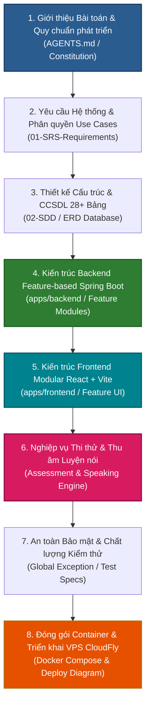

# Sơ Đồ Cấu Trúc Dự Án & Lộ Trình Thuyết Trình Bảo Vệ Đồ Án

> **Hệ Thống Học Tiếng Nhật JLPT (N5 - N1)**  
> **Kiến trúc:** Monorepo (Spring Boot 3.x Feature-based Backend + React 18 Modular Frontend)  
> **Ngày cập nhật:** 2026-07-25  

---

## I. SƠ ĐỒ CẤU TRÚC CÂY THƯ MỤC DỰ ÁN (PROJECT DIRECTORY TREE)

> 💡 *Ấn trực tiếp vào tên file/thư mục dưới đây để mở nhanh trên IDE hoặc GitHub.*

| Thư mục / Tệp tin Gốc (VS Code Explorer) | Thư mục Con / File Chi tiết & Link trực tiếp | Mô tả & Vai trò Thực tế trong Dự án |
| --- | --- | --- |
| **📁 [.agents/](../../../.agents)** | [.agents/](../../../.agents) | Cấu hình Automation Workflows & Dev Tools |
| | └── [workflows/analyze-feature.md](../../../.agents/workflows/analyze-feature.md) | Quy trình tự động phân tích tính năng chuyên sâu |
| **📁 [.claude/](../../../.claude)** | [.claude/](../../../.claude) | Cấu hình Development Assistant Tools |
| | └── [skills/](../../../.claude) | Thư viện kỹ năng mở rộng quy trình phát triển |
| **📁 [.github/](../../../.github)** | [.github/](../../../.github) | CI/CD Automation & Code Governance Gates |
| | ├── [PULL_REQUEST_TEMPLATE/](../../../.github/PULL_REQUEST_TEMPLATE) | Template quy chuẩn bắt buộc khi mở Pull Request |
| | └── [workflows/](../../../.github/workflows) | GitHub Actions kiểm tra Constitution Check & Consistency Gate |
| **📁 [.husky/](../../../.husky)** | [.husky/](../../../.husky) | Tự động kích hoạt Git Hooks kiểm tra mã nguồn trước khi commit |
| **📁 [.idea/](../../../.idea)** | [.idea/](../../../.idea) | Cấu hình dự án cho JetBrains IDE (IntelliJ IDEA / WebStorm) |
| **📁 [.playwright/](../../../.playwright)** | [.playwright/](../../../.playwright) | Môi trường và báo cáo chạy E2E Testing Playwright |
| **📁 [.postman/](../../../.postman)** | [.postman/](../../../.postman) | Cấu hình dữ liệu làm việc Postman Workspace |
| **📁 [.vs/](../../../.vs)** | [.vs/](../../../.vs) | Cấu hình môi trường cho Visual Studio |
| **📁 [.vscode/](../../../.vscode)** | [.vscode/](../../../.vscode) | Cấu hình Workspace, Extensions & Debugger trong VS Code |
| **📁 [apps/](../../../apps)** | [apps/](../../../apps) | Monorepo Applications (Chứa toàn bộ mã nguồn chính của dự án) |
| | ├── **[apps/backend/](../../../apps/backend)** | **Java 21 + Spring Boot 3.x (Feature-based Architecture)** |
| | │   ├── [pom.xml](../../../apps/backend/pom.xml) | Cấu hình Maven, Spring Boot dependencies, Flyway, JWT, Playwright |
| | │   ├── [Dockerfile](../../../apps/backend/Dockerfile) | Containerization build Docker image cho Backend Java |
| | │   ├── [.dockerignore](../../../apps/backend/.dockerignore) | Rules loại bỏ file khi build Docker image Backend |
| | │   ├── [.env.example](../../../apps/backend/.env.example) | Template biến môi trường riêng cho Backend |
| | │   ├── [spotless.xml](../../../apps/backend/spotless.xml) | Quy chuẩn format code Java tự động với Spotless |
| | │   ├── [src/main/java/com/jlpt/JlptApplication.java](../../../apps/backend/src/main/java/com/jlpt/JlptApplication.java) | Entry Point Spring Boot chính với `@SpringBootApplication`, `@ComponentScan` |
| | │   ├── *src/main/java/com/jlpt/shared/* | Hạ tầng dùng chung cắt ngang (Security, Exception, DTO, Config) |
| | │   │   ├── [shared/config/](../../../apps/backend/src/main/java/com/jlpt/shared/config) | Security, CORS, OpenAPI Swagger Configuration |
| | │   │   ├── [shared/security/](../../../apps/backend/src/main/java/com/jlpt/shared/security) | JWT Provider (`JwtTokenProvider`) & Filters xác thực User/Roles |
| | │   │   ├── [shared/exception/](../../../apps/backend/src/main/java/com/jlpt/shared/exception) | `GlobalExceptionHandler` bắt ngoại lệ và trả về JSON lỗi chuẩn |
| | │   │   ├── [shared/dto/](../../../apps/backend/src/main/java/com/jlpt/shared/dto) | `ApiResponse<T>`, `PagedResponse<T>` wrapper dữ liệu REST API |
| | │   │   ├── [shared/common/](../../../apps/backend/src/main/java/com/jlpt/shared/common) | Base Entity (`created_at`, `updated_at`, `is_deleted`) & Audit utils |
| | │   │   ├── [shared/email/](../../../apps/backend/src/main/java/com/jlpt/shared/email) | Dịch vụ gửi email kích hoạt tài khoản & thông báo hệ thống |
| | │   │   └── [shared/notification/](../../../apps/backend/src/main/java/com/jlpt/shared/notification) | Hạ tầng gửi và quản lý notification hệ thống |
| | │   ├── *src/main/java/com/jlpt/feature/* | Phân rã theo từng nghiệp vụ tính năng (Feature-based Package) |
| | │   │   ├── [feature/auth/](../../../apps/backend/src/main/java/com/jlpt/feature/auth) | Đăng nhập, Đăng ký, Refresh Token, OTP Kích hoạt tài khoản |
| | │   │   ├── [feature/student/](../../../apps/backend/src/main/java/com/jlpt/feature/student) | Nghiệp vụ Học viên, Tiến trình cá nhân & Dashboard |
| | │   │   ├── [feature/staff/](../../../apps/backend/src/main/java/com/jlpt/feature/staff) | Quản lý phân công công việc Nhân viên nội dung |
| | │   │   ├── [feature/staffcontent/](../../../apps/backend/src/main/java/com/jlpt/feature/staffcontent) | Soạn thảo Bài học, Từ vựng, Kanji, Ngữ pháp JLPT |
| | │   │   ├── [feature/admin/](../../../apps/backend/src/main/java/com/jlpt/feature/admin) | Quản trị viên hệ thống, Phân quyền Roles & Audit Logs |
| | │   │   ├── [feature/learning/](../../../apps/backend/src/main/java/com/jlpt/feature/learning) | Lộ trình học N5-N1, Mở khóa bài học theo thứ tự `lesson_order` |
| | │   │   ├── [feature/assessment/](../../../apps/backend/src/main/java/com/jlpt/feature/assessment) | Quiz, Thi thử Mock Test, Chấm điểm Server-side 100% bảo mật |
| | │   │   ├── [feature/flashcard/](../../../apps/backend/src/main/java/com/jlpt/feature/flashcard) | Thuật toán Spaced Repetition System (SRS) cho Flashcard Kanji/Vocab |
| | │   │   ├── [feature/dictionary/](../../../apps/backend/src/main/java/com/jlpt/feature/dictionary) | Tra cứu Từ vựng, Kanji, Hán tự & Ví dụ minh họa |
| | │   │   ├── [feature/speaking/](../../../apps/backend/src/main/java/com/jlpt/feature/speaking) | Xử lý Luyện nói & Thu âm phát âm tiếng Nhật |
| | │   │   ├── [feature/publishedcontent/](../../../apps/backend/src/main/java/com/jlpt/feature/publishedcontent) | Quản lý & hiển thị Nội dung bài học chính thức đã xuất bản |
| | │   │   ├── [feature/contentreview/](../../../apps/backend/src/main/java/com/jlpt/feature/contentreview) | Quy trình Duyệt bài học soạn thảo từ Staff lên Published |
| | │   │   ├── [feature/notification/](../../../apps/backend/src/main/java/com/jlpt/feature/notification) | Xử lý và phân phối thông báo người dùng |
| | │   │   └── [feature/support/](../../../apps/backend/src/main/java/com/jlpt/feature/support) | Hệ thống Ticket hỗ trợ học viên & Phản hồi |
| | │   ├── [src/main/resources/application.yml](../../../apps/backend/src/main/resources/application.yml) | Cấu hình Spring Boot chính (MySQL, Redis, Mail, JWT Secret) |
| | │   ├── [src/main/resources/db/migration/](../../../apps/backend/src/main/resources/db/migration) | Flyway SQL Migration Scripts (`V1__init_schema.sql` -> `V32__...`) |
| | │   └── [src/test/](../../../apps/backend/src/test) | Integration Tests & Unit Tests kiểm thử tự động Backend |
| | └── **[apps/frontend/](../../../apps/frontend)** | **React 18 + Vite + Tailwind CSS (Modular Feature UI)** |
| | ├── [package.json](../../../apps/frontend/package.json) | NPM scripts & dependencies (React 18, Vite, Redux/Zustand, Tailwind) |
| | ├── [vite.config.js](../../../apps/frontend/vite.config.js) | Vite Build & Proxy API sang Backend Server |
| | ├── [nginx.conf](../../../apps/frontend/nginx.conf) | Cấu hình Nginx Web Server SPA fallback routing |
| | ├── [Dockerfile](../../../apps/frontend/Dockerfile) | Containerization build Docker image cho Frontend SPA |
| | ├── [tailwind.config.js](../../../apps/frontend/tailwind.config.js) | Cấu hình Tailwind CSS & Custom Theme Tokens |
| | ├── [postcss.config.js](../../../apps/frontend/postcss.config.js) | Cấu hình PostCSS |
| | ├── [.eslintrc.json](../../../apps/frontend/.eslintrc.json) & [.prettierrc](../../../apps/frontend/.prettierrc) | Cấu hình Linting & Code Formatting Frontend |
| | ├── [index.html](../../../apps/frontend/index.html) | Single Page Application HTML Entry Point |
| | ├── [src/main.jsx](../../../apps/frontend/src/main.jsx) | Entry point chính khởi chạy React DOM App |
| | ├── [src/App.jsx](../../../apps/frontend/src/App.jsx) | Application Router Table & Dynamic Layout Providers |
| | ├── [src/index.css](../../../apps/frontend/src/index.css) | Stylesheet toàn cục & Utility CSS classes |
| | ├── [src/store/](../../../apps/frontend/src/store) | Quản lý Global State (Redux Toolkit / Zustand Store) |
| | ├── [src/shared/](../../../apps/frontend/src/shared) | Shared UI Components (Button, Modal, Navigation, Header, Layouts) |
| | └── *src/features/* | Phân rã Giao diện người dùng theo từng Feature |
| | ├── [features/auth/](../../../apps/frontend/src/features/auth) | UI Đăng nhập, Đăng ký, Quên mật khẩu, Token Guard |
| | ├── [features/dashboard/](../../../apps/frontend/src/features/dashboard) | UI Dashboard Học viên, Staff & Admin |
| | ├── [features/courses/](../../../apps/frontend/src/features/courses) | UI Lộ trình học N5 -> N1 & Danh sách bài học |
| | ├── [features/kana/](../../../apps/frontend/src/features/kana) | UI Học Bảng chữ cái Hiragana & Katakana |
| | ├── [features/kanji/](../../../apps/frontend/src/features/kanji) | UI Học Kanji, Flashcard & Tập viết nét (Stroke Order) |
| | ├── [features/vocabulary/](../../../apps/frontend/src/features/vocabulary) | UI Học Từ vựng, Audio phát âm & Thẻ ghi nhớ |
| | ├── [features/grammar/](../../../apps/frontend/src/features/grammar) | UI Học Ngữ pháp JLPT theo cấp độ |
| | ├── [features/mock-test/](../../../apps/frontend/src/features/mock-test) | UI làm bài Thi thử JLPT, Đồng hồ đếm ngược đồng bộ Server |
| | ├── [features/speaking/](../../../apps/frontend/src/features/speaking) | UI Thu âm luyện nói & Xem kết quả đánh giá phát âm AI |
| | ├── [features/notebook/](../../../apps/frontend/src/features/notebook) | UI Sổ tay lưu trữ từ vựng/Kanji cá nhân của học viên |
| | ├── [features/dictionary/](../../../apps/frontend/src/features/dictionary) | UI Tra cứu từ điển Hán tự / Từ vựng đa năng |
| | ├── [features/management/](../../../apps/frontend/src/features/management) | UI Quản lý soạn thảo nội dung dành cho Staff / Admin |
| | ├── [features/notifications/](../../../apps/frontend/src/features/notifications) | UI Trung tâm Thông báo người dùng |
| | ├── [features/onboarding/](../../../apps/frontend/src/features/onboarding) | UI Hướng dẫn ban đầu cho học viên mới |
| | ├── [features/profile/](../../../apps/frontend/src/features/profile) | UI Quản lý hồ sơ cá nhân & Đổi mật khẩu |
| | ├── [features/progress/](../../../apps/frontend/src/features/progress) | UI Theo dõi tiến trình học tập & Biểu đồ thống kê |
| | ├── [features/public/](../../../apps/frontend/src/features/public) | Trang chủ Landing Page công khai & Giới thiệu khóa học |
| | ├── [features/quiz/](../../../apps/frontend/src/features/quiz) | UI Làm bài Quiz nhanh sau mỗi bài học |
| | └── [features/settings/](../../../apps/frontend/src/features/settings) | UI Cài đặt giao diện, ngôn ngữ & tài khoản |
| **📁 [docs/](../../)** | [docs/](../../) | Hệ thống Tài liệu Kỹ thuật & Thiết kế Dự án (SDD System) |
| | ├── **[01-SRS-Requirements/](../../01-SRS-Requirements)** | **Đặc tả Yêu cầu Phần mềm (SRS) & System Rules** |
| | │   ├── [shared_context.md](../../01-SRS-Requirements/shared_context.md) | Bối cảnh dùng chung & Mô hình bài toán E-learning |
| | │   ├── [constraints/global.md](../../01-SRS-Requirements/constraints/global.md) | Ràng buộc công nghệ (Java 21, React 18, Naming conventions) |
| | │   ├── [constraints/business.md](../../01-SRS-Requirements/constraints/business.md) | Ràng buộc nghiệp vụ (Bảo mật JWT, Soft delete, JLPT score rules) |
| | │   ├── [constraints/safety.md](../../01-SRS-Requirements/constraints/safety.md) | Ràng buộc an toàn hệ thống (Cấm thao tác DB sản xuất) |
| | │   └── [use-cases/Bao_cao_dac_ta_Use_Case.md](../../01-SRS-Requirements/use-cases/Bao_cao_dac_ta_Use_Case.md) | Báo cáo đặc tả Use Case chi tiết cho Student, Staff, Admin |
| | ├── **[02-SDD-Architecture/](../)** | **Thiết kế Kiến trúc & Cơ sở dữ liệu (SDD)** |
| | │   ├── [system-design/SoDoDuAn.md](./SoDoDuAn.md) | [File Hiện Tại] Sơ đồ cấu trúc dự án & Lộ trình bảo vệ đồ án |
| | │   ├── [system-design/refactor-layer-to-feature.md](./refactor-layer-to-feature.md) | Tài liệu tái cấu trúc Backend sang Feature-based |
| | │   ├── [database-design/JLPT_database.md](../database-design/JLPT_database.md) | Thiết kế Chi tiết 28+ Bảng Database & Indexing |
| | │   ├── [database-design/MYSQL_MIGRATION_PLAN.md](../database-design/MYSQL_MIGRATION_PLAN.md) | Kế hoạch Migration dữ liệu MySQL |
| | │   ├── [feat_flow/](../../02-SDD-Architecture/feat_flow) | Phân tích luồng hoạt động chi tiết từng tính năng |
| | │   └── [ui-ux-design/DESIGN.md](../ui-ux-design/DESIGN.md) | Đặc tả Thiết kế Giao diện UI/UX & Design Tokens |
| | ├── **[03-Interface-Specs/](../../03-Interface-Specs)** | **Đặc tả Interface API & Feature Specs** |
| | │   ├── [api-postman/JLPT_Auth_API_Tests.postman_collection.json](../../03-Interface-Specs/api-postman/JLPT_Auth_API_Tests.postman_collection.json) | Postman Test Collection cho API Auth |
| | │   ├── [api-postman/JLPT_Local_Environment.postman_environment.json](../../03-Interface-Specs/api-postman/JLPT_Local_Environment.postman_environment.json) | Postman Local Environment Config |
| | │   └── [feature-specs/](../../03-Interface-Specs/feature-specs) | Chi tiết SPEC/PLAN/TASKS cho từng Feature |
| | ├── **[04-Test-Specs/](../../04-Test-Specs)** | **Kiểm thử & Đảm bảo Chất lượng** |
| | │   ├── [SPEC_VALIDATION_COVERAGE.md](../../04-Test-Specs/SPEC_VALIDATION_COVERAGE.md) | Báo cáo bao phủ Validation Backend |
| | │   ├── [TEST_SPEC_AUTH_API.md](../../04-Test-Specs/TEST_SPEC_AUTH_API.md) | Kịch bản kiểm thử API Authentication |
| | │   ├── [VALIDATION_ERROR_CATALOG.md](../../04-Test-Specs/VALIDATION_ERROR_CATALOG.md) | Danh mục lỗi Validation hệ thống |
| | │   └── [SPEC_DEAD_CODE_AUDIT.md](../../04-Test-Specs/SPEC_DEAD_CODE_AUDIT.md) | Kiểm tra và dọn dẹp mã nguồn thừa |
| | ├── **[05-Deployment/](../../05-Deployment)** | **Hướng dẫn Triển khai & Vận hành Production** |
| | │   ├── [CloudFly_VPS_Deployment_Guide.md](../../05-Deployment/CloudFly_VPS_Deployment_Guide.md) | Hướng dẫn triển khai thực tế trên CloudFly VPS |
| | │   ├── [Deploy_Diagram.md](../../05-Deployment/Deploy_Diagram.md) | Sơ đồ Hạ tầng Deploy (Reverse Proxy, Docker Containers) |
| | │   └── [Docker_Cheatsheet.md](../../05-Deployment/Docker_Cheatsheet.md) | Lệnh Docker vận hành sản phẩm |
| | ├── **[06-Management/](../../06-Management)** | **Quy chuẩn Phát triển & Tài liệu Bảo vệ Đồ án** |
| | │   ├── [constitution.md](../../06-Management/constitution.md) | Hiến pháp kỹ thuật dự án |
| | │   ├── [CODING-SPEC-variable-naming.md](../../06-Management/CODING-SPEC-variable-naming.md) | Quy chuẩn đặt tên biến & API Contract |
| | │   └── [THESIS_DEFENSE_QNA.md](../../06-Management/THESIS_DEFENSE_QNA.md) | Bộ 50+ Câu hỏi & Đáp án Phản biện Bảo vệ Đồ án |
| | ├── **[07-Release-Documents/](../../07-Release-Documents)** | **Tài liệu đóng gói phát hành các phiên bản** |
| | ├── [README.md](../../README.md) | Tổng quan hệ thống tài liệu |
| | └── [implementation_plan.md](../../implementation_plan.md) | Kế hoạch thực thi phát triển hệ thống |
| **📁 [graphify-out/](../../../graphify-out)** | [graphify-out/](../../../graphify-out) | Kết quả phân tích Knowledge Graph toàn bộ codebase |
| **📁 [node_modules/](../../../node_modules)** | [node_modules/](../../../node_modules) | Thư viện và dependencies Node.js cài đặt ở Root |
| **📁 [postman/](../../../postman)** | [postman/](../../../postman) | Thư mục lưu trữ Postman Collections & Environments xuất khẩu |
| | ├── [JLPT_Learning_Platform.postman_collection.json](../../../postman/JLPT_Learning_Platform.postman_collection.json) | Full Postman API Collection toàn bộ hệ thống |
| | └── [JLPT_Local_Environment.postman_environment.json](../../../postman/JLPT_Local_Environment.postman_environment.json) | Local Environment Variables cho Postman |
| **📁 [Temp_Document/](../../../Temp_Document)** | [Temp_Document/](../../../Temp_Document) | Tài liệu báo cáo đồ án & phát hành dạng Word / PDF |
| | ├── Template4_Issues Report.pdf | Báo cáo theo dõi lỗi hệ thống |
| | └── Template5_Final Release Document.docx | Báo cáo tổng kết phát hành đồ án |
| **📄 [.env](../../../.env)** | [.env](../../../.env) | File lưu trữ biến môi trường thực tế tại máy Local |
| **📄 [.env.example](../../../.env.example)** | [.env.example](../../../.env.example) | Template khai báo danh sách biến môi trường hệ thống |
| **📄 [.gitignore](../../../.gitignore)** | [.gitignore](../../../.gitignore) | Khai báo các file/thư mục không commit lên Git repository |
| **📄 [AGENTS.md](../../../AGENTS.md)** | [AGENTS.md](../../../AGENTS.md) | Quy tắc Agent, Domain Rules JLPT, Forbidden & Golden Patterns |
| **📄 [analyze-feature.md](../../../analyze-feature.md)** | [analyze-feature.md](../../../analyze-feature.md) | Workflow phân tích tính năng tại root |
| **📄 [backend_logs.txt](../../../backend_logs.txt)** | [backend_logs.txt](../../../backend_logs.txt) | File log chạy thực tế của Spring Boot Backend |
| **📄 [CLAUDE.md](../../../CLAUDE.md)** | [CLAUDE.md](../../../CLAUDE.md) | Project DNA, Architecture overview, ADRs (ADR-001 -> ADR-008) |
| **📄 [constitution.md](../../06-Management/constitution.md)** | [constitution.md](../../06-Management/constitution.md) | Hiến pháp kỹ thuật dự án (Technical Governance & Hard Rules) |
| **📄 [docker-compose.prod.yml](../../../docker-compose.prod.yml)** | [docker-compose.prod.yml](../../../docker-compose.prod.yml) | Orchestration môi trường Production Server |
| **📄 [docker-compose.staging.yml](../../../docker-compose.staging.yml)** | [docker-compose.staging.yml](../../../docker-compose.staging.yml) | Orchestration môi trường Staging Test |
| **📄 [docker-compose.yml](../../../docker-compose.yml)** | [docker-compose.yml](../../../docker-compose.yml) | Orchestration môi trường Local Dev (MySQL 8, Mailhog, Redis) |
| **📄 [package-lock.json](../../../package-lock.json)** | [package-lock.json](../../../package-lock.json) | NPM Dependency Lockfile ở Root |
| **📄 [package.json](../../../package.json)** | [package.json](../../../package.json) | Root scripts quản lý Monorepo workspace |

---

## II. LÝ DO TỒN TẠI VÀ CÁCH THỨC HOẠT ĐỘNG CỦA CÁC THÀNH PHẦN (WHY & HOW)

### 1. Thư mục Gốc (Root) & Bộ Ba Quản Trị Dự Án (Governance Triangle)

> 🛡️ **Bộ ba File Quản trị Luôn Đồng Hành:** `constitution.md` ↔ `AGENTS.md` ↔ `CLAUDE.md` đóng vai trò là "Kiềng 3 chân" định hình toàn bộ chuẩn mực kỹ thuật, quy định an toàn và tri thức kiến trúc của dự án.

#### [constitution.md](../../06-Management/constitution.md) (Hiến Pháp Kỹ Thuật)

* **WHY (Tại sao):** Đóng vai trò là "Hiến pháp kỹ thuật" (Technical Constitution) của hệ thống. Quy định các nguyên tắc công nghệ cốt lõi bất biến, chuẩn mực an toàn bảo mật, tiêu chuẩn kiểm thử và workflow phát triển mà mọi lập trình viên và AI Agent phải tuân thủ tuyệt đối.
* **HOW (Hoạt động như thế nào):** Thiết lập các quy định cứng về Tech Stack (Java 21, Spring Boot 3.x, React 18), Git workflow, Security Standards. File này được liên kết trực tiếp với các kịch bản tự động hóa CI/CD của GitHub Actions (`constitution-check.yml`) để tự động chặn các commit hoặc Pull Request vi phạm quy tắc.

#### [AGENTS.md](../../../AGENTS.md) (Quy Tắc Agent & Domain Rules)

* **WHY (Tại sao):** Đóng vai trò là "Luật nghiệp vụ cốt lõi & Persona" quản lý mọi hoạt động của lập trình viên và AI Agent. Đảm bảo toàn bộ dự án tuân thủ nghiêm ngặt các quy tắc an toàn (cấm log linh tinh, cấm hard delete, cấm tính điểm ở frontend, bắt buộc kiểm tra subscription).
* **HOW (Hoạt động như thế nào):** Khai báo các điều khoản bất biến (Forbidden Patterns, Golden Patterns, JLPT Domain Rules). Được tự động inject vào ngữ cảnh phát triển và kiểm tra tính tuân thủ khi viết mã.

#### [CLAUDE.md](../../../CLAUDE.md) (Project DNA & Quyết Định Kiến Trúc ADR)

* **WHY (Tại sao):** Đóng vai trò "DNA & Bộ nhớ kiến trúc" của dự án. Lưu trữ lại các bài học kinh nghiệm, thiết kế kiến trúc tổng thể, và các quyết định kiến trúc quan trọng (ADRs - Architecture Decision Records).
* **HOW (Hoạt động như thế nào):** Liệt kê các quyết định ADR-001 đến ADR-008 (ví dụ: ADR-007 chọn OCR Similarity % thay vì phân tích nét chữ stroke order) để ngăn ngừa việc tranh cãi hoặc thay đổi kiến trúc sai hướng trong tương lai.

#### [docker-compose.yml](../../../docker-compose.yml)

* **WHY (Tại sao):** Đóng gói và chuẩn hóa môi trường phát triển (Development) chỉ bằng một câu lệnh duy nhất (`docker compose up`), loại bỏ hoàn toàn lỗi "chạy được trên máy tôi nhưng không chạy được trên máy bạn".
* **HOW (Hoạt động như thế nào):** Tự động khởi tạo và kết nối các dịch vụ: MySQL 8 database Server, Mailhog (gi giả lập server gửi mail kích hoạt tài khoản), Redis Cache (lưu trữ token/session).

---

### 2. Mã nguồn Backend (`apps/backend`) — Java 21 + Spring Boot 3.x

Backend được thiết kế theo kiến trúc **Feature-based Package Architecture** (Phân rã theo Tính năng) nhằm thay thế mô hình Layered Architecture cũ, giúp các tính năng hoàn toàn độc lập, dễ mở rộng và bảo trì.

#### [JlptApplication.java](../../../apps/backend/src/main/java/com/jlpt/JlptApplication.java)

* **WHY (Tại sao):** Class trung tâm kích hoạt và khởi chạy ứng dụng Spring Boot.
* **HOW (Hoạt động như thế nào):** Khai báo các annotation mở rộng `@ComponentScan(basePackages = "com.jlpt")`, `@EntityScan`, `@EnableJpaRepositories` để Spring quét và tự động inject tất cả bean từ cả package `shared` và `feature`.

#### [shared/](../../../apps/backend/src/main/java/com/jlpt/shared) (Hạ tầng hạ tầng dùng chung)

* **WHY (Tại sao):** Tránh lặp lại code (DRY) và đảm bảo tính nhất quán trên toàn hệ thống cho các tác vụ cắt ngang (Cross-cutting Concerns) như Security, Exception, DTO chuẩn.
* **HOW (Hoạt động như thế nào):**
  * `security/`: Chứa `JwtTokenProvider` và `JwtAuthenticationFilter` để giải mã JWT, xác thực User và phân quyền Roles (STUDENT, STAFF, ADMIN) real-time.
  * `exception/`: Chứa `GlobalExceptionHandler` nhận toàn bộ ngoại lệ trong ứng dụng và trả về định dạng JSON lỗi chuẩn (`{ status, message, data }`).
  * `dto/`: Cung cấp lớp `ApiResponse<T>` chuẩn hóa mọi dữ liệu phản hồi từ REST API.

#### [feature/](../../../apps/backend/src/main/java/com/jlpt/feature) (Các module tính năng độc lập)

* **WHY (Tại sao):** Gom tất cả các class liên quan đến một nghiệp vụ cụ thể (Controller, Service, Repository, Entity, DTO) vào cùng một package thay vì xé lẻ ra các tầng.
* **HOW (Hoạt động như thế nào):**
  * `assessment/`: Chịu trách nhiệm tính điểm thi thử JLPT hoàn toàn ở Server-side. Nhận danh sách câu trả lời của sinh viên, so sánh với đáp án trong DB, kiểm tra thời gian làm bài server, và ghi nhận bản ghi mới vào bảng `quiz_attempts`.
  * `speaking/`: Xử lý nhận dạng giọng nói học viên khi luyện phát âm tiếng Nhật, so sánh chuỗi âm thanh/transcription nhận dạng được với mẫu chuẩn để chấm điểm phát âm.
  * `learning/`: Quản lý logic mở khóa bài học theo thứ tự `lesson_order`, ghi log hoạt động học tập vào bảng `learning_activity_log`.
  * `db/migration/`: Chứa các file SQL Flyway (`V1__init_schema.sql`, `V2__seed_data.sql`...). Khi backend khởi chạy, Flyway tự động kiểm tra và thực thi các bản vá DB mà không làm mất dữ liệu cũ.

---

### 3. Mã nguồn Frontend (`apps/frontend`) — React 18 + Vite

Frontend đóng vai trò là **Untrusted Client** (giao diện hiển thị), tuân thủ nguyên tắc cấm chứa logic nghiệp vụ quan trọng.

#### [src/App.jsx](../../../apps/frontend/src/App.jsx) & [src/main.jsx](../../../apps/frontend/src/main.jsx)

* **WHY (Tại sao):** Định tuyến giao diện (Routing) và khởi tạo ứng dụng React.
* **HOW (Hoạt động như thế nào):** Quản lý bảng tuyến đường (React Router DOM), bảo vệ các Private Routes bằng Token Guard, chỉ cho phép học viên hoặc staff đã đăng nhập truy cập các trang tương ứng.

#### [src/features/](../../../apps/frontend/src/features) (Modular UI Components)

* **WHY (Tại sao):** Tổ chức giao diện và giao tiếp API theo từng miền tính năng để mã nguồn gọn gàng, tái sử dụng cao.
* **HOW (Hoạt động như thế nào):**
  * `mock-test/`: Hiển thị giao diện bài thi JLPT, bộ đếm ngược thời gian (đồng bộ đồng hồ Server). Khi hết giờ hoặc bấm nộp bài, chỉ gửi payload câu trả lời về API Backend và nhận kết quả điểm số về hiển thị.
  * `kanji/`: Cung cấp component xem thẻ Kanji, stroke-order animation (thứ tự nét viết) và canvas luyện viết Kanji.
  * `speaking/`: Tích hợp Browser Web Speech API / Audio Recorder để thu âm trực tiếp giọng nói học viên, lưu trữ bản thu để học viên tự nghe và rèn luyện.

---

### 4. Hệ thống Tài liệu Kỹ thuật (`docs/`) — SDD System

Hệ thống tài liệu được phân chia thành 7 thư mục chuẩn hóa theo mô hình Quản trị Phần mềm Chuyên nghiệp.

#### [01-SRS-Requirements/](../../01-SRS-Requirements)

* **WHY (Tại sao):** Định nghĩa rõ ràng các yêu cầu chức năng, phi chức năng và ràng buộc nghiệp vụ hệ thống.
* **HOW (Hoạt động như thế nào):** Chứa `shared_context.md`, quy định ràng buộc (`constraints/global.md`, `business.md`, `safety.md`) và chi tiết đặc tả Use Case cho từng vai trò người dùng trong `Bao_cao_dac_ta_Use_Case.md`.

#### [02-SDD-Architecture/](../)

* **WHY (Tại sao):** Cung cấp bức tranh toàn cảnh về thiết kế kiến trúc phần mềm, cơ sở dữ liệu và luồng dữ liệu của hệ thống.
* **HOW (Hoạt động như thế nào):** Chứa thiết kế 28+ bảng CSDL (`database-design/JLPT_database.md`), kế hoạch migration MySQL, phân tích luồng dữ liệu từng tính năng (`feat_flow/`) và tài liệu hướng dẫn refactor package (`refactor-layer-to-feature.md`).

#### [03-Interface-Specs/](../../03-Interface-Specs)

* **WHY (Tại sao):** Chuẩn hóa Hợp đồng giao tiếp API (API Contract) và đặc tả chi tiết cho từng tính năng giữa Backend và Frontend.
* **HOW (Hoạt động như thế nào):** Chứa bộ Postman Test Collections (`JLPT_Auth_API_Tests.postman_collection.json`), Postman Environment config và thư mục `feature-specs/` lưu trữ các tài liệu SPEC/PLAN/TASKS chi tiết cho từng đợt nâng cấp.

#### [04-Test-Specs/](../../04-Test-Specs)

* **WHY (Tại sao):** Đảm bảo chất lượng mã nguồn (Quality Assurance), đo lường độ bao phủ kiểm thử và ngăn ngừa lỗi phát sinh.
* **HOW (Hoạt động như thế nào):** Chứa danh mục lỗi validation (`VALIDATION_ERROR_CATALOG.md`), test spec API Auth (`TEST_SPEC_AUTH_API.md`), báo cáo độ bao phủ validation (`SPEC_VALIDATION_COVERAGE.md`) và báo cáo dọn dẹp mã nguồn thừa (`SPEC_DEAD_CODE_AUDIT.md`).

#### [05-Deployment/](../../05-Deployment)

* **WHY (Tại sao):** Hướng dẫn quy trình đóng gói, container hóa và triển khai ứng dụng lên máy chủ VPS sản xuất thực tế.
* **HOW (Hoạt động như thế nào):** Cung cấp hướng dẫn từng bước deploy VPS CloudFly (`CloudFly_VPS_Deployment_Guide.md`), sơ đồ hạ tầng triển khai (`Deploy_Diagram.md`) và các câu lệnh vận hành Docker (`Docker_Cheatsheet.md`).

#### [06-Management/](../../06-Management) & [constitution.md](../../06-Management/constitution.md)

* **WHY (Tại sao):** Quản trị quy chuẩn phát triển phần mềm và chuẩn bị kịch bản bảo vệ đồ án tốt nghiệp trước Hội đồng.
* **HOW (Hoạt động như thế nào):**
  * **[constitution.md](../../06-Management/constitution.md):** Đóng vai trò là "Hiến pháp kỹ thuật", bắt buộc áp dụng tiêu chuẩn code, security và testing cho toàn bộ dự án.
  * **[CODING-SPEC-variable-naming.md](../../06-Management/CODING-SPEC-variable-naming.md):** Chuẩn hóa quy tắc đặt tên biến và API.
  * **[THESIS_DEFENSE_QNA.md](../../06-Management/THESIS_DEFENSE_QNA.md):** Bộ hơn 50 câu hỏi & câu trả lời phản biện chuyên sâu dành riêng cho buổi bảo vệ đồ án.

#### [07-Release-Documents/](../../07-Release-Documents)

* **WHY (Tại sao):** Lưu trữ tài liệu đóng gói và sơ đồ phát hành các phiên bản phần mềm theo chu kỳ.
* **HOW (Hoạt động như thế nào):** Chứa thư mục `diagrams/` lưu trữ các sơ đồ tổng kết phát hành chính thức của ứng dụng.

---

## III. SƠ ĐỒ THUYẾT TRÌNH BẢO VỆ ĐỒ ÁN (THESIS DEFENSE PRESENTATION ROADMAP)

> 🎯 **Mục tiêu:** Hướng dẫn thứ tự giới thiệu dự án một cách logic, ấn tượng và thuyết phục nhất dành cho Hội đồng giảng viên và người tham dự (những người chưa từng biết về dự án).

### 1. Sơ đồ Luồng Thuyết Trình (Mermaid Diagram)



---

### 2. Kịch bản Thuyết trình Chi tiết 8 Bước Dành cho Bảo Vệ Đồ Án

| Bước | Thành phần / File Minh chứng | Mục đích Giới thiệu | Kịch bản Nói (Talking Points dành cho Hội đồng) | Điểm cộng Kỹ thuật (Technical Highlights) |
| --- | --- | --- | --- | --- |
| **1** | [AGENTS.md](../../../AGENTS.md)<br/>[constitution.md](../../06-Management/constitution.md) | Giới thiệu bài toán E-Learning tiếng Nhật JLPT & Quy chuẩn phát triển | *"Em xin chào Hội đồng. Dự án của chúng em là Hệ thống luyện thi tiếng Nhật JLPT từ N5 đến N1. Ngay từ đầu, nhóm đã xây dựng một bộ 'Hiến pháp kỹ thuật' và quy định bất biến trong AGENTS.md để đảm bảo mã nguồn tuân thủ tiêu chuẩn doanh nghiệp, tuyệt đối không có hardcode secret hay tính điểm sai lệch ở client."* | Chuẩn hóa quy trình phát triển chuyên nghiệp, có Audit Trail & Governance gate. |
| **2** | [shared_context.md](../../01-SRS-Requirements/shared_context.md)<br/>[use-cases/](../../01-SRS-Requirements/use-cases) | Trình bày bài toán nghiệp vụ & Phân quyền các vai trò | *"Hệ thống phục vụ 3 vai trò rõ rệt: Học viên (luyện tập Kanji, Từ vựng, Ngữ pháp, Thi thử), Nhân viên Content (soạn thảo và trình duyệt bài học), và Quản trị viên (quản lý người dùng, phân quyền VIP và xem báo cáo audit log)."* | Phân rã Use Case theo từng Actor rõ ràng, chuẩn hóa tài liệu SRS. |
| **3** | [database-design/](../database-design)<br/>[refactor-layer-to-feature.md](./refactor-layer-to-feature.md) | Trình bày Thiết kế CSDL & Đột phá Kiến trúc | *"Cơ sở dữ liệu được thiết kế tối ưu với hơn 28 bảng, đánh Indexing chuẩn xác cho truy vấn tra cứu Kanji/Từ vựng. Đặc biệt, nhóm đã thực hiện bước chuyển dịch kiến trúc quan trọng từ Layered sang Feature-based Package Architecture để tối ưu hóa khả năng mở rộng."* | CSDL chuẩn hóa 3NF, có Flyway Migration tự động, kiến trúc Feature-based hiện đại. |
| **4** | [apps/backend/](../../../apps/backend)<br/>[JlptApplication.java](../../../apps/backend/src/main/java/com/jlpt/JlptApplication.java)<br/>[shared/](../../../apps/backend/src/main/java/com/jlpt/shared) | Demonstrating Backend Java 21 & Spring Boot 3 | *"Về Backend, chúng em sử dụng Java 21 và Spring Boot 3. Toàn bộ xử lý nghiệp vụ được đóng gói trong thư mục feature/ độc lập. Tầng shared/ đảm nhận bảo mật JWT, xử lý ngoại lệ tập trung qua GlobalExceptionHandler và trả về dữ liệu chuẩn JSON ApiResponse."* | Spring Security + JWT phân quyền real-time, kiến trúc sạch (Clean Architecture). |
| **5** | [apps/frontend/](../../../apps/frontend)<br/>[src/App.jsx](../../../apps/frontend/src/App.jsx)<br/>[src/features/](../../../apps/frontend/src/features) | Demonstrating Frontend React 18 + Vite | *"Giao diện người dùng được xây dựng bằng React 18 kết hợp Vite cho tốc độ phản hồi tức thì. Frontend được chia theo từng Feature UI tương ứng với Backend. Khởi tạo tuyến đường động với Router Table và bảo vệ các đường dẫn riêng tư qua Token Guard."* | SPA hiệu năng cao, UI Responsive, tách biệt hoàn toàn Logic khỏi Client. |
| **6** | [feature/speaking/](../../../apps/backend/src/main/java/com/jlpt/feature/speaking)<br/>[feature/assessment/](../../../apps/backend/src/main/java/com/jlpt/feature/assessment) | Trình bày Nghiệp vụ Trọng tâm: Thu âm Luyện nói & Chấm thi Server | *"Điểm sáng của dự án là tính năng Thu âm Luyện nói tiếng Nhật cùng tính năng Thi thử Mock Test với cơ chế chấm điểm server-side 100% bảo mật. Kết quả làm bài thi được lưu dưới dạng bất biến để đảm bảo tính minh bạch."* | Chấm điểm Server-side độc lập, Server-side time & score validation, chống gian lận điểm số. |
| **7** | [04-Test-Specs/](../../04-Test-Specs)<br/>[THESIS_DEFENSE_QNA.md](../../06-Management/THESIS_DEFENSE_QNA.md) | Chứng minh Chất lượng Mã nguồn & Khả năng Phản biện | *"Nhóm đã xây dựng bộ tài liệu kiểm thử toàn diện từ Unit Test, Integration Test API Auth cho đến thống kê độ bao phủ lỗi Validation. Đồng thời, nhóm đã chuẩn bị sẵn bộ tài liệu phản biện THESIS_DEFENSE_QNA với hơn 50 tình huống kỹ thuật phức tạp."* | Test coverage cao, xử lý lỗi chặt chẽ, tư duy phản biện hệ thống tốt. |
| **8** | [docker-compose.yml](../../../docker-compose.yml)<br/>[05-Deployment/](../../05-Deployment) | Trình bày Đóng gói Docker & Triển khai thực tế | *"Cuối cùng, toàn bộ hệ thống Monorepo đã được container hóa bằng Docker & Docker Compose. Ứng dụng đã sẵn sàng triển khai trên VPS CloudFly với Web Server Nginx đóng vai trò Reverse Proxy và SSL/TLS bảo mật."* | Containerization sẵn sàng cho CI/CD, có sơ đồ hạ tầng Deployment chi tiết. |

---

> 📌 **Lời khuyên khi thuyết trình trước Hội đồng:**
>
> 1. Luôn mở trực tiếp sơ đồ cây này trên IDE để khi Giảng viên hỏi tới file/chức năng nào, bạn chỉ cần **click trực tiếp vào đường dẫn** là có thể mở ngay file mã nguồn minh chứng.
> 2. Mở đầu thuyết trình bằng **Bước 1 & Bước 4** để tạo ấn tượng mạnh về sự chỉn chu trong kiến trúc và quy chuẩn quản trị dự án.
---

## PHỤ LỤC — SƠ ĐỒ CẤU TRÚC ĐỀ XUẤT TRƯỚC ĐÂY

> Nội dung local được giữ lại sau khi đồng bộ phiên bản mới từ remote để tiện đối chiếu.

```text
japanese-elearning-project/
│
├── .sdd/                              # [ĐỔI] Bỏ prefix "1." → tự ẩn trên Linux/Mac
│   ├── constitution.md                # "Hiến pháp" dự án (Hard rules, bảo mật, kiến trúc)
│   ├── shared_context.md              # Ngữ cảnh dùng chung để đồng bộ giữa các AI Agent
│   │
│   ├── constraints/                   # Ràng buộc chi tiết cho AI Agent
│   │   ├── global.md                  # Tech stack (Java, React), Naming convention
│   │   ├── business.md                # Ràng buộc nghiệp vụ (JWT, Soft delete, JLPT rules)
│   │   └── safety.md                  # Ràng buộc an toàn (Cấm xóa DB production)
│   │
│   ├── specs/                         # Đặc tả tính năng chi tiết
│   │   ├── _template.md               # Template mẫu để tạo Spec mới
│   │   ├── feat-auth/                 # Module Đăng nhập / Đăng ký
│   │   │   ├── SPEC.md                # Đặc tả đã chốt (Locked)
│   │   │   ├── PLAN.md                # Kế hoạch thực thi do AI lập
│   │   │   └── TASKS.md               # Danh sách task nhỏ đã chia
│   │   ├── feat-mock-test/            # Tính năng Thi thử JLPT Mock Test
│   │   └── feat-flashcard/            # Tính năng Quản lý Flashcard
│   │
│   ├── skills/                        #  [GIỮ] Thư viện kỹ năng chuyên sâu cho Agent
│   │   └── sql-performance.md         # Kỹ năng tối ưu truy vấn Database
│   │
│   ├── rfcs/                          # Lưu trữ các quyết định kiến trúc (ADR)
│   └── reviews/                       #  [GIỮ] Kết quả AI review Spec để phát hiện lỗi
│
├── .agents/                           #  [ĐỔI] Bỏ prefix "2." → tự ẩn
│   ├── AGENTS.md                      # Persona, công nghệ, giới hạn của Agent
│   ├── CLAUDE.md                      # Project DNA, bài học kinh nghiệm, ngữ cảnh
│   └── .agentignore                   # File cấm AI đọc để tránh nhiễu ngữ cảnh
│
├── .github/                           # [ĐỔI] Bỏ prefix "6." → dùng tên chuẩn GitHub
│   ├── workflows/
│   │   ├── constitution-check.yml     # Validation gate chặn commit vi phạm quy tắc
│   │   └── consistency-gate.yml       # Kiểm tra độ đồng nhất giữa Code và Spec
│   └── PULL_REQUEST_TEMPLATE/
│       └── prompt_change.md           # Template bắt buộc điền khi sửa AGENTS.md
│
├── apps/                              #  [THAY ĐỔI LỚN] Monorepo — mã nguồn chính
│   │
│   ├── backend/                       # Toàn bộ code Java / Spring Boot
│   │   ├── src/
│   │   │   ├── main/
│   │   │   │   ├── java/com/jlpt/
│   │   │   │   │   ├── controller/    # REST Controllers
│   │   │   │   │   ├── service/       # Business Logic
│   │   │   │   │   ├── repository/    # JPA Repositories
│   │   │   │   │   ├── entity/        # JPA Entities
│   │   │   │   │   ├── dto/           # Request / Response DTOs
│   │   │   │   │   ├── mapper/        # Entity ↔ DTO Mappers
│   │   │   │   │   ├── config/        # Spring Security, JWT, CORS config
│   │   │   │   │   └── exception/     # Global Exception Handler
│   │   │   │   └── resources/
│   │   │   │       ├── application.yml
│   │   │   │       ├── application-dev.yml
│   │   │   │       └── db/migration/  # Flyway migration scripts (V1__, V2__...)
│   │   │   └── test/                  # Unit & Integration Tests
│   │   │       └── java/com/jlpt/
│   │   └── pom.xml
│   │
│   └── frontend/                      # Toàn bộ code React / TypeScript
│       ├── src/
│       │   ├── components/            # UI Components (PascalCase.tsx)
│       │   ├── pages/                 # Page-level components
│       │   ├── hooks/                 # Custom Hooks (useXxx.ts)
│       │   ├── api/                   # API Client functions
│       │   ├── types/                 # TypeScript Types (XxxType.ts)
│       │   ├── schemas/               # Zod validation schemas
│       │   └── utils/                 # Utility functions
│       ├── cypress/                   # E2E Testing
│       └── package.json
│
├── database/                          #  [THÊM MỚI] Quản lý Database tập trung
│   ├── init.sql                       # Script tạo DB ban đầu (PostgreSQL / SQL Server)
│   ├── seeds/                         # Dữ liệu mẫu
│   │   ├── kanji_seed.sql             # Dữ liệu Kanji N5–N1
│   │   ├── vocabulary_seed.sql        # Dữ liệu Từ vựng
│   │   └── users_seed.sql             # Tài khoản test (Admin, Student, Staff)
│   └── erd-diagram.png                # Sơ đồ thiết kế Database
│
├── docs/                              #  [ĐỔI] Bỏ prefix "5."
│   ├── api/                           # API Contract (Swagger / OpenAPI JSON)
│   ├── architecture/                  # Sơ đồ luồng hệ thống
│   └── deployment/                    #  [THÊM MỚI] Hướng dẫn deploy lên server
│
├── plan.md                            # Master Plan — quản lý Task hiện tại
├── docker-compose.yml                 #  [THÊM MỚI] Môi trường Dev (PostgreSQL, Redis...)
├── .env.example                       #  [THÊM MỚI] Template biến môi trường
├── AGENTS.md                          # Symlink → .agents/AGENTS.md
└── CLAUDE.md                          # Symlink → .agents/CLAUDE.md
```
