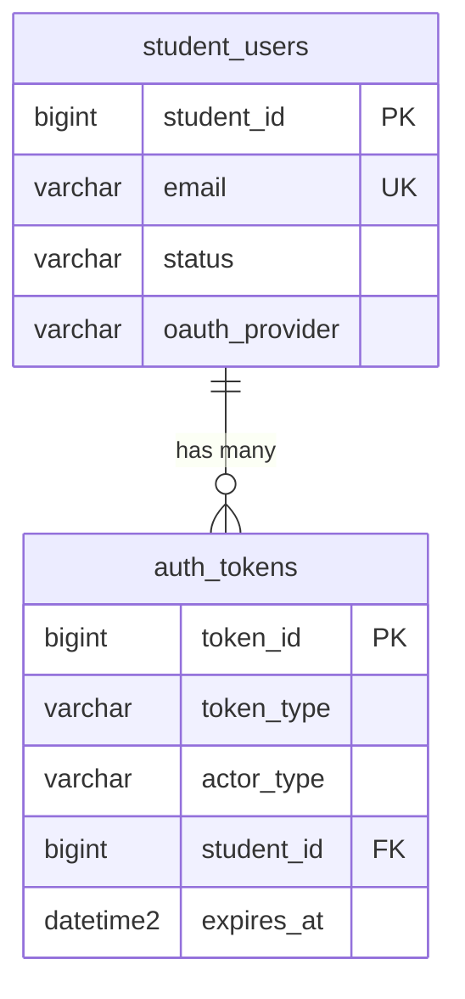

# SPEC — Authentication & Account Management
>
> **Feature ID:** `feat-auth`
> **UC Coverage:** UC-01, UC-02, UC-03, UC-04, UC-05, UC-18
> **Version:** 1.0 | **Status:** Draft
> **Author:** Team | **Last Updated:** 2026-05-28

---

## 1. CONTEXT & GOAL

### 1.1 Bối cảnh

Hệ thống cần xác thực danh tính người dùng (Student) để bảo vệ nội dung học tập và đảm bảo dữ liệu tiến trình cá nhân hóa chính xác. Đây là cổng vào bắt buộc của toàn bộ nền tảng.

### 1.2 Mục tiêu

- Cung cấp đăng nhập an toàn qua Email/Password và Google OAuth
- Quản lý phiên làm việc (session) bằng JWT stateless
- Cho phép đăng ký tài khoản mới với xác minh email
- Hỗ trợ khôi phục và đổi mật khẩu
- Cho phép xem và chỉnh sửa hồ sơ cá nhân

### 1.3 Tại sao cần?

Không có xác thực → không thể cá nhân hóa lộ trình học, lưu tiến trình, phân quyền VIP hay bảo vệ nội dung premium. Đây là foundation của toàn bộ hệ thống.

---

## 2. ACTOR

| Actor | Role | Điều kiện tiền quyết |
|:---|:---|:---|
| **Guest** (Khách) | Người dùng chưa đăng nhập | Truy cập internet |
| **Student** (Học viên) | Người dùng đã có tài khoản | Tài khoản tồn tại, status = `active` |

---

## 3. FUNCTIONAL REQUIREMENTS (EARS)

### 3.1 UC-01 — Đăng nhập (Login)

| ID | EARS Requirement |
|:---|:---|
| FR-AUTH-01 | WHEN a Guest submits a valid email and password, THE SYSTEM SHALL verify credentials against `student_users`, issue a JWT access token and session token in `auth_tokens`, and redirect the user to the Dashboard. |
| FR-AUTH-02 | WHEN a Guest chooses Google OAuth login, THE SYSTEM SHALL redirect to Google OAuth provider, receive the authorization code, create or link a `student_users` record using `oauth_provider_id`, and issue session tokens. |
| FR-AUTH-03 | IF a Guest submits an incorrect password, THEN THE SYSTEM SHALL increment the failed attempt counter and return HTTP 401 with message "Sai mật khẩu". |
| FR-AUTH-04 | WHEN a Guest fails login 5 consecutive times, THE SYSTEM SHALL temporarily lock the account for 15 minutes and return HTTP 429 with message "Tài khoản tạm thời bị khóa". |
| FR-AUTH-05 | WHILE a Student's account has `status = 'suspended'`, THE SYSTEM SHALL reject all login attempts with HTTP 403 and display the suspension reason. |
| FR-AUTH-06 | THE SYSTEM SHALL store passwords using bcrypt with cost factor ≥ 10 and never log or transmit plaintext passwords. |
| FR-AUTH-07 | THE SYSTEM SHALL issue JWT with expiry of 15 minutes and a separate refresh token with expiry of 7 days stored in `auth_tokens` with `token_type = 'refresh'`. |

### 3.2 UC-02 — Đăng ký (Register)

| ID | EARS Requirement |
|:---|:---|
| FR-AUTH-10 | WHEN a Guest submits registration with full_name, email, password, and confirmed password, THE SYSTEM SHALL validate all fields, create a new `student_users` record with `status = 'pending'`, and send an email containing a 6-digit OTP code. |
| FR-AUTH-11 | IF the submitted email already exists in `student_users`, THEN THE SYSTEM SHALL return HTTP 409 with message "Email đã được sử dụng" and suggest navigating to the Login page. |
| FR-AUTH-12 | THE SYSTEM SHALL enforce password strength: minimum 8 characters, at least 1 uppercase letter, 1 number. |
| FR-AUTH-13 | WHEN a Guest submits the correct 6-digit OTP code together with their email (`token_type = 'email_verification'`) within its 10-minute validity, THE SYSTEM SHALL update `student_users.status` to `'active'` and delete the OTP token. |
| FR-AUTH-14 | IF an email verification OTP has expired (> 10 minutes) OR has been guessed incorrectly more than 5 times, THEN THE SYSTEM SHALL reject the request (`OTP_EXPIRED` / `TOO_MANY_ATTEMPTS`) and require the Guest to request a new code via resend-verification. |

### 3.3 UC-03 — Khôi phục mật khẩu (Reset Password)

| ID | EARS Requirement |
|:---|:---|
| FR-AUTH-20 | WHEN a Guest submits a password reset request with a registered email, THE SYSTEM SHALL generate a `password_reset` token (expires in 15 minutes), store it in `auth_tokens`, and send a reset link to the email. |
| FR-AUTH-21 | IF the submitted email does not exist in the system, THEN THE SYSTEM SHALL still return HTTP 200 with a generic message "Nếu email tồn tại, bạn sẽ nhận được link đặt lại mật khẩu" to prevent email enumeration. |
| FR-AUTH-22 | WHEN a Guest submits a new password with a valid reset token, THE SYSTEM SHALL update `student_users.password_hash`, invalidate all existing `session` and `password_reset` tokens for this user, and return HTTP 200. |
| FR-AUTH-23 | IF a password reset token has been used or expired, THEN THE SYSTEM SHALL return HTTP 400 with message "Link đặt lại mật khẩu không hợp lệ hoặc đã hết hạn". |

### 3.4 UC-04 — Hồ sơ cá nhân (User Profile)

| ID | EARS Requirement |
|:---|:---|
| FR-AUTH-30 | WHEN an authenticated Student accesses the profile page, THE SYSTEM SHALL display: avatar_url, full_name, email, current_jlpt_level, target_jlpt_level, phone, and join date. |
| FR-AUTH-31 | WHEN a Student submits profile updates (full_name, phone, target_jlpt_level, avatar_url), THE SYSTEM SHALL validate and persist changes to `student_users`. |
| FR-AUTH-32 | THE SYSTEM SHALL NOT allow a Student to change their own `email` or `role` via the profile endpoint. |
| FR-AUTH-33 | WHILE uploading an avatar image, THE SYSTEM SHALL store the file in `/uploads` or S3 and save only the URL in `student_users.avatar_url`. THE SYSTEM SHALL NOT store image BLOB in the database. |

### 3.5 UC-05 — Đổi mật khẩu (Change Password)

| ID | EARS Requirement |
|:---|:---|
| FR-AUTH-40 | WHEN an authenticated Student submits current_password, new_password, and confirm_new_password, THE SYSTEM SHALL verify the current password against `password_hash`. |
| FR-AUTH-41 | IF the current password is incorrect, THEN THE SYSTEM SHALL return HTTP 400 with message "Mật khẩu hiện tại không đúng". |
| FR-AUTH-42 | WHEN the current password is verified, THE SYSTEM SHALL update `password_hash` with bcrypt (cost ≥ 10) and invalidate all other active `session` tokens for this user. |
| FR-AUTH-43 | IF the new password is the same as the current password, THEN THE SYSTEM SHALL return HTTP 422 with message "Mật khẩu mới không được giống mật khẩu cũ". |

### 3.6 UC-18 — Đăng xuất (Logout)

| ID | EARS Requirement |
|:---|:---|
| FR-AUTH-50 | WHEN an authenticated Student triggers logout, THE SYSTEM SHALL revoke and delete the current session token from `auth_tokens` and return HTTP 200. |
| FR-AUTH-51 | THE SYSTEM SHALL redirect the user to the Login page after successful logout. |
| FR-AUTH-52 | WHEN a Student logs out from one device, THE SYSTEM SHALL only invalidate the token for that specific session (not all sessions unless "logout all devices" is explicitly requested). |

---

## 4. NON-FUNCTIONAL REQUIREMENTS

| ID | Category | Requirement |
|:---|:---|:---|
| NFR-AUTH-01 | Performance | Login API phải phản hồi < 500ms (p95) không tính OAuth redirect |
| NFR-AUTH-02 | Security | Password phải bcrypt cost ≥ 10; không log plaintext password bao giờ |
| NFR-AUTH-03 | Security | JWT phải ký bằng RS256 hoặc HS256 (secret ≥ 256 bit); không lưu JWT trong DB |
| NFR-AUTH-04 | Security | Mật khẩu Admin dùng bcrypt cost ≥ 12 — cao hơn mức tối thiểu cho Student/Staff |
| NFR-AUTH-05 | Security | Reset token và email verification token phải là random URL-safe string ≥ 32 bytes |
| NFR-AUTH-06 | Logging | Mọi đăng nhập thành công/thất bại phải log với SLF4J: `[INFO/WARN] [AuthService] {email, ip, result}` |
| NFR-AUTH-07 | Availability | Auth endpoints phải available 99.5% uptime |
| NFR-AUTH-08 | Rate Limiting | Login endpoint giới hạn 10 request/phút/IP để chống brute force |

---

## 5. DATA MODEL

### 5.1 Bảng chính

> Nguồn: [`jlpt_database_v2.sql`](file:///d:/Japanese-Skill-Practice-Platform/3.src/infra/Database/jlpt_database_v2.sql)

```sql
-- Bảng 1: admin_users
CREATE TABLE admin_users (
    admin_id             BIGINT IDENTITY(1,1) PRIMARY KEY,
    email                NVARCHAR(255)   NOT NULL UNIQUE,
    password_hash        NVARCHAR(255)   NULL,                       -- NULL for OAuth login
    full_name            NVARCHAR(150)   NOT NULL,
    status               NVARCHAR(20)    NOT NULL DEFAULT 'active'
        CHECK (status IN ('active','suspended','pending','deleted')),
    suspend_reason       NVARCHAR(500)   NULL,
    email_verified_at    DATETIME2       NULL,
    -- Security & Authentication
    login_attempts       INT             NOT NULL DEFAULT 0,
    locked_until         DATETIME2       NULL,
    last_login_at        DATETIME2       NULL,
    last_login_ip        NVARCHAR(45)    NULL,
    password_changed_at  DATETIME2       NULL,
    two_factor_enabled   BIT             NOT NULL DEFAULT 0,
    two_factor_secret    NVARCHAR(255)   NULL,

    created_at           DATETIME2       NOT NULL DEFAULT SYSUTCDATETIME(),
    updated_at           DATETIME2       NOT NULL DEFAULT SYSUTCDATETIME()
);

-- Bảng 2: staff_users (includes StaffManager via staff_role)
CREATE TABLE staff_users (
    staff_id             BIGINT IDENTITY(1,1) PRIMARY KEY,
    email                NVARCHAR(255)   NOT NULL UNIQUE,
    password_hash        NVARCHAR(255)   NULL,
    full_name            NVARCHAR(150)   NOT NULL,
    staff_role           NVARCHAR(30)    NOT NULL DEFAULT 'staff'
        CHECK (staff_role IN ('staff','staff_manager')),
    status               NVARCHAR(20)    NOT NULL DEFAULT 'active'
        CHECK (status IN ('active','suspended','pending','deleted')),
    suspend_reason       NVARCHAR(500)   NULL,
    email_verified_at    DATETIME2       NULL,
    -- Security & Authentication
    login_attempts       INT             NOT NULL DEFAULT 0,
    locked_until         DATETIME2       NULL,
    last_login_at        DATETIME2       NULL,
    last_login_ip        NVARCHAR(45)    NULL,
    password_changed_at  DATETIME2       NULL,

    created_at           DATETIME2       NOT NULL DEFAULT SYSUTCDATETIME(),
    updated_at           DATETIME2       NOT NULL DEFAULT SYSUTCDATETIME()
);

-- Bảng 3: student_users
CREATE TABLE student_users (
    student_id           BIGINT IDENTITY(1,1) PRIMARY KEY,
    email                NVARCHAR(255)   NOT NULL UNIQUE,
    password_hash        NVARCHAR(255)   NULL,                       -- NULL for OAuth login
    full_name            NVARCHAR(150)   NOT NULL,
    status               NVARCHAR(20)    NOT NULL DEFAULT 'active'
        CHECK (status IN ('active','suspended','pending','deleted')),
    suspend_reason       NVARCHAR(500)   NULL,
    email_verified_at    DATETIME2       NULL,
    avatar_url           NVARCHAR(500)   NULL,
    phone                NVARCHAR(20)    NULL,

    -- OAuth fields (single identity per student)
    oauth_provider       NVARCHAR(30)    NULL
        CHECK (oauth_provider IN ('google','facebook','apple','github')),
    oauth_provider_id    NVARCHAR(255)   NULL,
    oauth_provider_email NVARCHAR(255)   NULL,                       -- Email returned from OAuth provider
    oauth_linked_at      DATETIME2       NULL,                       -- Timestamp when OAuth was linked

    -- JLPT Level
    current_jlpt_level   NVARCHAR(5)     NULL
        CHECK (current_jlpt_level IN ('N5','N4','N3','N2','N1')),
    target_jlpt_level    NVARCHAR(5)     NULL
        CHECK (target_jlpt_level IN ('N5','N4','N3','N2','N1')),

    -- Study streak statistics
    current_streak       INT             NOT NULL DEFAULT 0,
    longest_streak       INT             NOT NULL DEFAULT 0,
    last_activity_date   DATE            NULL,

    -- Security & Authentication
    login_attempts       INT             NOT NULL DEFAULT 0,
    locked_until         DATETIME2       NULL,
    last_login_at        DATETIME2       NULL,
    last_login_ip        NVARCHAR(45)    NULL,
    password_changed_at  DATETIME2       NULL,

    created_at           DATETIME2       NOT NULL DEFAULT SYSUTCDATETIME(),
    updated_at           DATETIME2       NOT NULL DEFAULT SYSUTCDATETIME()
);

-- Bảng 4: auth_tokens (Shared auth token table for Admin / Staff / Student)
CREATE TABLE auth_tokens (
    token_id        BIGINT IDENTITY(1,1) PRIMARY KEY,
    actor_type      NVARCHAR(20)    NOT NULL
        CHECK (actor_type IN ('admin','staff','student')),
    admin_id        BIGINT          NULL,
    staff_id        BIGINT          NULL,
    student_id      BIGINT          NULL,
    token_type      NVARCHAR(30)    NOT NULL
        CHECK (token_type IN ('session','email_verification','password_reset','refresh')),
    token_value     NVARCHAR(500)   NOT NULL,
    ip_address      NVARCHAR(45)    NULL,
    expires_at      DATETIME2       NOT NULL,
    revoked_at      DATETIME2       NULL,
    created_at      DATETIME2       NOT NULL DEFAULT SYSUTCDATETIME(),

    CONSTRAINT FK_auth_tokens_admin   FOREIGN KEY (admin_id)   REFERENCES admin_users(admin_id)   ON DELETE CASCADE,
    CONSTRAINT FK_auth_tokens_staff   FOREIGN KEY (staff_id)   REFERENCES staff_users(staff_id)   ON DELETE CASCADE,
    CONSTRAINT FK_auth_tokens_student FOREIGN KEY (student_id) REFERENCES student_users(student_id) ON DELETE CASCADE,
    CONSTRAINT CK_auth_token_actor CHECK (
        (actor_type = 'admin'   AND admin_id   IS NOT NULL AND staff_id IS NULL   AND student_id IS NULL) OR
        (actor_type = 'staff'   AND staff_id   IS NOT NULL AND admin_id IS NULL   AND student_id IS NULL) OR
        (actor_type = 'student' AND student_id IS NOT NULL AND admin_id IS NULL   AND staff_id   IS NULL)
    )
);
```

### 5.2 Quan hệ



---

## 6. API SPEC

### `POST /api/auth/login`

**Actor:** Guest | **Auth:** None

**Request:**

```json
{
  "email": "string — địa chỉ email",
  "password": "string — mật khẩu"
}
```

**Response (200):**

```json
{
  "status": 200,
  "message": "Đăng nhập thành công",
  "data": {
    "accessToken": "string — JWT (15 phút)",
    "refreshToken": "string — (7 ngày)",
    "student": {
      "studentId": "long",
      "fullName": "string",
      "email": "string",
      "currentJlptLevel": "string",
      "avatarUrl": "string|null"
    }
  }
}
```

---

### `POST /api/auth/register`

**Actor:** Guest | **Auth:** None

**Request:**

```json
{
  "fullName": "string — họ tên đầy đủ",
  "email": "string — email hợp lệ",
  "password": "string — mật khẩu (min 8 ký tự)",
  "confirmPassword": "string — xác nhận mật khẩu"
}
```

**Response (201):**

```json
{
  "status": 201,
  "message": "Đăng ký thành công. Vui lòng kiểm tra email để xác minh tài khoản.",
  "data": {
    "studentId": "long",
    "email": "string"
  }
}
```

> Đăng ký thành công sẽ tự động gửi 1 email chứa mã OTP 6 số (hết hạn sau 10 phút) đến `email`.
> Frontend chuyển hướng ngay sang `/verify-email?email={email}` để khách nhập mã.

---

### `POST /api/auth/verify-email`

**Actor:** Guest | **Auth:** None

**Request:**

```json
{ "email": "string", "otpCode": "string — mã 6 số nhận được qua email" }
```

**Response (200):**

```json
{
  "status": 200,
  "message": "Xác minh email thành công. Bạn có thể đăng nhập.",
  "data": null
}
```

**Lỗi có thể gặp:** `400 INVALID_OTP` (mã sai), `400 OTP_EXPIRED` (hết hạn/không còn token), `429 TOO_MANY_ATTEMPTS` (nhập sai quá 5 lần).

---

### `POST /api/auth/forgot-password`

**Actor:** Guest | **Auth:** None

**Request:**

```json
{ "email": "string" }
```

**Response (200):**

```json
{
  "status": 200,
  "message": "Nếu email tồn tại, bạn sẽ nhận được link đặt lại mật khẩu.",
  "data": null
}
```

---

### `POST /api/auth/reset-password`

**Actor:** Guest | **Auth:** None

**Request:**

```json
{
  "token": "string — token từ email reset",
  "newPassword": "string",
  "confirmPassword": "string"
}
```

**Response (200):**

```json
{
  "status": 200,
  "message": "Đặt lại mật khẩu thành công.",
  "data": null
}
```

---

### `GET /api/students/me`

**Actor:** Student | **Auth:** Bearer JWT

**Response (200):**

```json
{
  "status": 200,
  "message": "OK",
  "data": {
    "studentId": "long",
    "fullName": "string",
    "email": "string",
    "phone": "string|null",
    "avatarUrl": "string|null",
    "currentJlptLevel": "string",
    "targetJlptLevel": "string|null",
    "createdAt": "datetime"
  }
}
```

---

### `PUT /api/students/me`

**Actor:** Student | **Auth:** Bearer JWT

**Request:**

```json
{
  "fullName": "string|optional",
  "phone": "string|optional",
  "targetJlptLevel": "string|optional — N5|N4|N3|N2|N1",
  "avatarUrl": "string|optional — URL after upload"
}
```

**Response (200):**

```json
{
  "status": 200,
  "message": "Cập nhật hồ sơ thành công",
  "data": { "...updated StudentResponse..." }
}
```

---

### `PUT /api/students/me/password`

**Actor:** Student | **Auth:** Bearer JWT

**Request:**

```json
{
  "currentPassword": "string",
  "newPassword": "string",
  "confirmPassword": "string"
}
```

**Response (200):**

```json
{
  "status": 200,
  "message": "Đổi mật khẩu thành công.",
  "data": null
}
```

---

### `POST /api/auth/logout`

**Actor:** Student | **Auth:** Bearer JWT

**Response (200):**

```json
{
  "status": 200,
  "message": "Đăng xuất thành công.",
  "data": null
}
```

---

### `POST /api/auth/refresh`

**Actor:** Student | **Auth:** None (dùng refresh token)

**Request:**

```json
{ "refreshToken": "string" }
```

**Response (200):**

```json
{
  "status": 200,
  "message": "OK",
  "data": {
    "accessToken": "string — JWT mới",
    "refreshToken": "string — refresh token mới (rotate)"
  }
}
```

---

### `GET /api/auth/oauth/google`

**Actor:** Guest | **Auth:** None
> Redirect đến Google OAuth consent screen.

### `GET /api/auth/oauth/google/callback`

**Actor:** Guest | **Auth:** None (OAuth callback)
> Nhận authorization code từ Google, xử lý tạo/liên kết tài khoản, redirect về frontend với JWT.

---

## 7. ERROR HANDLING

| HTTP Code | Error Code | Message | Trigger |
|:---:|:---|:---|:---|
| 400 | `VALIDATION_FAILED` | "Dữ liệu đầu vào không hợp lệ: {field}" | Field thiếu hoặc sai định dạng |
| 400 | `INVALID_TOKEN` | "Link không hợp lệ hoặc đã hết hạn" | Token reset-password hết hạn/đã dùng |
| 400 | `INVALID_OTP` | "Mã xác minh không đúng" | Mã OTP xác minh email không khớp |
| 400 | `OTP_EXPIRED` | "Mã xác minh đã hết hạn, vui lòng yêu cầu gửi lại" | Mã OTP xác minh email hết hạn (>10 phút) hoặc không còn tồn tại |
| 429 | `TOO_MANY_ATTEMPTS` | "Nhập sai quá nhiều lần. Vui lòng yêu cầu gửi lại mã mới" | Nhập sai mã OTP xác minh email quá 5 lần |
| 400 | `PASSWORD_MISMATCH` | "Mật khẩu xác nhận không khớp" | confirmPassword ≠ newPassword |
| 400 | `SAME_PASSWORD` | "Mật khẩu mới không được giống mật khẩu cũ" | newPassword = currentPassword |
| 400 | `WRONG_PASSWORD` | "Mật khẩu hiện tại không đúng" | currentPassword sai trong đổi mật khẩu |
| 401 | `UNAUTHORIZED` | "Yêu cầu đăng nhập" | Thiếu hoặc JWT hết hạn |
| 401 | `INVALID_CREDENTIALS` | "Email hoặc mật khẩu không đúng" | Login sai |
| 403 | `ACCOUNT_SUSPENDED` | "Tài khoản bị tạm khóa: {reason}" | status = suspended |
| 403 | `EMAIL_NOT_VERIFIED` | "Vui lòng xác minh email trước khi đăng nhập" | status = pending |
| 409 | `EMAIL_EXISTS` | "Email đã được sử dụng" | Đăng ký email trùng |
| 422 | `WEAK_PASSWORD` | "Mật khẩu quá yếu: cần ≥ 8 ký tự, 1 hoa, 1 số" | Password không đủ mạnh |
| 429 | `TOO_MANY_REQUESTS` | "Quá nhiều lần thử. Vui lòng thử lại sau {X} phút" | Vượt rate limit hoặc 5 lần sai |
| 500 | `INTERNAL_ERROR` | "Internal server error" | Lỗi hệ thống không xác định |

---

## 8. ACCEPTANCE CRITERIA

| ID | Scenario | Given | When | Then |
|:---|:---|:---|:---|:---|
| AC-AUTH-01 | Đăng nhập thành công | Tài khoản active tồn tại | Gửi email/pass đúng | Nhận JWT + redirect Dashboard |
| AC-AUTH-02 | Đăng nhập sai 5 lần | Tài khoản active | 5 lần sai liên tiếp | Tài khoản tạm khóa 15 phút, HTTP 429 |
| AC-AUTH-03 | OAuth Google thành công | Chưa có tài khoản | Đăng nhập qua Google | Tài khoản mới tạo, có JWT |
| AC-AUTH-04 | Đăng ký email trùng | Email đã tồn tại trong DB | Submit form đăng ký | HTTP 409 + gợi ý đăng nhập |
| AC-AUTH-05 | Xác minh email hợp lệ | Mã OTP còn hạn (10 phút) | Nhập đúng mã OTP trên trang /verify-email | status → active, có thể đăng nhập |
| AC-AUTH-06 | Reset password thành công | Token còn hạn | Submit mật khẩu mới | Password cập nhật, token vô hiệu |
| AC-AUTH-07 | Cập nhật profile | Student đã login | PUT /api/students/me | Thông tin được cập nhật trong DB |
| AC-AUTH-08 | Đổi mật khẩu thành công | Student đã login | Submit đúng mật khẩu cũ + mới | Password cập nhật, các session khác bị revoke |
| AC-AUTH-09 | Đăng xuất | Student đang login | POST /api/auth/logout | Token bị revoke, redirect Login |
| AC-AUTH-10 | Tài khoản bị suspend login | status = suspended | Cố đăng nhập | HTTP 403 + lý do suspend |

---

## OUT OF SCOPE

- ❌ Payment/Subscription/VIP logic — xem `feat-payment` (future)
- ❌ 2FA (TOTP) — không áp dụng
- ❌ Social login ngoài Google (Facebook, Apple, GitHub) — Phase 2
- ❌ Admin/Staff account creation — xem `feat-system-admin`
- ❌ Logout tất cả thiết bị ("logout all sessions") — Phase 2
- ❌ Email template design — chỉ define nội dung, design nằm ở EmailService
