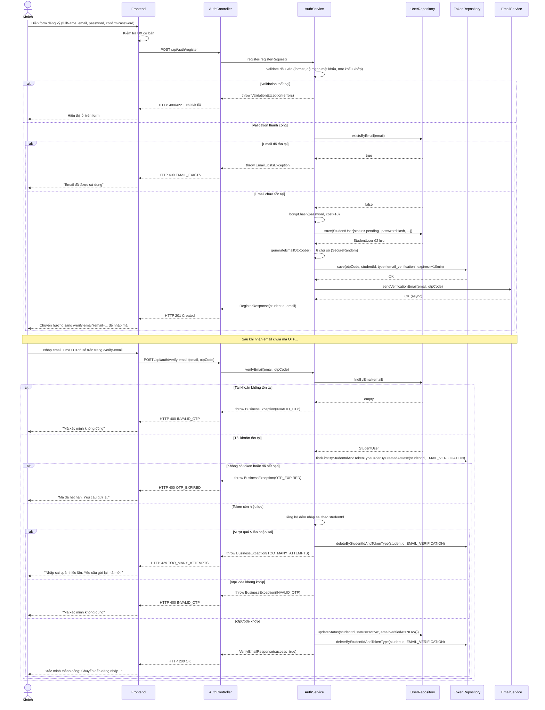

# UC-02 — Đăng Ký Tài Khoản (User Register)

> **Feature:** `feat-auth` | **Phiên bản:** 2.0 | **Trạng thái:** Draft
> **Tham chiếu FR:** FR-AUTH-10, FR-AUTH-11, FR-AUTH-12, FR-AUTH-13, FR-AUTH-14
> **Cập nhật:** 2026-07-12 — thay cơ chế xác minh email từ **link (token UUID)** sang **mã OTP 6 số nhập tay**

---

## 1. Tổng Quan

| Thuộc tính | Nội dung |
|:---|:---|
| **Mã Use Case** | UC-02 |
| **Tên** | Đăng Ký Tài Khoản (User Register) |
| **Tác nhân chính** | Khách (Guest) — người dùng chưa có tài khoản |
| **Mô tả ngắn** | Khách tạo tài khoản mới bằng Email/Mật khẩu và xác minh bằng mã OTP 6 số gửi qua email trước khi được phép đăng nhập |
| **Độ ưu tiên** | Rất cao (P0) — điều kiện tiên quyết để sử dụng hệ thống |

---

## 2. Tác Nhân & Điều Kiện

### 2.1 Tác Nhân

| Tác nhân | Vai trò |
|:---|:---|
| **Khách** | Người chủ động đăng ký tài khoản |
| **Hệ thống Email** | Gửi email chứa mã OTP 6 số để kích hoạt tài khoản |

### 2.2 Điều Kiện Tiền Quyết (Preconditions)

- Khách có kết nối internet
- Email đăng ký chưa tồn tại trong `student_users`
- Hệ thống gửi email đang hoạt động bình thường

### 2.3 Hậu Điều Kiện (Postconditions)

- **Đăng ký thành công:** Bản ghi `student_users` mới với `status = 'pending'` được tạo; email chứa mã OTP được gửi
- **Xác minh email thành công:** `status` chuyển sang `'active'`; mã OTP bị xoá khỏi hệ thống; tài khoản có thể đăng nhập
- **Thất bại:** Không tạo tài khoản; hiển thị lỗi cụ thể

---

## 3. Luồng Xử Lý

### 3.1 Luồng Chính — Đăng Ký Tài Khoản Mới

```
Bước 1 [Khách]:      Điền form đăng ký: Họ tên, Email, Mật khẩu, Xác nhận mật khẩu
Bước 2 [Frontend]:   Kiểm tra UX (không rỗng, mật khẩu khớp với xác nhận), gửi POST /api/auth/register
Bước 3 [Backend]:    Validate đầy đủ: email format, mật khẩu đủ mạnh, hai mật khẩu khớp
Bước 4 [Backend]:    Kiểm tra email chưa tồn tại trong student_users
Bước 5 [Backend]:    Hash mật khẩu bằng bcrypt (cost ≥ 10)
Bước 6 [Backend]:    Tạo bản ghi student_users mới:
                        - status = 'pending'
                        - password_hash = <bcrypt hash>
                        - email_verified_at = NULL
                        - created_at = NOW()
Bước 7 [Backend]:    Sinh mã OTP xác minh email:
                        - token_value = 6 chữ số ngẫu nhiên (SecureRandom, "000000"–"999999")
                        - token_type = 'email_verification'
                        - expires_at = NOW() + 10 phút
                      Lưu vào auth_tokens
Bước 8 [Backend]:    Gửi email chứa mã OTP (không có liên kết) đến địa chỉ vừa đăng ký
Bước 9 [Backend]:    Trả về HTTP 201 với studentId và email
Bước 10 [Frontend]:  Chuyển hướng ngay sang trang `/verify-email?email={email}` để khách nhập mã
```

### 3.2 Luồng Phụ A — Xác Minh Email Bằng Mã OTP (Kích Hoạt Tài Khoản)

```
Bước 1 [Khách]:      Mở email, đọc mã OTP 6 số, quay lại trang /verify-email và nhập mã
Bước 2 [Frontend]:   Gửi POST /api/auth/verify-email {email, otpCode}
Bước 3 [Backend]:    Tìm student_users theo email; nếu status = 'active' → coi như đã xác minh (idempotent), trả 200
Bước 4 [Backend]:    Lấy token EMAIL_VERIFICATION mới nhất của user (mỗi user chỉ có tối đa 1 token hiệu lực tại một thời điểm)
Bước 5 [Backend]:    Kiểm tra token chưa hết hạn (expires_at > NOW()); nếu hết hạn → lỗi OTP_EXPIRED
Bước 6 [Backend]:    Tăng bộ đếm số lần nhập sai (in-memory theo studentId); nếu vượt quá 5 lần →
                      xoá token hiện tại, trả lỗi TOO_MANY_ATTEMPTS (bắt buộc gửi lại mã mới)
Bước 7 [Backend]:    So khớp otpCode với token_value; nếu sai → lỗi INVALID_OTP (không tiết lộ lý do chi tiết hơn)
Bước 8 [Backend]:    Nếu khớp — cập nhật student_users:
                        - status = 'active'
                        - email_verified_at = NOW()
                      Xoá TẤT CẢ token EMAIL_VERIFICATION của user (không chỉ token vừa dùng)
                      Xoá bộ đếm số lần nhập sai
Bước 9 [Backend]:    Trả về HTTP 200 — thành công
Bước 10 [Frontend]:  Hiển thị "Xác minh thành công!" và chuyển hướng đến trang Đăng nhập
```

### 3.3 Luồng Phụ B — Gửi Lại Mã OTP

```
Bước 1 [Khách]:      Nhấn "Gửi lại mã xác minh" trên trang /verify-email hoặc từ banner ở trang đăng nhập
Bước 2 [Frontend]:   Gửi POST /api/auth/resend-verification {email}
Bước 3 [Backend]:    Kiểm tra tài khoản tồn tại và status = 'pending' (im lặng bỏ qua nếu không, tránh enumeration)
Bước 4 [Backend]:    Kiểm tra rate limit: token EMAIL_VERIFICATION gần nhất phải được tạo cách đây ≥ 60 giây
Bước 5 [Backend]:    Xoá tất cả token 'email_verification' cũ của user này
Bước 6 [Backend]:    Sinh mã OTP mới (như Bước 7 luồng chính, hết hạn sau 10 phút), gửi email
Bước 7 [Backend]:    Trả về HTTP 200 — (luôn trả 200 dù email không tồn tại để tránh enumeration;
                      riêng lỗi rate limit 429 vẫn được trả về khi tài khoản có tồn tại và đang PENDING)
```

### 3.4 Luồng Lỗi — Email Đã Tồn Tại

> **Tham chiếu:** FR-AUTH-11

```
Bước 4 [Backend]:    Phát hiện email đã có trong student_users
Bước X  [Backend]:   Trả về HTTP 409 — EMAIL_EXISTS
                      "Email này đã được sử dụng. Bạn có muốn đăng nhập không?"
```

### 3.5 Luồng Lỗi — Mật Khẩu Không Đủ Mạnh

> **Tham chiếu:** FR-AUTH-12

```
Bước 3 [Backend]:    Mật khẩu không đáp ứng yêu cầu độ mạnh
Bước X  [Backend]:   Trả về HTTP 422 — WEAK_PASSWORD
                      "Mật khẩu quá yếu: cần tối thiểu 8 ký tự, ít nhất 1 chữ hoa và 1 chữ số"
```

### 3.6 Luồng Lỗi — Mã OTP Hết Hạn

> **Tham chiếu:** FR-AUTH-14

```
Bước 5 [Backend]:    expires_at < NOW()
Bước X  [Backend]:   Trả về HTTP 400 — OTP_EXPIRED
                      "Mã xác minh đã hết hạn, vui lòng yêu cầu gửi lại"
```

### 3.7 Luồng Lỗi — Nhập Sai Mã OTP Quá Nhiều Lần

```
Bước 6 [Backend]:    Số lần nhập sai liên tiếp vượt quá 5 lần
Bước X  [Backend]:   Xoá token hiện tại, trả về HTTP 429 — TOO_MANY_ATTEMPTS
                      "Nhập sai quá nhiều lần. Vui lòng yêu cầu gửi lại mã mới"
```

---

## 4. Quy Tắc Nghiệp Vụ

| Mã | Quy tắc | Chi tiết |
|:---|:---|:---|
| BR-02-01 | Tài khoản mới luôn được tạo với `status = 'pending'` | Bắt buộc xác minh email trước khi đăng nhập |
| BR-02-02 | Mật khẩu bcrypt với cost factor **≥ 10** | → FR-AUTH-06 |
| BR-02-03 | Mã OTP xác minh email: 6 chữ số sinh bằng `SecureRandom`, hết hạn sau **10 phút** | → FR-AUTH-13, NFR-AUTH-05 |
| BR-02-04 | Một mã OTP chỉ sử dụng được **một lần**; sau khi xác minh thành công, xoá toàn bộ token EMAIL_VERIFICATION của user | Tránh tái sử dụng |
| BR-02-05 | Rate limit gửi lại mã OTP: tối đa **1 lần / 60 giây / tài khoản** | Chống spam email, nhất quán với `forgotPassword` |
| BR-02-06 | Giới hạn tối đa **5 lần** nhập sai OTP; vượt quá → xoá token, bắt buộc gửi lại mã mới | Chống brute-force mã 6 số (1 triệu khả năng) |
| BR-02-07 | Tên đầy đủ (`full_name`): tối đa 150 ký tự, không chứa ký tự đặc biệt nguy hiểm | Theo schema DB |
| BR-02-08 | Gửi lại mã OTP luôn trả HTTP 200 dù tài khoản không tồn tại | Chống email enumeration |
| BR-02-09 | Khi gửi lại, xoá token cũ trước khi tạo token OTP mới | Đảm bảo mỗi user chỉ có 1 token EMAIL_VERIFICATION hiệu lực tại một thời điểm |

---

## 5. Quy Tắc Kiểm Tra Đầu Vào

### Bảng Validation — POST /api/auth/register

| Trường | Kiểm tra | Thông báo lỗi |
|:---|:---|:---|
| `fullName` | Bắt buộc, không rỗng | "Họ tên là bắt buộc" |
| `fullName` | Tối thiểu 2 ký tự | "Họ tên phải có ít nhất 2 ký tự" |
| `fullName` | Tối đa 150 ký tự | "Họ tên không được vượt quá 150 ký tự" |
| `email` | Bắt buộc, không rỗng | "Email là bắt buộc" |
| `email` | Định dạng hợp lệ (pattern cơ bản: `^[^@]+@[^@]+\.[^@]+$`) | "Email không hợp lệ" |
| `email` | Tối đa 255 ký tự | "Email quá dài (tối đa 255 ký tự)" |
| `password` | Bắt buộc, không rỗng | "Mật khẩu là bắt buộc" |
| `password` | Tối thiểu 8 ký tự | "Mật khẩu phải có ít nhất 8 ký tự" |
| `password` | Có ít nhất 1 chữ hoa (A-Z) | "Mật khẩu cần có ít nhất 1 chữ hoa" |
| `password` | Có ít nhất 1 chữ số (0-9) | "Mật khẩu cần có ít nhất 1 chữ số" |
| `confirmPassword` | Bắt buộc | "Xác nhận mật khẩu là bắt buộc" |
| `confirmPassword` | Khớp với `password` | "Mật khẩu xác nhận không khớp" |

---

## 6. Sơ Đồ Tuần Tự (Sequence Diagram)

### 6.1 Luồng Đăng Ký & Xác Minh Email



---

## 7. Tham Chiếu API

> Xem đặc tả đầy đủ tại [SPEC.md § 6 — API SPEC](./SPEC.md)

| Phương thức | Endpoint | Mô tả |
|:---|:---|:---|
| `POST` | `/api/auth/register` | Đăng ký tài khoản mới |
| `POST` | `/api/auth/verify-email` | Xác minh email bằng token |
| `POST` | `/api/auth/resend-verification` | Gửi lại email xác minh |

---

## 8. Tiêu Chí Chấp Nhận (Acceptance Criteria)

### AC-02-01 — Đăng ký thành công

> **Tham chiếu:** FR-AUTH-10

- **Cho trước:** Email `new@test.com` chưa tồn tại trong hệ thống
- **Khi:** Gửi POST `/api/auth/register` với `fullName="Nguyễn Văn A"`, `email="new@test.com"`, `password="Abcdef12"`, `confirmPassword="Abcdef12"`
- **Thì:**
  - Nhận HTTP 201
  - Bản ghi `student_users` mới với `status = 'pending'`, `email = 'new@test.com'`
  - Bản ghi `auth_tokens` với `token_type = 'email_verification'`, `token_value` là chuỗi 6 chữ số, `expires_at = NOW() + 10 phút`
  - Email chứa mã OTP được gửi đến `new@test.com`
  - Response chứa `studentId` và `email`

---

### AC-02-02 — Đăng ký với email đã tồn tại

> **Tham chiếu:** FR-AUTH-11

- **Cho trước:** `existing@test.com` đã tồn tại trong `student_users`
- **Khi:** Gửi POST `/api/auth/register` với `email="existing@test.com"`
- **Thì:**
  - Nhận HTTP 409
  - `error_code = "EMAIL_EXISTS"`
  - Thông báo gợi ý đăng nhập
  - Không tạo bản ghi mới trong DB

---

### AC-02-03 — Mật khẩu không đủ mạnh

> **Tham chiếu:** FR-AUTH-12

- **Cho trước:** Dữ liệu hợp lệ ngoại trừ mật khẩu
- **Khi:** Gửi với `password = "abc"` (quá ngắn, không có hoa, không có số)
- **Thì:**
  - Nhận HTTP 422
  - `error_code = "WEAK_PASSWORD"`
  - Thông báo liệt kê các yêu cầu chưa đáp ứng

---

### AC-02-04 — Mật khẩu xác nhận không khớp

- **Cho trước:** Dữ liệu hợp lệ
- **Khi:** Gửi với `password = "Abcdef12"`, `confirmPassword = "Abcdef99"`
- **Thì:**
  - Nhận HTTP 400
  - `error_code = "PASSWORD_MISMATCH"`

---

### AC-02-05 — Xác minh email với mã OTP hợp lệ

> **Tham chiếu:** FR-AUTH-13

- **Cho trước:** Tài khoản `status = 'pending'`, mã OTP hợp lệ còn trong hạn 10 phút
- **Khi:** Gửi POST `/api/auth/verify-email` với `{email, otpCode}` đúng
- **Thì:**
  - Nhận HTTP 200
  - `student_users.status` chuyển thành `'active'`
  - `student_users.email_verified_at` được cập nhật
  - Toàn bộ token `EMAIL_VERIFICATION` của user bị xoá khỏi `auth_tokens`
  - Tài khoản có thể đăng nhập thành công

---

### AC-02-06 — Mã OTP hết hạn

> **Tham chiếu:** FR-AUTH-14

- **Cho trước:** Mã OTP được tạo hơn 10 phút trước
- **Khi:** Gửi POST `/api/auth/verify-email` với mã đã hết hạn
- **Thì:**
  - Nhận HTTP 400
  - `error_code = "OTP_EXPIRED"`
  - Thông báo hướng dẫn gửi lại mã
  - `student_users.status` KHÔNG thay đổi

---

### AC-02-07 — Mã OTP đã được dùng (dùng lại)

- **Cho trước:** Mã OTP đã được dùng một lần thành công (status = 'active', token đã bị xoá)
- **Khi:** Gửi lại POST `/api/auth/verify-email` với cùng mã đó
- **Thì:**
  - Nhận HTTP 400
  - `error_code = "OTP_EXPIRED"` (không còn token nào để đối chiếu)
  - `student_users.status` KHÔNG thay đổi lần thứ hai

---

### AC-02-08 — Gửi lại mã OTP bị giới hạn tần suất

- **Cho trước:** Tài khoản `status = 'pending'`, vừa yêu cầu gửi lại mã cách đây < 60 giây
- **Khi:** Yêu cầu gửi lại mã lần nữa trong khoảng thời gian đó
- **Thì:**
  - Nhận HTTP 429
  - `error_code = "TOO_MANY_REQUESTS"`
  - Thông báo thời gian chờ (60 giây)

---

### AC-02-09 — Nhập sai mã OTP quá nhiều lần

- **Cho trước:** Tài khoản `status = 'pending'`, đã nhập sai mã OTP 5 lần liên tiếp
- **Khi:** Gửi POST `/api/auth/verify-email` lần thứ 6 (dù đúng hay sai)
- **Thì:**
  - Nhận HTTP 429
  - `error_code = "TOO_MANY_ATTEMPTS"`
  - Token OTP hiện tại bị xoá — bắt buộc gọi `/api/auth/resend-verification` để nhận mã mới

---

## 9. Ngoài Phạm Vi (Out of Scope)

- ❌ Đăng ký bằng số điện thoại/OTP SMS — Phase 2 (OTP hiện tại chỉ gửi qua **email**)
- ❌ Đăng ký qua OAuth (Google đăng ký) — đã xử lý trong UC-01 (auto-register khi OAuth lần đầu)
- ❌ Captcha/reCAPTCHA — có thể thêm ở Phase 2
- ❌ Admin/Staff tạo tài khoản — xem `feat-system-admin`
