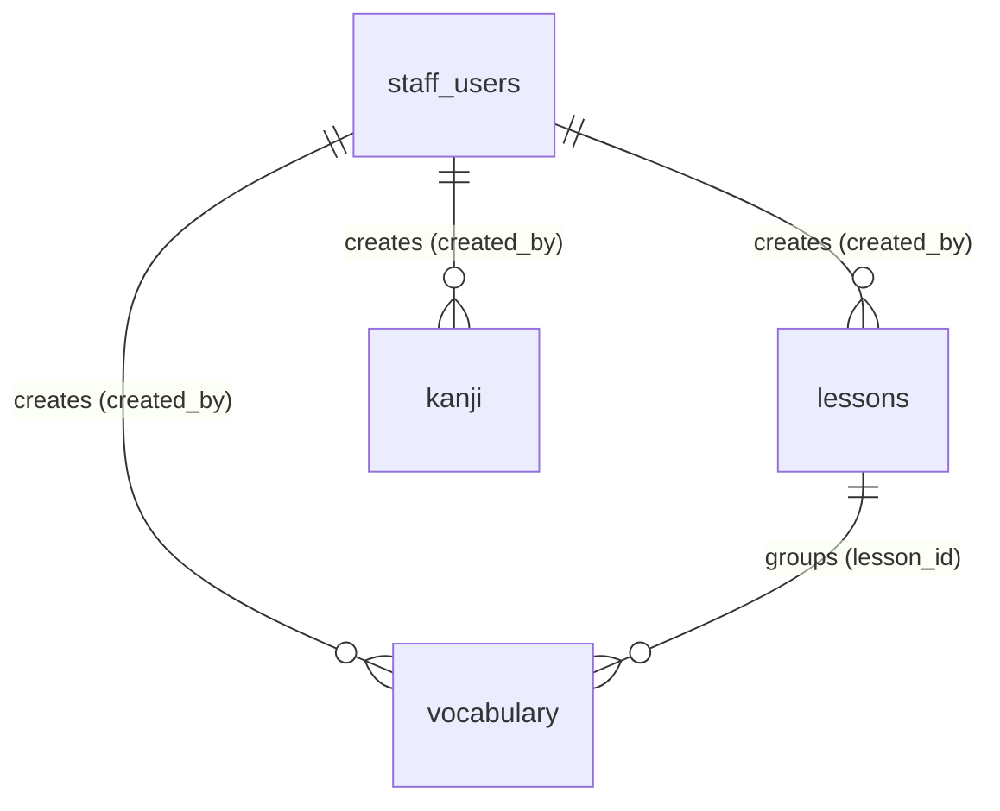

# UC-27 — Quản Lý Học Liệu (Manage Learning Content)

> **Feature:** `feat-content-management` | **Phiên bản:** 1.1 | **Trạng thái:** Draft
> **Actor chính:** Staff
> **Tham chiếu FR:** FR-27-01 → FR-27-26 (chi tiết hóa từ FR-CONTENT-01, FR-CONTENT-02, FR-CONTENT-04 trong `feat-content-management/SPEC.md`)
> **Liên quan:** UC-24 (Manage Question Bank), UC-25 (Manage Grammar Content), UC-29 (Review/Publish Content — StaffManager)
> **Cập nhật:** 2026-06-12

---

> ℹ️ **GHI CHÚ MÔ HÌNH DỮ LIỆU:** Hệ thống **không có bảng `courses` riêng**. Đơn vị học liệu (cả cấp "khóa học" lẫn "bài giảng") được biểu diễn bằng **một bảng `lessons` duy nhất** (`apps/backend/src/main/resources/db/migration/V1__init_schema.sql`, dòng 160). Vì vậy mọi yêu cầu thao tác trên "course" trong mô tả gốc đều ánh xạ về bảng `lessons` qua nhóm endpoint `/api/staff/lessons`. UC-27 quản lý 3 loại học liệu thực tế: **lesson (`lessons`)**, **vocabulary (`vocabulary`)**, **kanji (`kanji`)**.

---

## 1. CONTEXT & GOAL

### 1.1 Bối cảnh

Học liệu (learning content) là phần lõi sư phạm của nền tảng luyện thi JLPT. Bảng `lessons` đóng vai trò đơn vị học liệu trung tâm — chứa nội dung văn bản, video, audio và tài liệu đính kèm theo từng `lesson_type` và trình độ N5→N1 — được bổ trợ bởi kho từ vựng (`vocabulary`) và chữ Hán (`kanji`). Nhân viên soạn thảo (Staff) cần bộ công cụ nghiệp vụ để **tạo và chỉnh sửa** các học liệu này ở trạng thái nháp rồi **gửi duyệt** cho StaffManager. Vì nội dung sau khi xuất bản hiển thị trực tiếp cho học viên và ảnh hưởng tới lộ trình học, quy trình soạn thảo phải tách bạch trạng thái (`draft` → `pending_review` → `published`) và Staff **không được tự xuất bản**.

### 1.2 Mục tiêu

- Cho phép Staff **tạo và cập nhật** lesson, vocabulary, kanji ở trạng thái `draft`.
- Bắt buộc đầy đủ trường nghiệp vụ và cấp độ JLPT hợp lệ trước khi lưu/gửi duyệt.
- Lưu file audio/image/video/đính kèm dưới dạng **URL** trong DB (ADR-006), không lưu BLOB.
- Cho phép Staff **gửi nội dung sang `pending_review`** qua một endpoint thống nhất.
- Ngăn chặn tuyệt đối việc Staff tự đặt `status = 'published'` (chuyển sang StaffManager — UC-29).
- Chỉ cho sửa nội dung khi `status ∈ {draft, rejected}`.

### 1.3 Tại sao cần?

Nếu không quản lý tập trung và không tách trạng thái kiểm duyệt → bài học sai chính tả/kiến thức, từ vựng sai nghĩa, hoặc Kanji sai âm đọc sẽ đến trực tiếp học viên, làm giảm uy tín và sai lệch lộ trình học. Việc cấm Staff tự publish (Rule 9, ADR-005) và lưu media qua URL (ADR-006, LESSON-002) bảo đảm chất lượng nội dung và sức khỏe cơ sở dữ liệu.

---

## 2. ACTOR

| Actor | Role | Điều kiện tiền quyết (Precondition) |
|:---|:---|:---|
| **Staff** | Soạn thảo, cập nhật và gửi duyệt học liệu (lesson/vocabulary/kanji) | Đã đăng nhập với JWT hợp lệ role `STAFF`, `status = 'active'` |
| **StaffManager** | (Tham chiếu) Duyệt & xuất bản nội dung từ hàng đợi `pending_review` | Ngoài phạm vi UC-27 — xem UC-29 |
| **Hệ thống (System)** | Validate nghiệp vụ, gán trạng thái, ghi audit log | — |

**Postconditions:**

- **Thành công:** Bản ghi `lessons`/`vocabulary`/`kanji` được tạo/cập nhật/chuyển trạng thái; mọi thao tác ghi được log (`created_by`, `updated_at`).
- **Thất bại:** Không thay đổi dữ liệu; trả mã lỗi rõ ràng; giao dịch rollback.

---

## 3. FUNCTIONAL REQUIREMENTS (EARS)

> **EARS Syntax:** `WHEN [trigger] THE SYSTEM SHALL [behavior]` · `WHILE [state] …` · `IF [condition] THEN THE SYSTEM SHALL [response]` · `THE SYSTEM SHALL [ubiquitous]`

### 3.1 Quy tắc chung cho mọi học liệu (Ubiquitous)

| ID | EARS Requirement |
|:---|:---|
| FR-27-01 | WHEN a Staff creates any learning-content item (lesson, vocabulary, kanji), THE SYSTEM SHALL persist the record with `status = 'draft'` and set `created_by` to the authenticated Staff's `staff_id`. |
| FR-27-02 | THE SYSTEM SHALL accept `jlpt_level` only within the set {`N5`,`N4`,`N3`,`N2`,`N1`} for every content type. |
| FR-27-03 | THE SYSTEM SHALL store every audio, image, video, or attachment reference **as a URL string only** and SHALL NOT store binary/BLOB content in the database (ADR-006). |
| FR-27-04 | THE SYSTEM SHALL allow create/update operations only WHILE the item `status` is in {`draft`, `rejected`}; IF `status` is `pending_review`, `published`, `archived`, or `deleted` THEN THE SYSTEM SHALL reject the update with HTTP 409 `INVALID_STATUS_TRANSITION`. |
| FR-27-05 | THE SYSTEM SHALL NOT allow a Staff to set `status = 'published'` (or `archived`) through any endpoint in this use case (publishing is reserved for StaffManager — UC-29). |
| FR-27-06 | THE SYSTEM SHALL restrict update/submit operations to the Staff who owns the item (`created_by = current staff_id`) unless the caller has role `STAFF_MANAGER`. |
| FR-27-07 | WHEN any content item is updated successfully, THE SYSTEM SHALL refresh `updated_at` to the current server (UTC) timestamp. |
| FR-27-08 | THE SYSTEM SHALL log every create/update/status-change action via SLF4J in the format `[INFO] Staff {staffId} {action} {contentType} {contentId}`. |

### 3.2 Lesson — học liệu / khóa học (POST /api/staff/lessons · PUT /api/staff/lessons/{lessonId})

| ID | EARS Requirement |
|:---|:---|
| FR-27-09 | THE SYSTEM SHALL require `title`, `lessonType`, and `jlptLevel` to be non-null and non-empty before persisting a lesson. |
| FR-27-10 | THE SYSTEM SHALL accept `lessonType` only within the set {`lesson`,`reading`,`listening`,`speaking`}. |
| FR-27-11 | THE SYSTEM SHALL require at least one of `contentText`, `videoUrl`, `audioUrl`, or `attachmentUrl` to be present; IF all are empty THEN THE SYSTEM SHALL reject with HTTP 400 `LESSON_CONTENT_REQUIRED`. |
| FR-27-12 | IF `lessonType = 'listening'` THEN THE SYSTEM SHALL require `audioUrl` to be non-empty. |
| FR-27-13 | THE SYSTEM SHALL accept `displayOrder` only as an integer `>= 0`; IF omitted THEN THE SYSTEM SHALL default it to `0`. |
| FR-27-14 | THE SYSTEM SHALL persist optional fields `explanation` and `attachmentUrl` when supplied. |
| FR-27-15 | WHEN a lesson is created successfully, THE SYSTEM SHALL return HTTP 201 with the new `lessonId` and `status = 'draft'`; WHEN updated successfully, THE SYSTEM SHALL re-validate FR-27-09..FR-27-13 and return HTTP 200. |

### 3.3 Vocabulary (POST /api/staff/vocabulary)

| ID | EARS Requirement |
|:---|:---|
| FR-27-16 | THE SYSTEM SHALL require `word`, `meaning`, `furigana` (reading), and `jlptLevel` to be non-null and non-empty before persisting a vocabulary entry. |
| FR-27-17 | THE SYSTEM SHALL persist optional fields `wordType`, `topic`, `audioUrl`, `exampleSentenceJp`, `exampleSentenceVi`, and `lessonId` when supplied. |
| FR-27-18 | WHEN a `lessonId` is supplied, THE SYSTEM SHALL verify the referenced lesson exists and is not `deleted`; IF not found THEN THE SYSTEM SHALL reject with HTTP 404 `LESSON_NOT_FOUND`. |
| FR-27-19 | WHEN a vocabulary entry is created successfully, THE SYSTEM SHALL return HTTP 201 with the new `vocabularyId` and `status = 'draft'`. |

### 3.4 Kanji (POST /api/staff/kanji)

| ID | EARS Requirement |
|:---|:---|
| FR-27-20 | THE SYSTEM SHALL require `characterValue`, `meaning`, `jlptLevel`, and at least one of `onyomi` or `kunyomi` to be non-empty before persisting a kanji entry. |
| FR-27-21 | THE SYSTEM SHALL enforce uniqueness of `characterValue`; IF a kanji with the same `characterValue` already exists THEN THE SYSTEM SHALL reject with HTTP 409 `KANJI_DUPLICATE`. |
| FR-27-22 | IF `strokeCount` is supplied THEN THE SYSTEM SHALL require it to be an integer `>= 1`. |
| FR-27-23 | THE SYSTEM SHALL persist optional fields `strokeOrderUrl`, `exampleWord`, `exampleReading`, and `exampleMeaning` when supplied. |
| FR-27-24 | WHEN a kanji entry is created successfully, THE SYSTEM SHALL return HTTP 201 with the new `kanjiId` and `status = 'draft'`. |

### 3.5 Gửi duyệt (Submit for Review — POST /api/staff/contents/submit-review)

| ID | EARS Requirement |
|:---|:---|
| FR-27-25 | WHEN a Staff submits an item for review with `contentType ∈ {lesson, vocabulary, kanji}` and a valid `contentId`, THE SYSTEM SHALL transition that item's `status` from `draft` (or `rejected`) to `pending_review`. |
| FR-27-26 | THE SYSTEM SHALL re-run the mandatory-field and type-specific validation of the target content type (FR-27-09..FR-27-24) before allowing the transition to `pending_review`; IF the current `status` is not in {`draft`,`rejected`} THEN THE SYSTEM SHALL reject with HTTP 409 `INVALID_STATUS_TRANSITION`. |

---

## 4. NON-FUNCTIONAL REQUIREMENTS

| ID | Category | Requirement |
|:---|:---|:---|
| NFR-27-01 | Performance | Endpoint tạo/cập nhật phản hồi < 500ms (p95); cột lọc đã có index sẵn (`IX_lessons_public_list`, `IX_lessons_creator_status`, `IX_kanji_public_level`, `IX_vocab_public_lookup`, `IX_vocab_word`). |
| NFR-27-02 | Security | Mọi endpoint yêu cầu JWT hợp lệ + role `STAFF`; vi phạm trả 401/403. KHÔNG bypass Spring Security. |
| NFR-27-03 | Storage | File audio/image/video/đính kèm chỉ lưu URL trong DB; file vật lý ở `/uploads` (dev) hoặc S3 (prod) — KHÔNG lưu BLOB (ADR-006, LESSON-002). |
| NFR-27-04 | Architecture | Controller chỉ nhận/trả DTO (`*Request`/`*Response`); KHÔNG trả Entity trực tiếp (ADR-005). |
| NFR-27-05 | Validation | `@Valid` + Jakarta Bean Validation trên mọi `@RequestBody`; validation nghiệp vụ (enum, ràng buộc theo type) thực hiện ở backend, không tin client. |
| NFR-27-06 | Logging | Dùng SLF4J; KHÔNG `System.out.println`. Ghi `staffId`, `action`, `contentType`, `contentId` cho mọi thao tác ghi. |
| NFR-27-07 | Soft Delete | Xóa học liệu dùng `status = 'deleted'`, KHÔNG `DELETE FROM` (ADR-004). |
| NFR-27-08 | Transaction | Gán trạng thái và validate quyền sở hữu phải nằm trong cùng `@Transactional` ở Service Layer. |
| NFR-27-09 | File Upload | URL media chỉ chấp nhận sau khi qua module upload đã validate extension (whitelist) và size ≤ 10MB (Constitution §3.3). |

---

## 5. DATA MODEL

> Nguồn schema: `apps/backend/src/main/resources/db/migration/V1__init_schema.sql` — `lessons` (dòng 160), `kanji` (dòng 204), `vocabulary` (dòng 282), `staff_users` (dòng 38). **UC-27 chỉ ĐỌC schema; không thay đổi cấu trúc bảng.**

### 5.1 Bảng liên quan

| Bảng | Vai trò trong UC-27 | Ghi chú |
|:---|:---|:---|
| `lessons` | Học liệu trung tâm (đảm nhiệm cả khái niệm "khóa học" lẫn "bài giảng") | Không có bảng `courses` riêng |
| `vocabulary` | Từ vựng, có thể liên kết `lesson_id` | FK → `lessons` |
| `kanji` | Chữ Hán, `character_value` UNIQUE | — |
| `staff_users` | Chủ sở hữu nội dung (`created_by`), kiểm tra quyền | Chỉ tham chiếu |

### 5.2 Cấu trúc cột chính (trích yếu, theo `V1__init_schema.sql`)

```sql
-- lessons: đơn vị học liệu trung tâm (course = lesson)
--   title         NVARCHAR(255) NOT NULL
--   lesson_type   NVARCHAR(20)  NOT NULL CHECK IN ('lesson','reading','listening','speaking')
--   jlpt_level    NVARCHAR(5)   NOT NULL CHECK IN ('N5'..'N1')
--   content_text  / video_url / audio_url / attachment_url / explanation  NULL  (≥1 nội dung bắt buộc — FR-27-11)
--   display_order INT           NOT NULL DEFAULT 0
--   status        NVARCHAR(20)  NOT NULL DEFAULT 'draft'
--   created_by FK staff_users; có created_at / updated_at / published_at

-- vocabulary
--   word NOT NULL, meaning NOT NULL, furigana (reading), jlpt_level NOT NULL
--   word_type / topic / audio_url / example_sentence_jp / example_sentence_vi / lesson_id (FK lessons) NULL
--   status 'draft'; created_by FK staff_users

-- kanji
--   character_value NOT NULL UNIQUE, meaning NOT NULL, onyomi / kunyomi NULL (≥1 bắt buộc — FR-27-20)
--   stroke_count / stroke_order_url / example_word / example_reading / example_meaning NULL
--   jlpt_level NOT NULL; status 'draft'; created_by FK staff_users
```

### 5.3 Quan hệ



### 5.4 Vòng đời trạng thái (State machine — phạm vi Staff)

```
            create                submit-review              (UC-29)
   ─────►  draft  ───────────────►  pending_review  ──────────────►  published
             ▲                          │  reject
   update    │                          ▼
   (allowed) └──────────────────────  rejected  ──► (update / re-submit)

   * Staff KHÔNG được chuyển sang published/archived (FR-27-05).
   * update chỉ hợp lệ khi status ∈ {draft, rejected} (FR-27-04).
   * áp dụng đồng nhất cho lesson / vocabulary / kanji.
```

---

## 6. API SPEC

> Tất cả endpoint: **Auth = Bearer JWT (role STAFF)**. Định dạng response chuẩn `{ status, message, data }` (AGENTS.md §6).
> Vì "course" = `lessons`, **không có** endpoint `/api/staff/courses` riêng; mọi thao tác học liệu cấp bài/khóa dùng `/api/staff/lessons`.

### 6.1 `POST /api/staff/lessons` — Tạo học liệu (lesson / khóa học)

**Request:**

```json
{
  "title": "Bài 1: Kanji N5 cơ bản",
  "lessonType": "lesson",
  "jlptLevel": "N5",
  "contentText": "Nội dung bài giảng về bộ thủ và 10 chữ Kanji đầu tiên...",
  "videoUrl": "https://youtu.be/abc123",
  "explanation": "Ghi chú sư phạm cho giáo viên.",
  "displayOrder": 1
}
```

**Response (201 Created):**

```json
{
  "status": 201,
  "message": "Tạo học liệu thành công",
  "data": { "lessonId": 88, "status": "draft", "createdAt": "2026-06-12T09:05:00Z" }
}
```

### 6.2 `PUT /api/staff/lessons/{lessonId}` — Cập nhật học liệu

**Request:**

```json
{
  "title": "Bài 1: Kanji N5 cơ bản (rev.2)",
  "lessonType": "listening",
  "jlptLevel": "N5",
  "audioUrl": "https://cdn.jlpt.app/audio/lesson-88.mp3",
  "displayOrder": 1
}
```

**Response (200 OK):**

```json
{
  "status": 200,
  "message": "Cập nhật học liệu thành công",
  "data": { "lessonId": 88, "status": "draft", "updatedAt": "2026-06-12T10:20:00Z" }
}
```

### 6.3 `POST /api/staff/vocabulary` — Tạo từ vựng

**Request:**

```json
{
  "word": "水",
  "furigana": "みず",
  "meaning": "nước",
  "wordType": "danh từ",
  "jlptLevel": "N5",
  "topic": "Tự nhiên",
  "audioUrl": "https://cdn.jlpt.app/audio/mizu.mp3",
  "exampleSentenceJp": "水を飲みます。",
  "exampleSentenceVi": "Tôi uống nước.",
  "lessonId": 88
}
```

**Response (201 Created):**

```json
{
  "status": 201,
  "message": "Tạo từ vựng thành công",
  "data": { "vocabularyId": 540, "status": "draft", "createdAt": "2026-06-12T09:10:00Z" }
}
```

### 6.4 `POST /api/staff/kanji` — Tạo chữ Kanji

**Request:**

```json
{
  "characterValue": "水",
  "meaning": "nước",
  "onyomi": "スイ",
  "kunyomi": "みず",
  "strokeCount": 4,
  "jlptLevel": "N5",
  "strokeOrderUrl": "https://cdn.jlpt.app/stroke/mizu.gif",
  "exampleWord": "水曜日",
  "exampleReading": "すいようび",
  "exampleMeaning": "thứ Tư"
}
```

**Response (201 Created):**

```json
{
  "status": 201,
  "message": "Tạo Kanji thành công",
  "data": { "kanjiId": 301, "status": "draft", "createdAt": "2026-06-12T09:15:00Z" }
}
```

### 6.5 `POST /api/staff/contents/submit-review` — Gửi duyệt

**Request:**

```json
{ "contentType": "lesson", "contentId": 88 }
```

> `contentType` ∈ {`lesson`, `vocabulary`, `kanji`}.

**Response (200 OK):**

```json
{
  "status": 200,
  "message": "Đã gửi nội dung để phê duyệt",
  "data": { "contentId": 88, "contentType": "lesson", "status": "pending_review" }
}
```

---

## 7. ERROR HANDLING

| HTTP | Error Code | Message | Trigger |
|:---:|:---|:---|:---|
| 400 | `VALIDATION_FAILED` | "Thiếu trường bắt buộc: {field}" | Thiếu trường bắt buộc của lesson/vocab/kanji (FR-27-09/16/20) hoặc `displayOrder < 0` (FR-27-13) |
| 400 | `INVALID_JLPT_LEVEL` | "Cấp độ JLPT phải là N5 đến N1" | `jlptLevel` ngoài {N5..N1} (FR-27-02) |
| 400 | `INVALID_LESSON_TYPE` | "lesson_type không hợp lệ" | Ngoài {lesson, reading, listening, speaking} (FR-27-10) |
| 400 | `LESSON_CONTENT_REQUIRED` | "Học liệu phải có nội dung văn bản hoặc media URL" | Thiếu cả contentText/video/audio/attachment (FR-27-11); hoặc listening thiếu audioUrl (FR-27-12) |
| 401 | `UNAUTHORIZED` | "Yêu cầu đăng nhập" | JWT thiếu hoặc hết hạn |
| 403 | `FORBIDDEN` | "Không có quyền thao tác học liệu này" | Không phải chủ sở hữu (FR-27-06) hoặc role ≠ STAFF |
| 403 | `PUBLISH_NOT_ALLOWED` | "Staff không được tự xuất bản nội dung" | Cố đặt status=published/archived (FR-27-05) |
| 404 | `LESSON_NOT_FOUND` | "Không tìm thấy học liệu" | `lessonId` không tồn tại / đã deleted (FR-27-18 hoặc update lesson) |
| 404 | `CONTENT_NOT_FOUND` | "Không tìm thấy nội dung yêu cầu" | `contentId` không tồn tại khi update/submit |
| 409 | `KANJI_DUPLICATE` | "Chữ Kanji đã tồn tại" | `characterValue` trùng (FR-27-21) |
| 409 | `INVALID_STATUS_TRANSITION` | "Không thể thực hiện thao tác ở trạng thái hiện tại" | Update/submit khi status ∉ {draft, rejected} (FR-27-04/26) |
| 500 | `INTERNAL_ERROR` | "Internal server error" | Lỗi hệ thống / CSDL |

---

## 8. ACCEPTANCE CRITERIA

| ID | Scenario | Given | When | Then |
|:---|:---|:---|:---|:---|
| AC-27-01 | Tạo học liệu nháp thành công | Dữ liệu lesson hợp lệ (có contentText) | POST /api/staff/lessons | HTTP 201; `lessons` với `status='draft'`, `created_by` = staff hiện tại |
| AC-27-02 | Lesson thiếu trường bắt buộc | Body không có `lessonType` | POST /api/staff/lessons | HTTP 400 `VALIDATION_FAILED`; không tạo bản ghi |
| AC-27-03 | Lesson không có nội dung | lessonType hợp lệ nhưng thiếu cả text/media | POST /api/staff/lessons | HTTP 400 `LESSON_CONTENT_REQUIRED`; rollback |
| AC-27-04 | Lesson listening thiếu audio | `lessonType='listening'`, không `audioUrl` | POST /api/staff/lessons | HTTP 400 `LESSON_CONTENT_REQUIRED` |
| AC-27-05 | Tạo vocabulary hợp lệ | word/furigana/meaning/jlptLevel đủ | POST /api/staff/vocabulary | HTTP 201; `status='draft'` |
| AC-27-06 | Vocabulary thiếu cách đọc | Không có `furigana` | POST /api/staff/vocabulary | HTTP 400 `VALIDATION_FAILED` |
| AC-27-07 | Vocabulary gắn lesson không tồn tại | `lessonId=9999` không có | POST /api/staff/vocabulary | HTTP 404 `LESSON_NOT_FOUND` |
| AC-27-08 | Tạo kanji hợp lệ | characterValue/meaning/jlptLevel + onyomi | POST /api/staff/kanji | HTTP 201; `status='draft'` |
| AC-27-09 | Kanji trùng | `characterValue='水'` đã tồn tại | POST /api/staff/kanji | HTTP 409 `KANJI_DUPLICATE`; không tạo |
| AC-27-10 | Kanji thiếu cả On/Kun | meaning đủ nhưng không onyomi & kunyomi | POST /api/staff/kanji | HTTP 400 `VALIDATION_FAILED` |
| AC-27-11 | Cập nhật khi đang chờ duyệt | Lesson 88 `status=pending_review` | PUT /api/staff/lessons/88 | HTTP 409 `INVALID_STATUS_TRANSITION` |
| AC-27-12 | Cập nhật nội dung bị từ chối | Lesson 88 `status=rejected` | PUT /api/staff/lessons/88 | HTTP 200; `updated_at` làm mới |
| AC-27-13 | Gửi duyệt thành công | Lesson 88 `status=draft`, dữ liệu đủ | POST /api/staff/contents/submit-review | HTTP 200; `status='pending_review'` |
| AC-27-14 | Chặn Staff tự publish | Payload cố đặt `status=published` | PUT / submit | HTTP 403 `PUBLISH_NOT_ALLOWED`; status không đổi |
| AC-27-15 | Không phải chủ sở hữu | Lesson 88 do Staff A tạo, Staff B sửa | PUT /api/staff/lessons/88 | HTTP 403 `FORBIDDEN` |
| AC-27-16 | Media lưu dạng URL | Lesson có `videoUrl` | POST /api/staff/lessons | DB chỉ lưu URL, không có cột BLOB (ADR-006) |

---

## 9. OUT OF SCOPE

- ❌ **Bảng `courses` riêng** — không tồn tại trong hệ thống; học liệu cấp khóa/bài đều dùng bảng `lessons` (không có endpoint `/api/staff/courses`).
- ❌ **Xuất bản (publish) / lưu trữ (archive) học liệu** — thuộc StaffManager / UC-29. Staff chỉ gửi `pending_review`.
- ❌ **Quản lý ngân hàng câu hỏi & gán câu hỏi vào lesson** (`questions`, `question_assignments`) — thuộc UC-24 / UC-26.
- ❌ **Quản lý điểm ngữ pháp** (`grammar_points`) — thuộc UC-25.
- ❌ **Upload/lưu trữ file vật lý** (audio/image/video/PDF) — xử lý qua module File Upload; UC-27 chỉ nhận và lưu **URL** (ADR-006, Constitution §3.3).
- ❌ **Xóa cứng (hard delete)** — chỉ soft delete bằng `status='deleted'` (không nằm trong các API liệt kê).
- ❌ **Import học liệu hàng loạt** từ CSV/Excel/PDF — Phase 2.
- ❌ **Versioning học liệu đã publish** — Phase 2.
