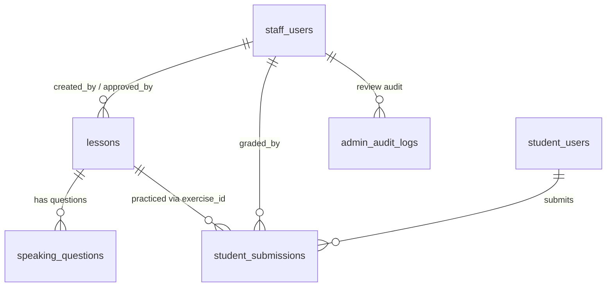

# SPEC — Speaking End-to-End (Authoring → Review → Practice → Grading)
>
> **Feature ID:** `feat-speaking`
> **UC Coverage:** UC-SPK-01 (Staff soạn bài Speaking) · UC-SPK-02 (StaffManager duyệt bài Speaking) · UC-13 (Student luyện nói) · UC-31 (Staff chấm bài nói)
> **Version:** 1.0 | **Status:** Draft
> **Author:** Team | **Last Updated:** 2026-07-21
> **Related code:** `feature/speaking` (practice + AI), `feature/staffcontent.learning` (authoring), `feature/contentreview` (review UC-33), `feature/support` (`StaffGradingController` UC-31)
> **ADR ref:** ADR-004 (Soft Delete), ADR-005 (DTO Pattern), ADR-006 (File Storage), ADR-008 (Global Exception Handler), LESSON-001 (tách UI Staff/Admin), LESSON-006 (AI không silent fail)
> **Constraint ref:** JWT chỉ cấp `ROLE_STAFF`/`ROLE_ADMIN` → phân biệt `staff_manager` enforce ở Service Layer (xem `StaffManagerGuard`).

---

## 1. CONTEXT & GOAL

### 1.1 Bối cảnh

Bài luyện nói (Speaking) là một loại học liệu đặc thù: học viên phát âm một đoạn văn bản mẫu và được chấm điểm. Trước đây, bài Speaking chỉ tồn tại như một `Lesson` với `lesson_type = speaking` và một trường `content_text` duy nhất, được luyện tập bởi Student với chấm điểm AI (UC-13). Chưa có một quy trình soạn — duyệt — chấm hoàn chỉnh dành riêng cho Speaking.

SPEC này **bổ sung** vòng đời đầy đủ của một bài Speaking, đưa nó ngang hàng với Grammar/Vocabulary về mặt kiểm duyệt bốn mắt (Four-Eyes), đồng thời hỗ trợ nhiều câu hỏi (prompt) trong một bài và cho phép Staff chấm bài nói thủ công.

### 1.2 Mục tiêu

- **UC-SPK-01 (Staff soạn bài):** Staff tạo một bài Speaking gồm **cấp độ JLPT**, **tiêu đề bài học**, và **danh sách câu hỏi** (mỗi câu hỏi có nội dung/đoạn văn bản cần đọc + chi tiết hướng dẫn). Staff xem lại được nội dung mình đã tạo (draft) và gửi đi duyệt (`submit-review`).
- **UC-SPK-02 (StaffManager duyệt):** StaffManager xem nội dung đã gửi, **Duyệt (Approve)** / **Từ chối (Reject)** / **Yêu cầu chỉnh sửa (Request Changes)**, tái sử dụng đúng hàng đợi duyệt của UC-33 (`type = speaking`/`lesson`).
- **UC-13 (Student luyện tập):** Sau khi bài được publish, Student thấy bài trong danh sách theo cấp độ, bật mic ghi âm đọc nội dung, và nộp (async).
- **UC-31 (Staff chấm bài):** Bài Student nộp được gửi tới hàng đợi chấm của Staff; Staff nghe và **chấm điểm thủ công + phản hồi**, điểm này là điểm cuối cùng (override điểm AI nếu có).

### 1.3 Tại sao cần?

- Không có kiểm duyệt → Staff tự xuất bản bài nói của mình, vi phạm nguyên tắc bốn mắt (đồng bộ với `feat-content-review`).
- Mô hình một `content_text` không đủ cho bài nhiều câu hỏi (ví dụ hội thoại nhiều lượt, nhiều đoạn shadowing).
- Chấm nói thuần AI không đủ tin cậy cho điểm chính thức → cần Staff chấm tay làm điểm authoritative (UC-31 đã có sẵn cơ chế `manual_score` override).

---

## 2. ACTOR

| Actor | Role / Quyền | Điều kiện tiền quyết |
|:---|:---|:---|
| **Staff (Author)** | Soạn bài Speaking, xem nội dung nháp của mình, gửi duyệt, chấm bài nói của Student | Đăng nhập `ROLE_STAFF`, `status = active` |
| **StaffManager** | Duyệt / Từ chối / Yêu cầu chỉnh sửa bài Speaking chờ duyệt, xem nội dung đã gửi | Đăng nhập `ROLE_STAFF` với `staff_role = staff_manager`, `status = active` |
| **Student** | Xem bài đã publish theo cấp độ, ghi âm & nộp bài, xem kết quả/điểm | Đăng nhập `ROLE_STUDENT`, level phù hợp (LESSON-003) |
| **System (AI Engine)** | Pre-grade async (transcript + điểm gợi ý), fallback khi lỗi | Nội bộ, `SpeechRecognitionEngine` |

---

## 3. FUNCTIONAL REQUIREMENTS (EARS)

### 3.1 UC-SPK-01 — Staff soạn bài Speaking

| ID | EARS Requirement |
|:---|:---|
| FR-SPK-01 | WHEN a Staff creates a Speaking lesson, THE SYSTEM SHALL persist it with `lesson_type = 'speaking'`, `status = 'draft'`, `created_by = StaffId`, and reject any client-supplied status other than draft. |
| FR-SPK-02 | THE SYSTEM SHALL require `jlptLevel` ∈ {N5,N4,N3,N2,N1}, a non-blank `title` (≤255), and at least one question; each question SHALL have a non-blank `promptText` (the text to read aloud). |
| FR-SPK-03 | WHEN a Staff saves question details, THE SYSTEM SHALL persist per-question `instruction`, `sampleAudioUrl` (optional), and `displayOrder`, preserving author-defined order. |
| FR-SPK-04 | WHEN a Staff updates a Speaking lesson that is in `draft` or `rejected` status, THE SYSTEM SHALL apply the changes; WHILE the lesson is in `pending_review` or `published`, THE SYSTEM SHALL reject edits with HTTP 409. |
| FR-SPK-05 | THE SYSTEM SHALL allow the authoring Staff to retrieve full content (all questions + details) of their own draft/rejected Speaking lessons regardless of publish status. |
| FR-SPK-06 | WHEN a Staff submits a Speaking lesson for review, THE SYSTEM SHALL set `status = 'pending_review'` only IF current status ∈ {draft, rejected} and the lesson passes FR-SPK-02 validation; otherwise return HTTP 409. |
| FR-SPK-07 | WHEN a Speaking lesson enters `pending_review`, THE SYSTEM SHALL notify StaffManagers (reuse existing staff notification channel) and make it appear in the Review Queue. |

### 3.2 UC-SPK-02 — StaffManager duyệt bài Speaking

| ID | EARS Requirement |
|:---|:---|
| FR-SPK-10 | THE SYSTEM SHALL list Speaking lessons with `status = 'pending_review'` in the Review Queue, filterable by `type = 'speaking'` and `jlptLevel`. |
| FR-SPK-11 | WHEN a StaffManager opens a pending Speaking item, THE SYSTEM SHALL return the full authored content (title, level, all questions + details, author, submittedAt) for review. |
| FR-SPK-12 | WHEN a StaffManager approves a Speaking lesson, THE SYSTEM SHALL set `status = 'published'`, `approved_by = ManagerId`, `published_at = now (UTC)`, and write an `admin_audit_logs` entry (`action = 'approve_content'`). |
| FR-SPK-13 | WHEN a StaffManager rejects or requests changes, THE SYSTEM SHALL set `status = 'rejected'` (back to author's drafts) and enforce a mandatory non-blank `feedback`. |
| FR-SPK-14 | IF the acting StaffManager is the author of the Speaking lesson (`created_by = actor`), THEN THE SYSTEM SHALL reject the approval with HTTP 403 `SELF_REVIEW_DENIED` (Four-Eyes). |
| FR-SPK-15 | IF another reviewer already moved the item out of `pending_review`, THEN THE SYSTEM SHALL return HTTP 409 `CONCURRENT_REVIEW`. |

### 3.3 UC-13 — Student luyện nói (practice, async)

| ID | EARS Requirement |
|:---|:---|
| FR-SPK-20 | THE SYSTEM SHALL expose to Student only Speaking lessons with `status = 'published'` matching the requested `level`, ordered by `displayOrder, id`. |
| FR-SPK-21 | WHEN a Student submits a recording for a question, THE SYSTEM SHALL store the audio file (path/URL only, ADR-006), create a `StudentSubmission` with `submission_type = 'speaking'`, `status = 'pending'`, and return `202 Accepted` with a `jobId` immediately (async). |
| FR-SPK-22 | THE SYSTEM SHALL enqueue AI pre-grading; WHEN the AI succeeds, THE SYSTEM SHALL set `status = 'ai_graded'` with transcript + AI scores; IF the AI fails after 3 attempts, THEN THE SYSTEM SHALL fall back without exposing raw error (LESSON-006) and keep the submission gradable by Staff. |
| FR-SPK-23 | WHEN a Student polls `GET /api/speaking/{jobId}`, THE SYSTEM SHALL return status ∈ {PENDING, COMPLETED, FAILED, AWAITING_REVIEW}; and SHALL only return submissions belonging to the requesting Student. |
| FR-SPK-24 | THE SYSTEM SHALL treat the Staff manual score as the authoritative final score; WHILE only an AI score exists, THE SYSTEM SHALL present it as provisional. |

### 3.4 UC-31 — Staff chấm bài nói

| ID | EARS Requirement |
|:---|:---|
| FR-SPK-30 | THE SYSTEM SHALL provide Staff a queue of speaking submissions filterable by `status` (e.g. `ai_graded`, `pending`), paginated. |
| FR-SPK-31 | WHEN a Staff opens a submission, THE SYSTEM SHALL return the student recording URL, the target question text, and any AI transcript/scores as reference. |
| FR-SPK-32 | WHEN a Staff submits a manual grade, THE SYSTEM SHALL require `manualScore` ∈ [0,100] and persist `manual_feedback`, `graded_by`, `graded_at`, set `status = 'graded'`, and notify the Student. |
| FR-SPK-33 | THE SYSTEM SHALL, after grading, make the final score + feedback visible to the owning Student via the poll endpoint. |

---

## 4. NON-FUNCTIONAL REQUIREMENTS

| ID | Category | Requirement |
|:---|:---|:---|
| NFR-SPK-01 | Security (Four-Eyes) | Chặn Staff/Manager tự duyệt bài của chính mình phải enforce ở Service Layer, không dựa vào ẩn UI (LESSON-001, ADR bốn mắt). |
| NFR-SPK-02 | Security (RBAC) | `staff_role = 'staff'` không được gọi API duyệt (`/api/manager/**`); Student không được gọi API soạn/duyệt/chấm. Sai quyền → 403. |
| NFR-SPK-03 | Async / Resilience | Chấm AI phải async (trả `jobId`), retry tối đa 3 lần + backoff, fallback thân thiện; mọi lần thử ghi log đầy đủ (LESSON-006). |
| NFR-SPK-04 | Storage | Audio (mẫu và bài nộp) lưu tại `/uploads` hoặc S3, DB chỉ giữ path/URL — không BLOB (ADR-006). |
| NFR-SPK-05 | Data Integrity | Soft delete toàn bộ (`status`), không hard delete bài học hay bài nộp (ADR-004). |
| NFR-SPK-06 | Performance | Truy vấn Review Queue và danh sách bài publish theo level < 300ms (p95) nhờ index trên `status`, `jlpt_level`, `lesson_type`. |
| NFR-SPK-07 | I18n / Charset | Nội dung tiếng Nhật lưu utf8mb4; không để kanji bị `?` (ADR-009). |
| NFR-SPK-08 | Consistency | Điểm không tính ở client; điểm cuối cùng do Staff quyết định, tính/ghi ở Service Layer. |

---

## 5. DATA MODEL

### 5.1 Tận dụng bảng hiện có

- **`lessons`** — bài Speaking là `lesson_type = 'speaking'`. Dùng lại: `title`, `jlpt_level`, `status` (draft→pending_review→rejected→published→archived→deleted), `created_by`, `approved_by`, `published_at`, `display_order`. Trường `content_text`/`audio_url` giữ tương thích ngược (bài 1 câu hỏi legacy).
- **`student_submissions`** — bài Student nộp: `submission_type = 'speaking'`, `status` (pending→ai_graded→graded / rejected), `recording_url`, `ai_*`, `manual_score`, `manual_feedback`, `graded_by`, `graded_at`, FK `exercise_id → lessons`.
- **`admin_audit_logs`** — lưu vết duyệt (`approve_content` / `reject_content`).

### 5.2 Bổ sung — câu hỏi của bài Speaking

Để hỗ trợ **nhiều câu hỏi + chi tiết câu hỏi** trong một bài (FR-SPK-02/03), bổ sung bảng con:

```sql
CREATE TABLE speaking_questions (
    speaking_question_id BIGINT AUTO_INCREMENT PRIMARY KEY,
    lesson_id            BIGINT NOT NULL,                 -- FK -> lessons(lesson_id)
    prompt_text          TEXT NOT NULL,                   -- đoạn cần đọc (utf8mb4)
    instruction          TEXT NULL,                       -- chi tiết/hướng dẫn cho câu hỏi
    sample_audio_url     VARCHAR(500) NULL,               -- audio mẫu (path, không BLOB)
    display_order        INT NOT NULL DEFAULT 0,
    created_at           DATETIME NOT NULL DEFAULT (UTC_TIMESTAMP()),
    updated_at           DATETIME NOT NULL DEFAULT (UTC_TIMESTAMP()),
    CONSTRAINT fk_spkq_lesson FOREIGN KEY (lesson_id) REFERENCES lessons(lesson_id)
) CHARACTER SET utf8mb4 COLLATE utf8mb4_unicode_ci;

CREATE INDEX ix_spkq_lesson_order ON speaking_questions (lesson_id, display_order);
```

> `student_submissions` có thể tham chiếu câu hỏi cụ thể qua cột tùy chọn `speaking_question_id` (nullable, thêm khi cần chấm theo từng câu). Nếu chưa thêm cột này, `exercise_id` (lesson) là mức chi tiết tối thiểu — hợp lệ cho bài 1 câu hỏi.

### 5.3 Quan hệ



### 5.4 Vòng đời trạng thái

```
Lesson:      draft ──submit──> pending_review ──approve──> published ──> (archived/deleted)
                 ^                    │
                 └──reject/changes────┘  (status = rejected, kèm feedback)

Submission:  pending ──AI──> ai_graded ──staff grade──> graded
                 └── AI fail ──> ai_graded(no score) ──staff grade──> graded
```

---

## 6. API SPEC

> Base: `ApiResponse<T> = { status, message, data }` (ADR-008). Auth: Bearer JWT.

### 6.1 Staff — Authoring (UC-SPK-01)

#### `POST /api/staff/speaking-lessons`  — tạo bài (draft)
```json
// Request
{
  "jlptLevel": "N5",
  "title": "Giới thiệu bản thân",
  "questions": [
    { "promptText": "はじめまして。わたしは田中です。", "instruction": "Đọc rõ, tốc độ vừa phải", "displayOrder": 1 },
    { "promptText": "よろしくお願いします。", "instruction": "Chú ý âm 'お'", "displayOrder": 2 }
  ]
}
// Response 201
{ "status": 201, "message": "Đã tạo bài nói (nháp)", "data": { "lessonId": 42, "status": "draft" } }
```

#### `PUT /api/staff/speaking-lessons/{lessonId}` — sửa (chỉ khi draft/rejected)
#### `GET /api/staff/speaking-lessons/{lessonId}` — Staff xem lại nội dung đã tạo (full câu hỏi)
```json
{ "status": 200, "message": "OK", "data": {
  "lessonId": 42, "title": "Giới thiệu bản thân", "jlptLevel": "N5", "status": "draft",
  "questions": [ { "speakingQuestionId": 1, "promptText": "はじめまして…", "instruction": "…", "displayOrder": 1 } ]
} }
```

#### `POST /api/staff/contents/submit-review` — gửi duyệt (dispatcher chung, `contentType = speaking`)
```json
// Request
{ "contentType": "speaking", "contentId": 42 }
// Response 200
{ "status": 200, "message": "Đã gửi bài nói đi duyệt", "data": { "contentId": 42, "status": "pending_review" } }
```

### 6.2 StaffManager — Review (UC-SPK-02, tái dùng `/api/manager`)

#### `GET /api/manager/review-queue?type=speaking&jlptLevel=N5&page=0&size=20`
#### `GET /api/manager/contents/{contentId}?contentType=speaking` — xem nội dung đã gửi
#### `POST /api/manager/reviews`  — Approve / Reject
```json
// Request
{ "contentType": "speaking", "contentId": 42, "action": "APPROVE", "feedback": "Nội dung chuẩn." }
// Response 200
{ "status": 200, "message": "Phê duyệt nội dung thành công", "data": { "contentId": 42, "status": "published", "approvedAt": "2026-07-21T10:00:00Z" } }
```
#### `POST /api/manager/reviews/request-changes`
```json
{ "contentType": "speaking", "contentId": 42, "feedback": "Câu 2 thiếu dấu, sửa lại rồi gửi duyệt lại." }
// → data.status = "rejected"
```

### 6.3 Student — Practice (UC-13)

#### `GET /api/speaking/exercises?level=N5`
```json
{ "data": [ { "exerciseId": 42, "title": "Giới thiệu bản thân", "level": "N5",
  "category": "Shadowing", "targetText": "はじめまして…", "sampleAudioUrl": "/uploads/…",
  "bestScore": 82, "attemptCount": 2 } ] }
```
#### `POST /api/speaking/submit`  (multipart/form-data: `exerciseId`, `audio`) → `202 { jobId, status: "PENDING" }`
#### `GET /api/speaking/{jobId}` → `PENDING | COMPLETED | FAILED | AWAITING_REVIEW`
```json
{ "data": { "jobId": 555, "status": "COMPLETED", "score": 85,
  "transcript": "はじめまして…", "wordResults": [ { "word": "はじめまして", "correct": true } ],
  "feedback": "Phát âm tốt, chú ý âm お." } }
```

### 6.4 Staff — Grading (UC-31, `/api/staff/submissions`)

#### `GET /api/staff/submissions?type=speaking&status=ai_graded&page=0&size=20`
#### `GET /api/staff/submissions/{submissionId}` — chi tiết + audio + AI reference
#### `POST /api/staff/submissions/{submissionId}/grade`
```json
// Request
{ "manualScore": 85, "manualFeedback": "Ngữ điệu tốt, âm 'つ' chưa rõ." }
// Response 200
{ "status": 200, "message": "Đã lưu điểm. Học viên sẽ nhận thông báo kết quả.",
  "data": { "submissionId": 555, "status": "graded", "finalScore": 85 } }
```

---

## 7. ERROR HANDLING

| HTTP | Error Code | Message | Trigger |
|:---:|:---|:---|:---|
| 400 | `VALIDATION_FAILED` | "Dữ liệu bài nói không hợp lệ" | Thiếu title/level, không có câu hỏi, `promptText` rỗng, score ngoài [0,100] |
| 400 | `INVALID_LEVEL` | "Cấp độ JLPT không hợp lệ" | `jlptLevel` ∉ {N5..N1} |
| 401 | `UNAUTHORIZED` | "Yêu cầu đăng nhập" | JWT thiếu/hết hạn |
| 403 | `FORBIDDEN` | "Không có thẩm quyền" | Student gọi API soạn/duyệt/chấm; staff thường gọi `/api/manager/**` |
| 403 | `SELF_REVIEW_DENIED` | "Nguyên tắc chéo: không thể tự phê duyệt nội dung của chính mình" | Manager duyệt bài do chính mình tạo (FR-SPK-14) |
| 404 | `CONTENT_NOT_FOUND` | "Không tìm thấy bài nói" | `lessonId`/`contentId` sai |
| 404 | `SUBMISSION_NOT_FOUND` | "Không tìm thấy bài nộp" | `jobId`/`submissionId` sai, hoặc không thuộc Student (FR-SPK-23) |
| 409 | `INVALID_STATE_TRANSITION` | "Không thể sửa/gửi duyệt ở trạng thái hiện tại" | Sửa bài khi pending/published; submit-review khi không phải draft/rejected |
| 409 | `CONCURRENT_REVIEW` | "Nội dung này đã được duyệt bởi StaffManager khác" | Trùng lặp duyệt đồng thời (FR-SPK-15) |
| 413 | `FILE_TOO_LARGE` | "File ghi âm quá lớn" | Audio vượt giới hạn upload |
| 415 | `UNSUPPORTED_MEDIA` | "Định dạng ghi âm không hỗ trợ" | Không phải audio hợp lệ (webm/mp3/wav) |
| 500 | `INTERNAL_ERROR` | "Internal server error" | Lỗi hệ thống |

> AI thất bại KHÔNG trả 5xx cho Student — trả trạng thái thân thiện qua poll (LESSON-006).

---

## 8. ACCEPTANCE CRITERIA

| ID | Scenario | Given | When | Then |
|:---|:---|:---|:---|:---|
| AC-SPK-01 | Tạo bài nháp | Staff đăng nhập | POST /staff/speaking-lessons với level+title+2 câu hỏi | 201, `status=draft`, `created_by=Staff`, câu hỏi lưu đúng thứ tự |
| AC-SPK-02 | Từ chối tạo thiếu câu hỏi | Staff | POST với `questions=[]` | 400 `VALIDATION_FAILED` |
| AC-SPK-03 | Staff xem lại nội dung đã tạo | Bài draft của Staff | GET /staff/speaking-lessons/{id} | Trả đủ câu hỏi + chi tiết |
| AC-SPK-04 | Gửi duyệt | Bài ở `draft` | POST /staff/contents/submit-review (speaking) | `status=pending_review`, Manager nhận thông báo, xuất hiện trong queue |
| AC-SPK-05 | Chặn sửa khi đang duyệt | Bài `pending_review` | PUT /staff/speaking-lessons/{id} | 409 `INVALID_STATE_TRANSITION` |
| AC-SPK-06 | Manager duyệt | Bài `pending_review`, người duyệt ≠ tác giả | POST /manager/reviews APPROVE | `status=published`, `approved_by`, `published_at`, audit log ghi nhận |
| AC-SPK-07 | Yêu cầu chỉnh sửa | Manager gửi feedback | POST /manager/reviews/request-changes | `status=rejected`, feedback bắt buộc, quay về nháp của Staff |
| AC-SPK-08 | Chặn tự duyệt | Manager là tác giả bài | POST /manager/reviews APPROVE | 403 `SELF_REVIEW_DENIED` |
| AC-SPK-09 | Student chỉ thấy bài published | Có bài draft + published N5 | GET /speaking/exercises?level=N5 | Chỉ trả bài `published` |
| AC-SPK-10 | Nộp bài async | Student, bài published | POST /speaking/submit (audio) | 202, `jobId`, submission `pending`, chấm AI chạy nền |
| AC-SPK-11 | AI fallback | AI engine lỗi 3 lần | Student poll /speaking/{jobId} | Không 5xx; trạng thái thân thiện, bài vẫn chờ Staff chấm |
| AC-SPK-12 | Staff chấm bài | Submission `ai_graded` | POST /staff/submissions/{id}/grade score=85 | `status=graded`, `manual_score=85`, `graded_by/at`, Student nhận thông báo |
| AC-SPK-13 | Student nhận điểm cuối | Bài đã Staff chấm | Student poll /speaking/{jobId} | Trả `COMPLETED` với final score = điểm Staff (override AI) |
| AC-SPK-14 | Chỉ chủ sở hữu xem bài nộp | Student A poll bài của Student B | GET /speaking/{jobId} | 404 `SUBMISSION_NOT_FOUND` |

---

## 9. OUT OF SCOPE

- ❌ Chấm điểm nói **hoàn toàn tự động** thay Staff làm điểm chính thức — AI chỉ là điểm gợi ý/pre-grade.
- ❌ Phân tích ngữ điệu/stroke/prosody chi tiết ngoài transcript + điểm tổng (đồng bộ ADR-007 tinh thần "similarity only").
- ❌ StaffManager **sửa trực tiếp** nội dung bài trong lúc duyệt — chỉ Approve/Reject/Request Changes; sửa là việc của Staff soạn.
- ❌ Chấm theo **từng câu hỏi riêng lẻ** với rubric nhiều tiêu chí — phiên bản này chấm ở mức bài nộp (một điểm/feedback).
- ❌ Hội thoại thời gian thực (live conversation) hoặc chấm nhiều lượt nói qua lại.
- ❌ Quản lý trạng thái xuất bản sau publish (unpublish/archive/restore) — thuộc `feat-content-review` UC-34.
- ❌ Giao diện Frontend chi tiết — xem `feat-student/SPEC-speaking.md` (Student) và spec Staff/Manager tương ứng.
