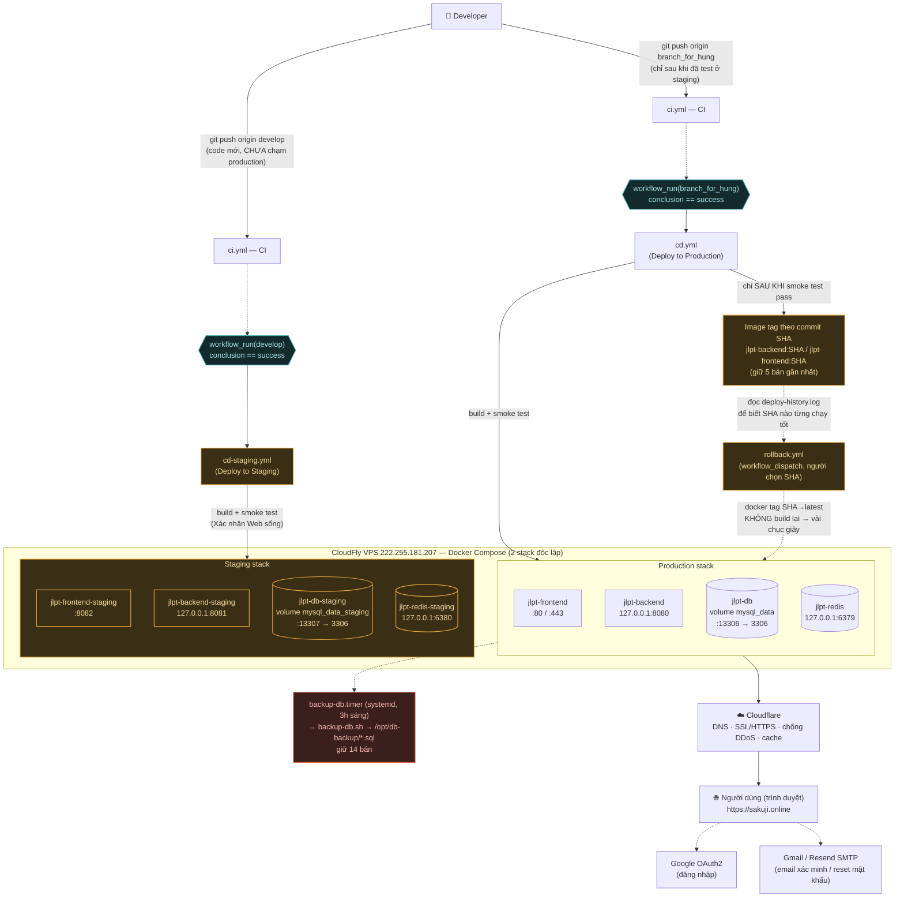

# Sơ Đồ Deploy — JLPT Learning Platform

> Sơ đồ được vẽ dựa trên trạng thái thật của các file cấu hình `.github/workflows/*.yml` và `docker-compose*.yml` chạy trên máy chủ VPS Ubuntu 22.04 (CloudFly). Đây là quy trình CI/CD hoàn chỉnh từ Test tới Deploy.



> **Đọc sơ đồ:** Hệ thống rẽ ra 2 luồng rõ rệt. Nhánh `develop` dẫn code chạy tới **staging** (để Reviewer kiểm tra, đường nét liền phía trên bên trái). Nhánh `branch_for_hung` đưa code chạy thẳng lên **production** (bên phải).  
> Tính năng `rollback.yml` (đường nét đứt) được thiết kế khẩn cấp, chỉ chạy khi có người quản trị chủ động bấm nút "Run workflow" để đưa phiên bản của ứng dụng lùi về quá khứ mà không cần Build lại tốn thời gian.

---

## Chú Giải Chi Tiết Các Mắt Xích Kỹ Thuật

Mục tiêu của phần này là giải thích **vai trò, chức năng, và lý do tồn tại** của từng thiết lập, giúp bạn nắm vững kiến trúc CloudFly VPS.

### 1. Nguồn — Git & chiến lược nhánh
**Vai trò:** Nhánh `develop` và `branch_for_hung` đóng vai trò là công tắc kích hoạt CI/CD. Cấu trúc 2 nhánh này giải quyết bài toán: Không phải mọi code nào dev đẩy lên cũng an toàn. Mọi sự thay đổi phải trải qua môi trường "Staging" cho nhóm tự trải nghiệm thử trước khi Merge sang "Production" cho User dùng.

### 2. CI (Continuous Integration) — `ci.yml`
**Vai trò:** Đây là người gác cổng số 1.
- Backend CI kiểm tra xem bộ Source Code Java có biên dịch được thành file JAR hay không. Đồng thời tính tỉ lệ phần trăm Test Coverage (JaCoCo).
- Frontend CI chạy `npm run lint` để kiểm tra lỗi cú pháp và chạy thử quá trình Build giao diện tĩnh cho ReactJS.

### 3. Gate (Chốt kiểm soát CI -> CD)
Trong `cd.yml` và `cd-staging.yml` có thiết lập quan trọng sau:
```yaml
on:
  workflow_run:
    workflows: ["CI (Build & Test)"]
    branches: ["branch_for_hung"]
    types: [completed]
```
Lệnh này ngăn cản việc triển khai (Deploy) nếu như Code bị lỗi cú pháp ở bước CI. Code lỗi sẽ dừng lại tại Github, ngăn chặn tuyệt đối việc Server cố gắng kéo 1 bản code lỗi về và bị sập.

### 4. CD (Triển khai liên tục qua SSH)
Thay vì Developer phải đăng nhập bằng Putty/MobaXTerm vào VPS `222.255.181.207`, kịch bản CD thông qua `appleboy/ssh-action` sẽ tự động:
1. Đăng nhập SSH bằng IP, Tài khoản và Mật khẩu bạn đặt ở phần Secrets của Repository.
2. Di chuyển đến thư mục dự án trên VPS (`/opt/...`).
3. Dùng lệnh `git reset --hard` để ép Server nhận 100% bản code mới (xóa bỏ mọi file rác do can thiệp tay cục bộ).
4. Khởi động DB và Redis trước.
5. Cập nhật (Build) Backend và Frontend.
6. **Smoke Test:** Kịch bản sẽ không mù quáng thông báo "Deploy thành công" nếu Nginx và Spring Boot chưa thực sự phản hồi Web ở cổng 8080 và 80. Nó sẽ Ping liên tục tới khi Spring Boot báo `UP` thì mới đánh dấu Workflow màu xanh lá cây trên trang chủ Github.

### 5. Tag Image và Tính Năng Rollback
Mỗi một lần ứng dụng Deploy thành công qua bước Smoke Test, hệ thống sẽ gán 1 cái thẻ (Tag) vào Container chứa mã SHA của Commit đó. Ví dụ `jlpt-backend:f9e70f6e`.
Nhờ cơ chế này, chúng ta lưu được 5 phiên bản khỏe mạnh gần nhất.

Khi một ngày có biến cố xảy ra với code mới, thay vì hoảng loạn chờ Build lại 10 phút, bạn chỉ cần mở file `.github/workflows/rollback.yml`, nhập tay cái mã SHA cũ kia vào. Hệ thống sẽ ngay lập tức đổi nhãn dán, ép Server chạy lại cái Image cũ kia ngay trong vài chục giây.

### 6. Cloudflare DNS & Caching
Máy chủ VPS `222.255.181.207` hiện nay không tiếp xúc trực tiếp Internet. Tất cả người dùng đều đi qua Domain `sakuji.online` (Cloudflare). Ở bước CD thứ 6, sau khi Build xong code mới, tự động sẽ có một đoạn Script gọi API lên Cloudflare để xóa `Cache`, ép trình duyệt người dùng load lại File JS, CSS mới nhất, tránh tình trạng "Dev sửa Code nhưng Web khách hiển thị cái cũ".

### 7. Uptime Monitoring (Theo Dõi Máy Chủ Chết/Sống)
File `.github/workflows/uptime-check.yml` được cấu hình để mỗi 10 phút sẽ đánh thức Github Server, thực hiện lệnh `curl` gửi Ping tới trang chủ của bạn. Nếu trang bị ngỏm (doVPS bị treo ổ cứng, cạn RAM...), quy trình Github sẽ chớp đỏ cảnh báo để bạn biết website đang có vấn đề.

---
*(Lưu ý cuối cùng về Bảo mật: File `.env` chứa mật khẩu Database và API Key của Google, Email chỉ được phép tạo trên VPS. Tuyệt đối không commit nó lên Github. Nếu sau này có đổi Mật khẩu, hãy nhắn tin báo trong nhóm nội bộ ngay).*
