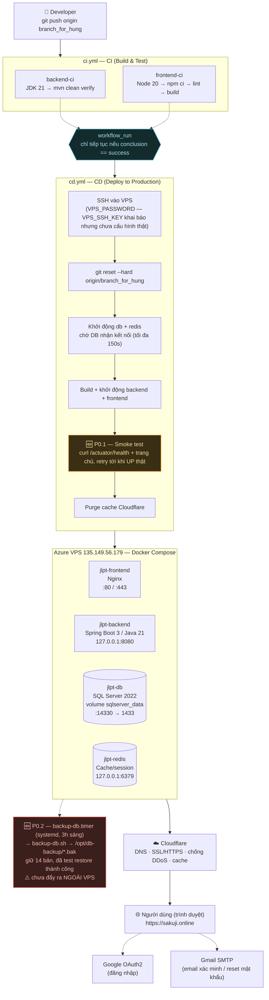

# Sơ Đồ Deploy — JLPT Learning Platform

> Vẽ dựa trên trạng thái thật của `.github/workflows/*.yml`, `docker-compose*.yml` và cấu hình đã xác minh trực tiếp trên VPS (`135.149.56.179`) tính đến 11/07/2026 — không phải sơ đồ lý thuyết. Xem thêm [`Incident_Report_2026-07-11_va_Danh_Gia_Quy_Trinh_Deploy.md`](./Incident_Report_2026-07-11_va_Danh_Gia_Quy_Trinh_Deploy.md) và [`Deploy_Improvement_Plan.md`](./Deploy_Improvement_Plan.md).

---

## Chú giải theo từng giai đoạn

### 1. Nguồn
`git push origin branch_for_hung` — nhánh này vừa là nhánh làm việc chính vừa là nhánh trigger deploy production (không tách `develop`/`main` riêng — xem khuyến nghị P1.4 về staging).

### 2. CI — `ci.yml`
Chạy song song 2 job độc lập trên mọi push vào `branch_for_hung`, `main`, `develop`:
- **`backend-ci`**: JDK 21 → `mvn clean verify` (build + test + JaCoCo, ngưỡng coverage hiện chỉ 10%).
- **`frontend-ci`**: Node 20 → `npm ci` → `npm run lint` → `npm run build` (chưa có bước test frontend).

### 3. Gate — `workflow_run`
CD **không** trigger trực tiếp bằng `push`. Nó chỉ khởi chạy sau khi `ci.yml` báo `completed`, và job `deploy` chỉ thực thi khi `conclusion == 'success'`. Đây là điểm đã sửa hôm 11/07/2026 — trước đó CD chạy song song độc lập với CI, code lỗi vẫn deploy được.

### 4. CD — `cd.yml`
SSH vào VPS rồi thực hiện tuần tự:
1. `git reset --hard origin/branch_for_hung`
2. Khởi động `db` + `redis`, chờ DB nhận kết nối (retry tối đa 150 giây)
3. Build + khởi động `backend` + `frontend`
4. **🆕 P0.1 — Smoke test**: gọi `curl` vào `/actuator/health` và trang chủ, retry tới khi xác nhận UP thật (trước đây `docker compose up -d` báo "thành công" ngay cả khi backend crash-loop bên trong — xem sự cố SMTP_PORT trong `Incident_Report...md`)
5. Purge cache Cloudflare

### 5. Hạ tầng — Azure VPS (Docker Compose)
Một VPS duy nhất (chưa có staging riêng), 4 container:

| Container | Vai trò | Port ra ngoài |
|---|---|---|
| `jlpt-frontend` | Nginx — phục vụ React build + reverse-proxy `/api` | `:80` / `:443` |
| `jlpt-backend` | Spring Boot 3 / Java 21 | `127.0.0.1:8080` (không public trực tiếp) |
| `jlpt-db` | SQL Server 2022, volume `sqlserver_data` | `:14330 → 1433` (nội bộ `1433` không public) |
| `jlpt-redis` | Cache/session | `127.0.0.1:6379` |

**🆕 P0.2 — Backup tự động:** `backup-db.timer` (systemd, chạy 3h sáng hàng ngày) → `backup-db.sh` → lưu vào `/opt/db-backup/*.bak`, giữ 14 bản gần nhất. Đã test phục hồi thành công (27 bảng, dữ liệu khớp thật).

> ⚠️ **Rủi ro còn tồn tại:** bản backup hiện chỉ nằm trên chính VPS này — chưa đẩy ra ngoài (rclone/S3/Google Drive...). Nếu VPS hỏng ổ cứng, mất cả ứng dụng lẫn backup cùng lúc. Đang chờ chủ dự án cung cấp credential cloud storage để tự động hoá bước này.

### 6. Biên — Cloudflare
Đứng trước VPS: ẩn IP thật, cấp SSL/HTTPS tự động, chống DDoS, cache static asset, quản lý DNS cho `sakuji.online`.

### 7. Người dùng
Truy cập qua HTTPS, cộng 2 phụ thuộc ngoài:
- **Google OAuth2** — cho luồng "Đăng nhập với Google"
- **Gmail SMTP** — gửi email xác minh tài khoản / đặt lại mật khẩu (cấu hình qua trang admin, lưu trong bảng `system_settings`, không chỉ qua biến môi trường `.env`)
