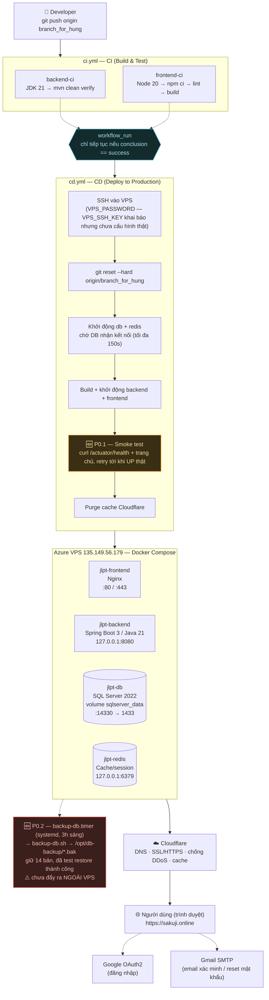

# Sơ Đồ Deploy — JLPT Learning Platform

> Vẽ dựa trên trạng thái thật của `.github/workflows/*.yml`, `docker-compose*.yml` và cấu hình đã xác minh trực tiếp trên VPS (`135.149.56.179`) tính đến 11/07/2026 — không phải sơ đồ lý thuyết. Xem thêm [`Incident_Report_2026-07-11_va_Danh_Gia_Quy_Trinh_Deploy.md`](./Incident_Report_2026-07-11_va_Danh_Gia_Quy_Trinh_Deploy.md) và [`Deploy_Improvement_Plan.md`](./Deploy_Improvement_Plan.md).



---

## Chú giải chi tiết theo từng giai đoạn

> Mục tiêu của phần này là giải thích **vai trò, chức năng, và lý do tồn tại** của từng mắt xích — không chỉ "nó làm gì" mà cả "tại sao phải làm vậy", để hiểu đây là một quy trình DevOps chuẩn công nghiệp (dù còn thiếu vài mảnh — xem `Deploy_Improvement_Plan.md`), chứ không phải một chuỗi lệnh chắp vá.

### 1. Nguồn — Git & chiến lược nhánh

**Vai trò:** Điểm khởi đầu duy nhất của mọi thay đổi lên production. Git không chỉ là nơi lưu code — trong mô hình này, **một nhánh Git (`branch_for_hung`) chính là "công tắc" kích hoạt toàn bộ pipeline phía sau**.

**Chức năng:**
- `git push origin branch_for_hung` gửi commit mới lên GitHub.
- GitHub phát ra một **webhook event** (`push`) — đây là cơ chế cốt lõi khiến CI/CD "tự động": GitHub Actions lắng nghe event này và tự khởi chạy workflow tương ứng, không cần ai bấm nút.

**Tại sao thiết kế vậy (và vì sao chưa chuẩn 100%):**
- Chuẩn công nghiệp thường tách biệt rõ 3 nhánh: `develop` (tích hợp code, chưa lên prod) → `staging`/`release` (test trước khi lên thật) → `main`/`production` (chỉ merge vào khi đã duyệt). Ở đây, `branch_for_hung` gánh **cả 2 vai** (vừa là nơi làm việc hàng ngày, vừa là nhánh deploy production) — nghĩa là **mọi push hợp lệ (qua được CI) đều lập tức lên production thật**, không có bước "duyệt" hay môi trường trung gian để bắt lỗi trước.
- Đây chính là lý do `Deploy_Improvement_Plan.md` xếp **P1.4 — môi trường staging** là việc nên làm sớm: tách một nhánh (`develop`) + một bộ container riêng để test trước, thay vì mọi thay đổi đều "đặt cược" thẳng vào production.

---

### 2. CI (Continuous Integration) — `ci.yml`

**Vai trò:** Người gác cổng đầu tiên. Nhiệm vụ duy nhất của CI là trả lời câu hỏi: **"code này có build được và có lỗi rõ ràng không?"** — trước khi nó có cơ hội chạm vào server thật.

**Chức năng — 2 job chạy song song (không phụ thuộc nhau), trên mọi push vào `branch_for_hung`, `main`, `develop`:**

| Job | Các bước | Ý nghĩa từng bước |
|---|---|---|
| `backend-ci` | 1) Cài JDK 21<br/>2) `mvn clean verify` | `clean` xoá build cũ (tránh lẫn artifact rác) → biên dịch lại Java từ đầu → chạy **unit test + integration test** → tính **JaCoCo coverage** (tỉ lệ % code có test bao phủ) và **chặn build nếu dưới ngưỡng** (hiện đặt 10% — khá thấp, xem P2.9) |
| `frontend-ci` | 1) Cài Node 20<br/>2) `npm ci`<br/>3) `npm run lint`<br/>4) `npm run build` | `npm ci` cài đúng version dependency ghi trong `package-lock.json` (khác `npm install` — không tự ý nâng version) → `lint` bắt lỗi cú pháp/style JS/JSX → `build` biên dịch React thành file tĩnh (HTML/CSS/JS) mà Nginx sẽ phục vụ sau này. **Chưa có bước chạy test** (dòng `npm run test` đang bị comment sẵn trong file — xem P2.10) |

**Tại sao tách 2 job song song thay vì 1 job tuần tự:** Tiết kiệm thời gian (backend và frontend không phụ thuộc nhau, chạy cùng lúc thay vì nối tiếp) và cô lập lỗi (nếu frontend fail, vẫn biết ngay backend có ổn không, dễ khoanh vùng nguyên nhân).

**Đây có phải "test thật" không?** Một phần. `mvn clean verify` chạy test tự động hoá (unit + integration test có sẵn trong code), nhưng **không hề chạm vào ứng dụng thật đang chạy** — nó dùng H2 (database giả lập trong bộ nhớ) thay vì SQL Server thật. Vì vậy CI pass **không đảm bảo** ứng dụng chạy đúng trên production (khác biệt môi trường, biến môi trường thật, dữ liệu thật) — đây chính là lỗ hổng mà **P0.1 (smoke test)** ở bước CD được thêm vào để bù đắp.

---

### 3. Gate — `workflow_run` (điểm nối CI → CD)

**Vai trò:** Đây là **"chốt kiểm soát"** — đảm bảo CD (deploy) không bao giờ chạy nếu CI chưa xác nhận code sạch. Về bản chất đây là nơi biến 2 workflow độc lập thành **1 pipeline có thứ tự**.

**Chức năng kỹ thuật:**
```yaml
on:
  workflow_run:
    workflows: ["CI (Build & Test)"]   # theo dõi đúng workflow tên này
    branches: ["branch_for_hung"]
    types: [completed]                  # kích hoạt khi CI CHẠY XONG (không quan tâm pass/fail ở bước trigger)
jobs:
  deploy:
    if: ${{ github.event.workflow_run.conclusion == 'success' }}  # nhưng CHỈ THỰC THI nếu CI thật sự pass
```
Có 2 lớp kiểm tra: `types: [completed]` khiến CD "được đánh thức" ngay khi CI xong (dù pass hay fail), nhưng `if: conclusion == 'success'` mới là **cửa khoá thật** — nếu CI fail, job `deploy` bị skip hoàn toàn (không chạy dòng lệnh nào cả), GitHub Actions sẽ hiện job này với trạng thái "skipped", không phải "failed".

**Tại sao không dùng `needs:` đơn giản hơn?** `needs:` chỉ hoạt động giữa các **job trong cùng 1 file workflow**. Vì `ci.yml` và `cd.yml` là 2 file riêng biệt, GitHub Actions bắt buộc phải dùng cơ chế `workflow_run` (sự kiện chéo file) để nối chúng lại — đây là pattern chuẩn của GitHub Actions cho tình huống "workflow B chạy sau khi workflow A xong", khác hoàn toàn với repo có 1 file workflow duy nhất chứa nhiều `jobs` nối bằng `needs`.

**Vì sao đây từng là một lỗ hổng thật:** Trước 11/07/2026, `cd.yml` dùng trực tiếp `on: push` (giống `ci.yml`) — nghĩa là 2 workflow chạy **song song, độc lập hoàn toàn**, không "nói chuyện" với nhau. Code build lỗi ở CI vẫn deploy thẳng lên production vì CD không hề biết CI đang/đã fail.

---

### 4. CD (Continuous Deployment) — `cd.yml`

**Vai trò:** Người thực thi — nhận code đã qua kiểm định (từ Gate), đưa nó lên máy chủ thật, và (từ P0.1) **tự xác nhận nó thực sự sống được** trước khi báo "xong".

**Chức năng — chạy tuần tự (`set -e`: bất kỳ lệnh nào lỗi sẽ dừng ngay, không chạy tiếp lệnh sau):**

#### 4.1. Kết nối SSH vào VPS
```yaml
uses: appleboy/ssh-action@v1.0.3
with:
  host: ${{ secrets.VPS_HOST }}
  username: ${{ secrets.VPS_USERNAME }}
  password: ${{ secrets.VPS_PASSWORD }}   # ← phương thức đang hoạt động thật
  key: ${{ secrets.VPS_SSH_KEY }}         # ← có khai báo nhưng chưa từng cấu hình
```
`appleboy/ssh-action` là 1 GitHub Action có sẵn (không phải code tự viết), đóng gói sẵn logic "mở kết nối SSH, chạy 1 đoạn script trên máy đích, trả log về". **Toàn bộ các bước dưới đây (4.2 → 4.6) thực chất chạy TRÊN VPS**, không phải trên máy chủ của GitHub — GitHub Actions chỉ là người gõ lệnh từ xa.

#### 4.2. Đồng bộ code
```bash
git reset --hard origin/branch_for_hung
```
**Tại sao `reset --hard` chứ không phải `git pull`:** `pull` có thể xung đột nếu ai đó lỡ sửa tay trên VPS (dù không nên). `reset --hard` **cưỡng chế** thư mục trên VPS khớp 100% với commit mới nhất trên GitHub, xoá bỏ mọi khác biệt cục bộ — đảm bảo tính **nhất quán tuyệt đối** giữa code trên GitHub và code đang chạy thật (nguyên tắc "Git là nguồn sự thật duy nhất" — *source of truth*).

#### 4.3. Khởi động `db` + `redis` trước, rồi mới chờ
```bash
docker compose up -d db redis
# retry loop: gọi sqlcmd tối đa 30 lần, cách nhau 5s (tổng 150s)
until docker exec jlpt-db sqlcmd ... -Q "IF NOT EXISTS(...) CREATE DATABASE JLPT_LearningDB"; do sleep 5; done
```
**Vai trò:** SQL Server (`jlpt-db`) cần vài giây tới vài chục giây để thực sự sẵn sàng nhận kết nối sau khi container "start" (khác nhau giữa "container đã chạy" và "phần mềm bên trong đã sẵn sàng" — một khái niệm quan trọng sẽ lặp lại ở mục 4.5). Vòng lặp này **chủ động hỏi tới khi có câu trả lời**, thay vì đoán bừa một khoảng `sleep` cố định.

**Bài học thực tế đứng sau dòng lệnh này:** Đây chính là nơi sự cố nghiêm trọng nhất ngày 11/07/2026 xảy ra — vòng lặp chạy đủ 150 giây rồi thất bại vì **mật khẩu SA trong `.env` không khớp với dữ liệu đã khởi tạo trong volume** (đọc chi tiết ở `Incident_Report...md`, Sự cố 4).

#### 4.4. Build & khởi động `backend` + `frontend`
```bash
docker compose up -d --build backend frontend
```
`--build` bắt Docker build lại image từ `Dockerfile` (biên dịch Java thành `.jar`, biên dịch React thành file tĩnh) **trước khi** khởi động container — đảm bảo container luôn chạy đúng code vừa `git reset` ở bước 4.2, không phải image cũ còn cache lại.

#### 4.5. 🆕 P0.1 — Smoke test (xác minh ứng dụng THỰC SỰ sống)
```bash
curl -sf http://127.0.0.1:8080/actuator/health | grep '"status":"UP"'   # retry tới 100s
curl -sf http://127.0.0.1:80                                            # retry tới 30s
# nếu không UP: in log container rồi exit 1 → cả job CD bị đánh dấu FAILED
```
**Đây là khái niệm quan trọng nhất trong toàn bộ tài liệu này:** `docker compose up -d` chỉ đảm bảo Docker đã **tạo và khởi động tiến trình** bên trong container — nó **không hề biết** (và không quan tâm) ứng dụng Java bên trong có thực sự khởi động thành công hay không. Một ứng dụng Spring Boot có thể "container đang chạy" (`docker ps` báo `Up`) trong khi bản thân tiến trình Java đã crash và đang tự khởi động lại liên tục (*crash-loop*, vì có `restart: unless-stopped`) — với người ngoài nhìn vào, container vẫn "Up", nhưng ứng dụng bên trong không bao giờ thực sự phục vụ được request nào.

Đây **chính xác** là điều đã xảy ra ngày 11/07/2026 (sự cố `SMTP_PORT` rỗng, xem `Incident_Report...md`, Sự cố 3): CD báo "Deploy thành công" (màu xanh trên GitHub Actions) trong khi website trả lỗi `502 Bad Gateway` cho mọi request. Bước smoke test được thêm vào **chính xác để đóng lỗ hổng này** — bằng cách chủ động gửi 1 request HTTP thật vào ứng dụng và đọc phản hồi, thay vì chỉ tin vào trạng thái của Docker.

`/actuator/health` là 1 endpoint có sẵn của **Spring Boot Actuator** (thư viện giám sát chuẩn của hệ sinh thái Spring) — nó tự kiểm tra các thành phần phụ thuộc quan trọng của ứng dụng (kết nối database, dung lượng ổ đĩa...) và trả về `{"status":"UP"}` chỉ khi tất cả đều ổn.

#### 4.6. Purge cache Cloudflare
```yaml
curl -X POST "https://api.cloudflare.com/.../purge_cache" -H "Authorization: Bearer ${{ secrets.CLOUDFLARE_API_TOKEN }}" --data '{"purge_everything":true}'
```
**Vai trò:** Bước này chạy **trên máy chủ của GitHub Actions** (không qua SSH vào VPS) — gọi thẳng vào Cloudflare API. Cloudflare cache lại các file tĩnh (JS/CSS/hình ảnh) ở các "điểm biên" (edge) gần người dùng để tăng tốc độ tải trang — nhưng nếu không xoá cache sau mỗi lần deploy, người dùng có thể vẫn nhận được **phiên bản JS/CSS cũ** dù backend/frontend trên VPS đã cập nhật, gây ra tình trạng frontend và backend "lệch phiên bản" nhìn như lỗi khó hiểu.

---

### 5. Hạ tầng — Azure VPS & Docker Compose

**Vai trò:** Đây là nơi ứng dụng thực sự "sống" 24/7, phục vụ người dùng thật.

**Docker Compose là gì và tại sao dùng:** Thay vì cài Java, Node, SQL Server, Redis trực tiếp lên hệ điều hành VPS (dễ xung đột phiên bản, khó dọn dẹp, khó di dời), mỗi thành phần được đóng gói thành 1 **container** — một môi trường chạy độc lập, đóng gói sẵn đúng phiên bản phần mềm + thư viện cần thiết, không ảnh hưởng lẫn nhau. `docker-compose.yml` mô tả **cả 4 container này nên chạy như thế nào và nói chuyện với nhau ra sao** bằng 1 file cấu hình duy nhất — 1 lệnh `docker compose up` là dựng lại được toàn bộ hệ thống.

**Vai trò & chức năng từng container:**

| Container | Vai trò trong hệ thống | Vì sao cấu hình port như vậy |
|---|---|---|
| **`jlpt-frontend`** (Nginx) | "Cửa ngõ" duy nhất nhận traffic từ người dùng thật. Phục vụ file tĩnh (HTML/CSS/JS đã build từ React) và **reverse-proxy** (chuyển tiếp) các request `/api/*` sang `jlpt-backend`. | `:80`/`:443` — cổng duy nhất mở công khai ra internet, vì đây là điểm tiếp xúc an toàn duy nhất cần thiết. |
| **`jlpt-backend`** (Spring Boot) | "Bộ não" — xử lý toàn bộ logic nghiệp vụ: xác thực, tính điểm quiz, gọi database, gửi email... | `127.0.0.1:8080` — chỉ bind vào loopback (localhost) của chính VPS, **không** expose ra internet. Người dùng thật không bao giờ gọi thẳng vào backend — luôn phải đi qua Nginx ở trên. Đây là nguyên tắc *defense in depth*: giảm bề mặt tấn công, kẻ xấu không thể dò/tấn công thẳng API mà bỏ qua lớp Nginx. |
| **`jlpt-db`** (SQL Server) | Lưu trữ toàn bộ dữ liệu thật: tài khoản, câu hỏi, kết quả bài thi... | `14330 → 1433` — cổng nội bộ chuẩn của SQL Server là `1433`, nhưng map ra ngoài ở `14330` (không phải cổng mặc định, khó đoán hơn) **và** trong `docker-compose.yml` gốc còn có comment ghi rõ mục tiêu: cổng DB đáng ra không nên public trực tiếp — chỉ nên truy cập qua SSH tunnel (xem mục 6 `CI_CD.md`). |
| **`jlpt-redis`** | Bộ nhớ đệm (cache) tốc độ cao, dùng cho session/dữ liệu cần truy xuất nhanh. | `127.0.0.1:6379` — Redis mặc định **không có mật khẩu** trong cấu hình hiện tại, nên tuyệt đối không được public ra ngoài, chỉ bind loopback. |

**Volume là gì (`sqlserver_data`, `jlpt-uploads`):** Container Docker theo mặc định là **tạm thời** — nếu container bị xoá/tạo lại, mọi dữ liệu bên trong nó mất sạch. `volume` là một vùng lưu trữ **độc lập với vòng đời container**, được "gắn" (mount) vào container — nhờ vậy dữ liệu database vẫn còn nguyên dù container `jlpt-db` bị `docker compose up --build` tạo lại nhiều lần (chỉ ứng dụng/code bên trong image mới bị build lại, còn dữ liệu trong volume thì không đổi).

**🆕 P0.2 — Backup tự động:**
```
backup-db.timer (systemd, 03:00 hàng ngày)
   → backup-db.sh
       → BACKUP DATABASE JLPT_LearningDB TO DISK (bên trong container, dùng lệnh SQL Server chuẩn)
       → docker cp ra /opt/db-backup/ trên VPS (thoát khỏi container, để không mất nếu container bị xoá)
       → giữ lại 14 bản gần nhất, tự xoá bản cũ hơn
```
`systemd timer` là cơ chế lập lịch chuẩn của Linux hiện đại (thay thế `cron` truyền thống ở các bản Ubuntu mới, có ưu điểm là log qua `journalctl`, dễ debug hơn `cron` khi lỗi âm thầm). Đã **test phục hồi thật** bằng cách restore 1 bản `.bak` vào 1 SQL Server tạm và xác nhận đủ 27 bảng, dữ liệu đúng — vì "có file backup" và "backup dùng phục hồi được" là 2 điều khác nhau, chỉ tin cái sau.

> ⚠️ **Rủi ro còn tồn tại:** bản backup hiện chỉ nằm trên chính VPS này — chưa đẩy ra ngoài (rclone/S3/Google Drive...). Nếu VPS hỏng ổ cứng, mất cả ứng dụng lẫn backup cùng lúc — vi phạm nguyên tắc backup chuẩn "3-2-1" (giữ ít nhất 1 bản sao **ở một nơi vật lý khác**). Đang chờ chủ dự án cung cấp credential cloud storage để tự động hoá bước này.

---

### 6. Biên — Cloudflare

**Vai trò:** Lớp trung gian đứng **giữa toàn bộ internet và VPS thật** — người dùng không bao giờ kết nối trực tiếp tới IP `135.149.56.179`, mà luôn đi qua Cloudflare trước.

**Chức năng cụ thể:**
- **DNS:** Dịch tên miền `sakuji.online` thành địa chỉ IP — nhưng thay vì trả về IP thật của VPS, Cloudflare trả về IP của chính nó (chế độ "proxy"), **ẩn hoàn toàn IP thật của VPS** khỏi người dùng/kẻ tấn công.
- **SSL/HTTPS tự động:** Cloudflare tự cấp và gia hạn chứng chỉ SSL, mã hoá kết nối giữa trình duyệt và Cloudflare — người dùng thấy ổ khoá HTTPS mà không cần tự quản lý chứng chỉ trên VPS.
- **Chống DDoS:** Lọc traffic độc hại/tấn công từ chối dịch vụ trước khi nó chạm tới VPS — VPS cá nhân/nhỏ gần như không thể tự chống chịu một cuộc tấn công DDoS thật nếu không có lớp này.
- **Cache:** Lưu tạm các file tĩnh (JS/CSS/ảnh) ở các máy chủ Cloudflare đặt gần người dùng về mặt địa lý — giảm tải cho VPS và tăng tốc độ tải trang. (Đây là lý do bước 4.6 phải purge cache sau mỗi lần deploy.)

**Vì sao đây là thực hành chuẩn:** Đặt 1 lớp CDN/reverse-proxy trước server gốc (*origin server*) là kiến trúc tiêu chuẩn của hầu hết ứng dụng web hiện đại có traffic thật — tách biệt rõ "ai lộ diện với internet" (Cloudflare) và "ai xử lý logic thật" (VPS), giảm đáng kể rủi ro bị tấn công trực diện vào hạ tầng.

---

### 7. Người dùng & các phụ thuộc bên ngoài

**Vai trò:** Điểm cuối của toàn bộ pipeline — nhưng hệ thống còn phụ thuộc vào 2 dịch vụ bên thứ ba nằm **ngoài tầm kiểm soát trực tiếp** của VPS/Docker:

- **Google OAuth2** (đăng nhập): Khi người dùng bấm "Đăng nhập với Google", trình duyệt được chuyển hướng sang máy chủ của Google để xác thực, Google trả về 1 token, backend xác minh token đó với Google rồi mới tạo phiên đăng nhập. Nếu cấu hình `redirect URI` giữa Google Console và backend không khớp domain thật (`sakuji.online`), luồng này sẽ lỗi ngay cả khi mọi thứ khác trên VPS đều hoạt động bình thường.
- **Gmail SMTP** (gửi email xác minh/đặt lại mật khẩu): Cấu hình **không chỉ nằm trong `.env`** — hệ thống có `AdminSettingsService` đọc cấu hình SMTP (host, port, username, mật khẩu ứng dụng Gmail...) từ bảng `system_settings` trong chính database, cho phép đổi qua trang quản trị mà không cần deploy lại code. Đây là một lớp gián tiếp cần nhớ khi debug: **biến môi trường `SMTP_*` trong `.env` chỉ là giá trị khởi tạo ban đầu**, giá trị THỰC SỰ đang dùng có thể đã bị ghi đè qua admin panel.
