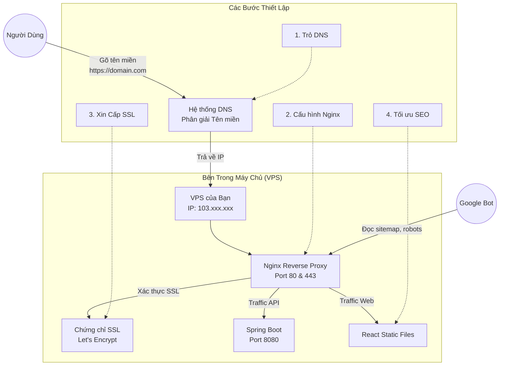

# Quy Trình Đưa Dự Án Lên Mạng Chuyên Nghiệp (Domain, SSL & SEO)

Dưới đây là sơ đồ luồng hoạt động tổng thể để đưa hệ thống nội bộ của bạn ra thế giới, được Google công nhận và bảo mật an toàn.

## Sơ Đồ Quy Trình (Mindmap / Flowchart)

---

## Chi Tiết Từng Bước Triển Khai

> [!IMPORTANT]
> Hãy thực hiện các bước này theo đúng thứ tự. Việc nhảy cóc (ví dụ cấu hình SSL khi chưa trỏ DNS) sẽ dẫn đến lỗi hệ thống bị khoá (Rate limit) từ tổ chức cấp phát chứng chỉ.

### BƯỚC 1: Trỏ Tên Miền (DNS Mapping)

**Nó sinh ra để làm gì?**
Máy tính giao tiếp bằng địa chỉ IP (ví dụ `103.14.56.78`). Con người không thể nhớ nổi dãy số này. DNS (Domain Name System) đóng vai trò như một "Danh bạ điện thoại", dịch tên miền (`nhatngu.com`) thành địa chỉ IP để trình duyệt biết cần kết nối đến máy chủ nào.

**Tại sao phải có bước này?**
Nếu không có bước này, dự án của bạn chỉ là một cục IP trơ trọi trên mạng, hoàn toàn không có thương hiệu và Google cũng không đánh giá cao các website không có tên miền.

**Lợi ích & Nguy cơ tiềm ẩn:**
- **Lợi ích**: Tăng uy tín thương hiệu, người dùng dễ nhớ, bắt buộc phải có để tạo chứng chỉ SSL/HTTPS.
- **Nguy cơ**: Nếu cấu hình sai (trỏ nhầm IP) hoặc bị lộ IP gốc (nếu bị tấn công DDoS), kẻ gian có thể đánh sập máy chủ. Nhiều dự án lớn dùng Cloudflare làm trung gian để giấu IP thật này.

**Cách xử lý khi có lỗi:**
- **Lỗi:** Cập nhật DNS nhưng gõ tên miền không vào được trang.
- **Xử lý:** Do DNS cần thời gian cập nhật trên toàn cầu (từ 5 phút đến 24 giờ). Dùng lệnh `ping tenmien.com` trên máy tính. Nếu nó chưa ra IP của VPS, bạn chỉ cần chờ đợi. Nếu ra sai IP, hãy kiểm tra lại bảng ghi (A Record) ở nơi mua tên miền.

---

### BƯỚC 2: Cấu Hình Nginx & Mở Port (Web Server)

**Nó sinh ra để làm gì?**
Máy chủ (VPS) có hàng chục ngàn "cánh cửa" (Cổng/Port). Nginx là một người bảo vệ đứng ở cổng số `80` (HTTP) và `443` (HTTPS) để đón khách (Request) và phân luồng: ai đòi xem ảnh thì cho vào kho ảnh (Frontend), ai đòi lấy dữ liệu thì dẫn tới bộ phận API (Backend).

**Tại sao phải có bước này?**
Hệ thống hiện tại của bạn (`docker-compose.yml`) đã có Nginx, nhưng Nginx hiện đang cấu hình mù (chấp nhận mọi tên miền, chỉ chạy cổng 80). Phải cấu hình lại Nginx để nó nhận diện đích danh tên miền của bạn (`server_name tenmien.com`).

**Lợi ích & Nguy cơ tiềm ẩn:**
- **Lợi ích**: Bảo vệ backend không bị lộ trực tiếp ra internet (không ai chui thẳng vào cổng 8080 của Java được).
- **Nguy cơ**: Cấu hình sai luật điều hướng (Routing) sẽ gây lỗi `502 Bad Gateway` hoặc trang trắng bóc.

**Cách xử lý khi có lỗi:**
- **Lỗi:** Nginx báo `502 Bad Gateway`.
- **Xử lý:** Lỗi này nghĩa là Nginx không liên lạc được với Backend. Bạn chạy `docker-compose logs backend` để xem Java có đang bị lỗi hay sập không, hoặc kiểm tra xem tên mạng Docker nối Nginx và Backend đã khớp chưa.

---

### BƯỚC 3: Thiết Lập Bảo Mật SSL/HTTPS (Let's Encrypt)

**Nó sinh ra để làm gì?**
HTTPS (HyperText Transfer Protocol Secure) là phiên bản mã hóa của HTTP. SSL/TLS là "chứng thư" chứng minh website của bạn là hàng thật giá thật và dữ liệu gửi đi (mật khẩu, email) sẽ bị làm rối tinh mù mịt, hacker không thể đọc trộm.

**Tại sao phải có bước này?**
Từ năm 2018, Google Chrome hiển thị "Cảnh báo không an toàn" to đùng với trang web không có HTTPS. Các công cụ tìm kiếm **đánh tụt hạng thê thảm** các trang web HTTP.

**Lợi ích & Nguy cơ tiềm ẩn:**
- **Lợi ích**: Uy tín cao, bảo vệ dữ liệu người học, được Google cưng chiều xếp hạng cao hơn.
- **Nguy cơ**: Chứng chỉ Let's Encrypt chỉ có hạn 90 ngày. Nếu bạn quên cài đặt tự động gia hạn (auto-renew), sau 3 tháng web sẽ báo lỗi bảo mật đỏ lòm, người dùng không thể truy cập.

**Cách xử lý khi có lỗi:**
- **Lỗi:** Cài Certbot báo lỗi `Rate Limit Exceeded`.
- **Xử lý:** Do bạn cài lỗi và thử lại quá nhiều lần trong ngày (hệ thống nghi ngờ bạn phá hoại). Giải pháp là dùng môi trường `--staging` (thử nghiệm) của Certbot trước khi lấy chứng chỉ thật. Nếu lỡ bị khoá, bạn phải đợi 7 ngày.

---

### BƯỚC 4: Tối Ưu Tương Tác Bot (SEO Cơ Bản)

**Nó sinh ra để làm gì?**
Google sử dụng các con Bot (nhện) đi đào bới internet. Nó sẽ tìm các file như `robots.txt` (bản đồ cấm/cho phép đi vào) và `sitemap.xml` (bản đồ đường đi). Thẻ `Meta` là tấm chứng minh thư gắn trước cửa mỗi trang để giới thiệu nội dung tóm tắt.

**Tại sao phải có bước này?**
Website của bạn viết bằng React (SPA). HTML tải về ban đầu trắng tinh, nội dung được tải sau bằng Javascript. Nếu không có Meta tags chuẩn và sitemap, con Bot của Google vào xem thấy trắng tinh, nó sẽ bỏ đi và website bạn mãi mãi không lên trang nhất tìm kiếm.

**Lợi ích & Nguy cơ tiềm ẩn:**
- **Lợi ích**: Tăng Traffic tự nhiên (Organic Traffic) không tốn tiền quảng cáo. Khi share link lên Facebook sẽ hiện ảnh đại diện (Thumbnail) và tiêu đề rất chuyên nghiệp (nhờ thẻ Open Graph).
- **Nguy cơ**: Chặn nhầm file `robots.txt` (ví dụ: `Disallow: /`). Chỉ với 1 dòng đó, bạn đã cấm toàn bộ thế giới tìm kiếm truy cập web bạn, coi như tự cắt đường sống.

**Cách xử lý khi có lỗi:**
- **Lỗi:** Gõ tên miền lên Google không thấy website đâu dù đã 1 tháng.
- **Xử lý:** Đăng nhập vào **Google Search Console**, khai báo tên miền và nộp file `sitemap.xml` thủ công. Nhấn "Yêu cầu lập chỉ mục" để ép Google Bot vào nhà mình ngay lập tức. Cài thêm các thẻ `<meta name="description" ...>` vào file `apps/frontend/index.html`.

---

## Phụ Lục: Giải Thích Thuật Ngữ Chuyên Ngành (Glossary)

Dưới đây là giải thích các thuật ngữ chuyên môn xuất hiện trong tài liệu bằng ngôn ngữ bình dân nhất:

- **DNS (Domain Name System)**: "Danh bạ internet". Nó giúp dịch tên miền dễ nhớ (ví dụ: `google.com`) thành địa chỉ IP (ví dụ: `142.250.190.46`) để trình duyệt biết đường tìm đến máy chủ.
- **A Record (Bản ghi A)**: Một loại cấu hình cụ thể trong bảng điều khiển DNS, dùng để trỏ thẳng tên miền tới một địa chỉ IP của máy chủ.
- **VPS (Virtual Private Server)**: Máy chủ ảo. Hiểu đơn giản là một chiếc máy tính được bạn thuê trên mạng, cắm điện và kết nối internet 24/24 để chứa mã nguồn dự án.
- **Reverse Proxy**: "Người gác cổng". Ở dự án này là **Nginx**. Nó đứng ở cửa ngoài máy chủ, đón mọi yêu cầu từ người dùng và quyết định xem nên đưa họ vào phòng nào (phòng Frontend để xem giao diện, hay phòng Backend để lấy dữ liệu).
- **SSL / TLS**: "Phong bì niêm phong". Công nghệ mã hóa dữ liệu. Khi có SSL, dữ liệu người dùng gửi đi (như mật khẩu, thẻ tín dụng) sẽ bị xáo trộn, dù có bị hacker nghe lén trên đường truyền cũng không thể đọc được.
- **HTTPS**: Là sự kết hợp của HTTP (cách web hoạt động) + SSL (bảo mật). Khi vào các trang HTTPS, trình duyệt sẽ hiển thị hình chiếc ổ khóa an toàn.
- **Let's Encrypt / Certbot**: Let's Encrypt là tổ chức phi lợi nhuận cung cấp chứng chỉ SSL miễn phí toàn cầu. Certbot là phần mềm tự động giúp bạn xin và cài đặt chứng chỉ đó vào máy chủ Nginx.
- **Rate Limit**: "Giới hạn tốc độ". Cơ chế chống phá hoại. Nếu bạn cấu hình sai và thử xin chứng chỉ SSL quá nhiều lần (thường > 5 lần/giờ), hệ thống của Let's Encrypt sẽ tạm khóa bạn.
- **SEO (Search Engine Optimization)**: Tập hợp các công việc nhằm giúp trang web của bạn "chơi thân" với Google, từ đó khi người dùng tìm kiếm, trang của bạn sẽ được ưu tiên hiển thị ở những kết quả đầu tiên.
- **Bot / Crawler / Spider**: Các "robot con nhện" tự động của Google. Chúng đi mò mẫm khắp mọi ngóc ngách internet 24/7 để đọc nội dung các trang web và mang dữ liệu về lưu trữ (lập chỉ mục).
- **Robots.txt**: "Biển báo giao thông" dành cho Bot. File này cho biết Bot được phép đi vào thư mục nào và cấm không được rớ tới thư mục nào trên web.
- **Sitemap.xml**: "Bản đồ khu du lịch". File này liệt kê sẵn danh sách tất cả các link quan trọng của website để Bot không phải tốn công tự tìm kiếm, giúp website lên Google nhanh hơn.
- **SPA (Single Page Application)**: Ứng dụng web một trang (như React, Vue). Người dùng tải trang 1 lần duy nhất, sau đó khi nhấn chuyển trang, nội dung sẽ được cập nhật tức thì bằng Javascript thay vì phải tải lại toàn bộ giao diện từ đầu.

---

> [!TIP]
> **Khuyến nghị tiếp theo**: Để tiến hành thực tế, chúng ta nên bắt đầu bằng việc thay đổi file Nginx của frontend (`apps/frontend/nginx.conf`) để chuẩn bị sẵn sàng hứng tên miền mới, hoặc nâng cấp file `index.html` để có ngay các thẻ SEO cơ bản.
